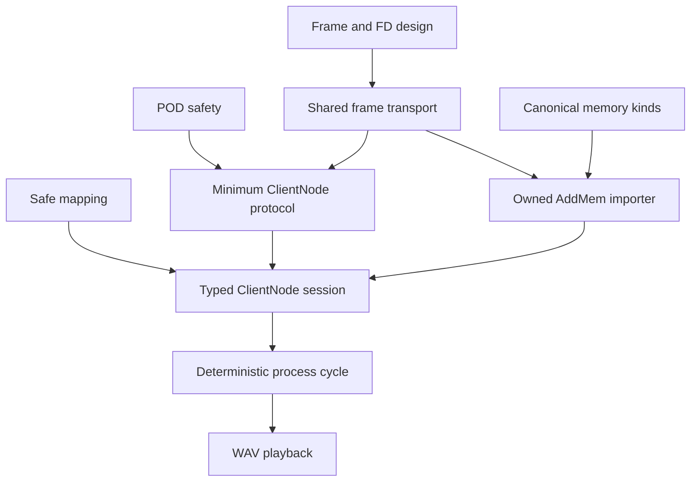

# ClientNode Architecture Advancement Wave

## What this wave set out to do

The architecture re-kickoff identified several streams that could advance in
parallel without prematurely coupling the final ClientNode session design:

- make SPA POD parsing bounded on malformed input;
- make shared-memory slices uphold their safe interface;
- establish canonical SPA memory kinds;
- repair known plugin ABI and ownership defects;
- make listener dispatch reentrancy-safe;
- settle the canonical native frame/FD interface;
- document the threading contract;
- build the first shared frame implementation;
- bound integration-test waits;
- inventory the minimum upstream ClientNode protocol.

The main line remains one deterministic, ownership-safe, typed ClientNode cycle.
These streams are foundation work only where they directly improve the truth of the
safe Rust and protocol interfaces.

## Result at a glance

This wave moved the repository from architecture review into implementation:

1. Malformed POD shapes now have checked size and progress invariants plus targeted regressions.
2. Shared mappings validate ranges and correctly support unaligned logical regions; raw shared access now retains an explicit unsafe contract.
3. SPA memory-kind values now have one canonical definition and node decoding is correct.
4. SPA plugin callbacks now use the C ABI and retain their dynamic owners.
5. Hook callbacks no longer run under the hook-list mutex.
6. The native frame/FD seam is designed against upstream behavior.
7. A new `pipewire-native-protocol` crate implements that frame seam with owned descriptors.
8. The threading contract now identifies loop affinity and a concrete `pw-browse` violation.
9. Beads now has a ClientNode-cycle epic and dependency graph rather than only server-unification tasks.

Several follow-on streams were still active when this document was opened. Their
state is recorded in the completion addendum below.

## Landed implementation

### Bounds-safe shared mappings

Commit: `f590a129834d` (`Harden shared memory mappings`)

[`/node/src/shm/memfd.rs`](/node/src/shm/memfd.rs) now:

- checks `usize` to `off_t` conversion before `ftruncate`;
- seals locally created memfds against shrinking;
- checks `offset + len` arithmetic;
- validates ranges against `fstat` size;
- maps a page-aligned physical range for unaligned logical offsets;
- exposes only the requested logical slice;
- unmaps the physical base and length;
- tests valid unaligned ranges, short files, overflow, empty ranges, oversized sizes, and sealing.

Imported unsealed files retain a documented concurrent-truncation/SIGBUS risk. The
memory importer must enforce or negotiate that policy because the mapper alone does
not know the protocol memory kind or peer guarantees.

### Malformed POD hardening

Commit: `5149c56d9a67` (`Harden POD decoding against malformed sizes`)

The changes in [`/spa/src/pod/mod.rs`](/spa/src/pod/mod.rs) and
[`/spa/src/pod/parser.rs`](/spa/src/pod/parser.rs) cover:

- checked padded-size arithmetic;
- primitive short bodies;
- string/byte short headers and padding;
- zero-length strings;
- undersized arrays and objects;
- zero and partial array children;
- choice child-size/count/bounds failures;
- raw parser progress;
- padded struct/object totals.

Commit: `b2e94f13` (`Exercise POD decoders with generated invalid bytes`)

The normal SPA test suite now sends reproducibly generated and structured-invalid
byte slices through typed and raw POD entry points. This is a persistent broad
no-panic/no-hang sweep, not a substitute for coverage-guided mutation or an explicit
peer-allocation policy.

Commit: `770c2e0c` (`Add persistent SPA POD fuzz harness`)

[`/fuzz`](/fuzz) is an independent `cargo-fuzz` workspace that exercises typed POD
decoders, typed parser methods, and raw array/choice/object parsing. Its checked-in
corpus includes truncated headers and bodies, zero-child containers, undersized
objects/choices/arrays, padding failures, and valid nested forms. Inputs are capped
at 64 KiB; normal compilation succeeds with `cargo check --manifest-path
fuzz/Cargo.toml`.

### Canonical SPA memory kinds

Commit: `12dc2df5a2fb` (`Canonicalize SPA data types`)

[`/spa/src/buffer/data_type.rs`](/spa/src/buffer/data_type.rs) now owns upstream
`spa_data_type` values and conversions. The server retains a compatibility re-export,
while [`/node/src/control/events.rs`](/node/src/control/events.rs) now correctly maps:

- `SPA_DATA_MemFd = 2`;
- `SPA_DATA_DmaBuf = 3`;
- other values to `Unknown(value)`.

The previous `0/1` mapping was a concrete cross-crate protocol drift bug.

### SPA plugin ABI and ownership

Commit: `3d9e77dbbe67` (`Fix SPA plugin ABI and ownership chains`)

[`/spa/src/support/ffi/plugin.rs`](/spa/src/support/ffi/plugin.rs) now:

- represents factory and handle callbacks as `unsafe extern "C"`;
- uses upstream-confirmed pointer constness;
- retains the dynamic library through factory and handle owners;
- retains the handle through every C-backed interface wrapper;
- frees failed handle allocations;
- preserves dependency-safe support teardown order.

[`/spa/tests/ffi.rs`](/spa/tests/ffi.rs) includes a real-plugin drop-order test.

This repairs the reviewed plugin -> factory -> handle -> interface lifetime chain.
It does not settle the broader threading traits of generic plugin interfaces; that
belongs to the threading migration.

### Reentrant listener dispatch

Commit: `f7b2f8075b5b` (`Make hook dispatch reentrancy-safe`)

[`/spa/src/hook.rs`](/spa/src/hook.rs) now snapshots listener IDs, extracts one
callback table under the mutex, and invokes it after releasing the mutex. The chosen
semantics are:

- removals take effect immediately;
- self-removal is supported;
- additions begin on the next emission;
- nested emission skips callbacks already active;
- remaining callbacks preserve order;
- RAII restores callback state on normal return or panic.

Concurrent overlapping emission skips an already-active callback rather than
queueing the event. Removing an active hook returns no callback table because
dispatch temporarily owns it. These are explicit semantics, not hidden lock behavior.

Follow-up commit `ddda0998ddd8` removes the concurrent-drop regression: external
emissions serialize across the callback snapshot, same-thread nested emissions
remain reentrant and skip only active callbacks, and restoration tolerates poisoned
mutexes. Tests now cover two concurrent emitters, callback panic, removal while
active, and existing nested ordering. Concurrent wake order is unspecified; a
callback that spawns a foreign emitter and synchronously joins it will deadlock under
the intentional external-serialization policy.

### Shared native frame transport

Commit: `21b73d6fdc3` (`Implement owned native frame transport`)

The new [`/protocol`](/protocol) crate implements:

- native v3 `Header` encoding and decoding;
- configurable payload, FD, receive, and queue limits;
- `ReceivedFrame` with indexed `FrameFds` ownership;
- one-time `FrameFds::take` transfer for importers;
- `OutboundFrame` deriving payload and FD counts;
- incremental `FrameReceiver` state;
- absolute stream-position FD batches;
- checked ancillary-control parsing and immediate `OwnedFd` adoption;
- partial nonblocking sending with SCM_RIGHTS emitted once;
- terminal poisoning and RAII cleanup;
- diagnostic queue and buffer accounting.

Sixteen focused tests cover header vectors, every-byte segmentation, frame
coalescing, incomplete EOF, final-frame EOF, FD partitioning, indexed ownership,
unknown-frame cleanup, limits, ancillary truncation, EAGAIN retention, queue bounds,
and partial FD sends.

The existing client and scripted peer still need migration. Until both consume this
crate, duplicate direct libc paths remain and the frame-transport ticket remains
open.

## Landed design

### Native frame and FD contract

[`/.design/native-frame/frame0.gpt56.md`](/.design/native-frame/frame0.gpt56.md)
defines the concrete transport interface and migration. Its central decisions are:

- frames own payload bytes and exactly their descriptor table;
- FD batches retain absolute receive positions through buffer compaction;
- header `n_fds` partitions eligible descriptors in wire order;
- malformed framing/control poisons the transport;
- semantic decode failures drop one already-consumed frame;
- sender-owned duplicate FDs survive caller return;
- a positive FD-bearing `sendmsg` commits ancillary transfer exactly once;
- final readable frames are drained before HUP becomes terminal;
- client session semantics and scripted-peer expectations remain outside the wire crate.

The design is grounded in upstream `connection.c`, `protocol.dox`, and
`test-connection.c`, including upstream's multi-frame FD batching behavior.

### Threading contract

[`/.design/threading-contract/threading0.gpt56.md`](/.design/threading-contract/threading0.gpt56.md)
shows that blanket `refcounted!` auto-trait assertions conceal actual upstream loop
affinity. Its target model is:

- loop-local context, core, proxies, listeners, sources, and plugin aggregates;
- a bounded eventfd-woken command queue for cross-thread control;
- generation-tagged proxy keys to reject reused IDs;
- owned event snapshots crossing to UI/application threads;
- single-owner node mappings and process state;
- optional narrowly audited SPA invoke capability, not broad pointer sharing.

The design found that `pw-browse` currently shares proxies with the UI thread and
performs operations without the required thread-loop lock. The browser becomes the
executable proof for typed cross-thread handles before blanket assertions are
removed.

## Verification completed during orchestration

The combined safety implementation passed:

```text
cargo test -p pipewire-native-spa -p pipewire-native-node -p pipewire-native-server
```

Observed totals after the first implementation wave:

- node: 11 tests;
- server unit: 4 tests;
- scripted server: 3 tests;
- SPA data types: 2 tests;
- SPA FFI: 3 tests;
- SPA hooks: 4 tests after reentrancy work;
- SPA POD: 11 tests after generated-input coverage;
- SPA thread: 1 test;
- native protocol frame crate: 16 tests.

Focused clippy passes completed for SPA, node, server, and the protocol crate. Two
existing server clippy warnings remain in scripted message parsing and a test branch.
Workspace formatting also reports pre-existing node formatting differences outside
the files intentionally changed by this wave.

## Roadmap reset

The active beads epic is `SU-client-node-cycle`: **Prove one ownership-safe
ClientNode cycle**.



Supporting children track plugin safety, listener reentrancy, bounded test waits,
and the threading contract. The old `SU-epic` made server visibility changes the
goal; the new epic makes shared framing one prerequisite of the ClientNode outcome.

## Work intentionally still open

### Frame consumer migration

The scripted peer and both client directions now use the shared transport. Session
and scenario interfaces remain outside the frame crate. The remaining compatibility
gap is the scripted peer's legacy AddMem payload adapter.

### AddMem importer

Core AddMem now decodes an explicit frame-local FD index and transfers one `OwnedFd`
through a single-owner importer. The private owning-raw-FD multicast is removed.
The scripted server's AddMem action still needs the same canonical explicit index.

### Minimum ClientNode protocol

The repository still lacks the ClientNode wire surface for transport, activation,
port IO, buffers, processing, and teardown. An upstream inventory is part of this
wave's follow-on work.

### Typed session state

`ControlPlaneState` still has one global pending transport and no node/port identity,
buffer model, transport generation, or cycle validity window.

### Broad threading migration

The contract is written, but proxies remain blanket `Send + Sync`. Removing those
assertions safely requires loop-local ownership and cross-thread handles first.

## Independent review feedback

An independent review of the landed safety commits found that several changes fix
the originally identified defect without yet establishing the full safety contract.

### Shared mapping remains an unsafe-domain problem

Range checking and aligned unmapping are correct improvements, but a safe
`MappedRegion::map_shared` plus safe `&[u8]`/`&mut [u8]` access still permits two
writable mappings of the same physical bytes. Moving one mapping to another thread
can create aliased ordinary Rust references and a data race. Foreign PipeWire writes
raise the same aliasing question even without two Rust mappings.

Imported unsealed files also retain the documented `fstat`/truncate race: safe slice
access can still receive `SIGBUS`. The next mapping change must choose an honest
interface, such as unsafe slice construction under a cycle/ownership contract,
volatile/atomic field access, or a registry that proves one Rust mapping and required
seals. Removing `Sync` is necessary but not sufficient.

The follow-up `36d815121904` implements the first option and explicit seal policy,
closing the false-safe slice interface while typed atomic activation access remains
in progress.

### Generic plugin thread safety remains unproven

The plugin ownership chain is repaired, but `HandleFactory::init` still returns
`Box<dyn Handle + Send + Sync>` backed by manual assertions. The SPA ABI does not
grant every plugin handle arbitrary concurrent safety. This belongs to the threading
contract migration.

The reviewer also found that `get_interface` ignored the C return status and
interface enumeration treated errors as successful truncation. A focused follow-up
stream is correcting those ABI error surfaces.

### Concurrent hook emission has an explicit compatibility cost

Unlocked callback execution solves reentrant deadlocks, but a concurrent second
emission currently skips a callback already in flight rather than serializing or
queueing it. The intended loop-local threading model should eliminate concurrent
control-plane emission, but the current blanket `Send + Sync` world can still
exercise it. The compatibility policy needs either serialization now or an explicit
temporary limitation until loop locality is compiler-enforced.

`HookDispatch::drop` also needs poison-safe restoration to avoid a second panic while
unwinding from callback code that poisoned the list mutex.

Both review findings are resolved by `ddda0998ddd8`; the remaining synchronous-join
limitation is now explicit.

### POD coverage still has allocation/performance edges

The generated input sweep covers bounded short slices, but coverage-guided mutation,
larger valid containers, allocation accounting, and `RawPodOwned` trailing-data copy
behavior remain. These are retained as residual POD-safety work rather than folded
into the ClientNode wire implementation.

## Completion addendum

### Client outbound framing migrated

Commit: `f8a1eb945d16` (`Migrate connection outbound framing`)

`pipewire::protocol::Connection` now encodes method/footer payload bytes into an
`OutboundFrame` and queues them through the shared `FrameSender`. The old outbound
byte and raw-FD queues are gone. Sequence allocation, generation footers, and
`need_flush` remain session behavior. Existing callers still observe `EAGAIN` for
would-block, and no-FD wire bytes remain identical.

Follow-up commits `28493dc5fa5e` and `a1b6c27b5983` complete inbound migration.
`Connection` now owns a `FrameReceiver`; client routing receives one complete owned
frame before object lookup; demarshallers consume payload and indexed `FrameFds`;
unknown objects drop one frame and its FDs; final frames drain before HUP. The old
inbound byte buffers, global FD queue, `next_message`, connection-coupled decode, and
`pop_fd` are removed.

Core AddMem now decodes its explicit SPA FD index and transfers one `OwnedFd` through
the additive single-owner `CoreMemoryImporter` interface. With no importer installed,
the descriptor is logged and dropped. Importer teardown receives deterministic
removal cleanup.

### Scripted peer framing migrated

Commit: `ad51b8929c5d` (`Migrate scripted peer framing`)

The scripted peer now keeps persistent shared `FrameReceiver`/`FrameSender` state,
uses bounded polling under scenario deadlines, rejects unexpected inbound FDs, and
sends AddMem ownership through `OutboundFrame`. Timeout diagnostics include shared
receiver/sender byte and FD state plus the last route.

`NativePacket` remains only as a scenario/message adapter. Repository search under
`server/src` finds no private `recvmsg`, `sendmsg`, `msghdr`, `cmsghdr`, or ancillary
parser. Tests cover every frame-byte split and unexpected inbound FDs; eleven server
tests pass.

### Integration waits are bounded

Commit: `91c481b270e5` (`Bound integration test waits`)

The scripted server now applies an overall accept/read/write deadline and reports
the active script step on timeout. Testkit helpers provide bounded connect and server
completion. The AddMem integration path acknowledges delivery and bounds both main
loop and server waits.

The host-daemon test now waits for daemon readiness, contains helpers in a process
group, and terminates/reaps them on deadline. In this environment it still stalls in
the existing `create_link` callback, but it now fails after eight seconds with
`phase=helper-execution` rather than hanging the suite.

### Low-risk auto traits narrowed

Commit: `53068b7d3f5a` (`Narrow thread-transfer auto traits`)

`MappedRegion` and the SPA thread-transfer pointer remain `Send` but are no longer
`Sync`, with compile-time assertions. `BoundTransport::wait_cycle` was narrowed so
only the thread-safe eventfd borrow crosses `.await`, keeping `NodeRuntime` spawnable
without making the mapping `Sync`.

This does not remove blanket proxy/plugin traits or make shared slice access sound;
those remain separate threading and mapping-contract work.

### Minimum ClientNode v6 protocol inventoried

Commit: `cb580d29dd5f` (`Inventory minimum ClientNode protocol`)

[`/.design/client-node-protocol/inventory0.gpt56.md`](/.design/client-node-protocol/inventory0.gpt56.md)
traces exact v6 methods, events, opcodes, POD fields, FD indices, activation ABI,
buffer reconstruction, first-cycle partial order, teardown, fixtures, and migration.

Its most important correction is completion semantics. A current v6 non-driving
node does not unconditionally write the transport completion eventfd after every
callback. It performs activation CAS transitions, publishes IO/chunk state, reaches
`FINISHED`, decrements downstream peer pending state, and signals peers that become
triggerable. The current node runtime models older/incomplete behavior and must be
replaced by version-aware typed activation and peer signaling.

### Typed ClientNode session designed

Commit: `e1af8662fedb` (`Design typed ClientNode session`)

[`/.design/client-node-session/session0.gpt56s.md`](/.design/client-node-session/session0.gpt56s.md)
turns the wire inventory into a per-node domain model with connection memory,
generation retirement, activation atomics, format/buffer/IO state, peer targets,
cycle-scoped publication, teardown, and runtime adapters.

It places process authorization in `TRIGGERED -> AWAKE`, publishes PCM/chunk/IO and
timing before `AWAKE -> FINISHED`, then performs v6 downstream pending/CAS/signal
logic. The transport completion eventfd remains owned for compatibility but is not
written by this non-driving mode. Reconfiguration and RemoveMem retire generations
only between cycle borrows; a runtime waits and schedules but does not own cycle
semantics.

### Plugin ABI failures now propagate

Commit: `2af3cbceb2c2` (`Honor SPA plugin ABI errors`)

Plugin enumeration and interface lookup now return `io::Result`, propagate negative
C errno results, reject null factory/name/interface metadata, and do not wrap a
non-null output pointer from a failed C call. Tests cover an interface error with a
non-null output, enumeration failure after one successful item, and null metadata.

This is an intentional pre-1.0 Rust interface break. Generic plugin `Send + Sync`
claims and the ignored `clear` result remain threading/lifecycle follow-up work.

### Shared-memory access now preserves the unsafe boundary

Commit: `36d815121904` (`Make shared memory API honest`)

`MappedRegion` no longer returns safe ordinary slices over externally mutable shared
memory. Slice access is unsafe and documents non-shrink, ordinary-memory, foreign
synchronization, and Rust aliasing obligations. `BoundTransport` and `ProcessCycle`
carry the region rather than erasing that boundary with a safe byte slice.

Seal inspection and explicit permissive/require-sealed shrink policies support both
upstream-compatible imports and callers that require SIGBUS protection. Safe APIs
expose lengths, seal metadata, and raw pointers only. This does not yet provide the
desired safe typed activation API; it prevents the temporary raw substrate from
claiming guarantees it cannot prove.

### Activation v1 atomics implemented with explicit ABI support

Commit: `82a042ac9687` (`Implement activation ABI view`)

The new node session activation module provides an unsafe-to-construct, `Send` but
not `Sync` view with exact statuses and SeqCst transitions for v6 readiness, trigger,
claim, finish, required/pending/result state, and volatile timing fields. It never
forms a Rust reference over the complete externally mutated C record. Tests compare
size, alignment, and selected offsets with an upstream C probe and cover invalid
regions/transitions.

Follow-up commit `c7530ef2ce9c` removes the first non-portable build probe. Normal
builds use checked-in constants for the explicitly supported
`x86_64-unknown-linux-gnu` ABI and fail clearly on unsupported targets. Upstream
private-header differential validation is an opt-in developer tool under
[`/node/tools`](/node/tools), not a package-build dependency. Builds and tests pass
with both `HOME` and `PIPEWIRE_SOURCE_DIR` unset.

### Work continuing from this wave

- canonicalize the scripted server's explicit AddMem frame-FD index and integration test;
- implement the remaining typed memory/port/buffer/cycle session on the activation foundation.

## Cross-references

- [`review0.oc.md`](/.design/architecture-review/review0.oc.md): broad evidence review that identified the safety and architecture defects addressed here.
- [`review-rekick0.oc.md`](/.design/architecture-review/review-rekick0.oc.md): operational direction and tracer-bullet sequence used to select this wave.
- [`frame0.gpt56.md`](/.design/native-frame/frame0.gpt56.md): implementation contract for the new protocol crate and consumer migration.
- [`threading0.gpt56.md`](/.design/threading-contract/threading0.gpt56.md): loop-affinity and cross-thread handle model for later migration.
- [`inventory0.gpt56.md`](/.design/client-node-protocol/inventory0.gpt56.md): exact ClientNode v6 wire and shared-memory behavior, including corrected activation completion semantics.
- [`session0.gpt56s.md`](/.design/client-node-session/session0.gpt56s.md): typed state, cycle, generation, teardown, and runtime-adapter design built from that inventory.
- [`/doc/discovery/node-integration.md`](/doc/discovery/node-integration.md): prior bridge analysis; this wave supplies safe mapping and frame ownership prerequisites but not yet the importer/session bridge.
- [`/examples/wav-player/src/main.rs`](/examples/wav-player/src/main.rs): product acceptance target that remains downstream of the deterministic typed cycle.
