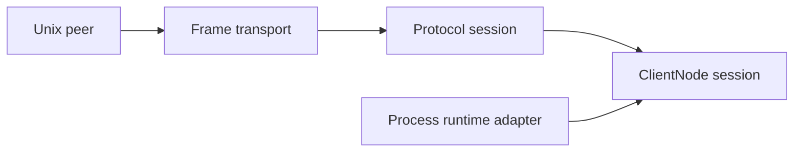

# PipeWire Native Rust Architecture Re-Kickoff

## Why we are re-kicking off

The project has completed enough milestone work that its old framing is no longer
useful.

We are not starting a Rust PipeWire client from scratch. We have one.

We are not merely experimenting with Unix descriptor passing. Receive-side
SCM_RIGHTS and scripted descriptor delivery work in focused tests.

We are not yet finishing a nearly complete node by connecting two crates. The
current node crate provides memfd, mmap, eventfd, activation-region, and worker-loop
primitives, but the repository does not yet model the complete PipeWire ClientNode
session or its media buffers.

This re-kickoff resets the work around the actual missing center:

> Build one ownership-safe, bounded, typed ClientNode process cycle over the native
> protocol, prove it against the scripted peer, and then use the same path for WAV
> playback against a real daemon.

The full evidence and broad architectural critique live in
[`review0.oc.md`](/.design/architecture-review/review0.oc.md). This document is the
shorter operational brief for deciding and starting the next body of work.

## Current position

### What is real

The repository has a substantial control-plane client:

- context and configuration loading;
- main-loop and thread-loop integration;
- native connection framing and generation footers;
- proxy identity and lifecycle;
- object creation and destruction;
- registry enumeration and binding;
- typed marshal modules for many regular PipeWire interfaces;
- a working `pw-browse` application.

The repository has useful deterministic test infrastructure:

- a single-client scripted native peer;
- ordered expectations and emitted actions;
- real Unix stream communication;
- server-to-client SCM_RIGHTS transfer;
- bootstrap, client rejection, and AddMem scenarios.

The repository has useful data-plane substrate:

- memory IDs retaining `OwnedFd` values;
- shared mmap ownership;
- asynchronous eventfd wait and signal;
- activation-memory binding;
- a synchronous callback inside an asynchronous worker lifecycle.

The repository also has a good acceptance target: `pw-wav-player`. It parses WAV
files and shows exactly where the missing node integration begins
([`/examples/wav-player/src/main.rs#L100-L135`](/examples/wav-player/src/main.rs#L100-L135)).

### What is not real yet

The following capabilities should not be described as implemented:

- a PipeWire ClientNode protocol object;
- transport and activation wire coverage sufficient for node bootstrap;
- negotiated port buffers and IO regions;
- typed activation state;
- media buffer mapping and chunk metadata;
- cycle-scoped safe buffer access;
- format-to-buffer contract;
- transport replacement and RemoveMem invalidation;
- a real-time scheduling policy;
- end-to-end audio playback.

The node crate is an activation-signaling substrate. It is not yet a node
implementation.

## Architectural thesis

The next architecture should be organized around four deep modules.



### Frame transport

The frame transport owns incremental byte IO and SCM_RIGHTS association. Its
interface should return complete frames:

```rust
pub struct ReceivedFrame {
    pub header: Header,
    pub payload: Bytes,
    pub fds: Vec<OwnedFd>,
}
```

Callers should not learn about a connection-global FD queue, partial headers,
ancillary buffer parsing, or stream compaction. A frame either owns exactly the
descriptors declared by its header or frame receipt fails and closes all received
resources.

### Protocol session

The protocol session owns:

- sequence numbers;
- generation footers;
- object identity and interface routing;
- typed method/event conversion;
- unknown-object and unknown-opcode policy.

Typed dispatch receives an already-consumed frame. A failed lookup or decode cannot
leave the stream pointed at the same bytes.

### ClientNode session

The ClientNode session owns the actual data-plane domain:

- connection memory pool references;
- per-node transport generation;
- activation state;
- per-port negotiated format;
- port IO and buffer descriptors;
- process-cycle transitions;
- reconfiguration and teardown.

It should expose cycle-scoped typed buffers. It should not make applications parse
activation bytes or locate buffer memory manually.

### Process runtime adapter

Waiting and scheduling are adapter concerns. The ClientNode model should support:

- a dedicated processing thread;
- a Tokio `AsyncFd` adapter;
- potentially a SPA-loop adapter.

Tokio may remain a useful implementation, but it should not define the media-cycle
interface or default real-time contract without measurement.

## Non-negotiable invariants

These invariants are the design rails for the next work.

### Frames own descriptors

Every received FD belongs to one received frame. `header.n_fds` is validated before
dispatch. Missing, extra, truncated, or malformed descriptor data is an error that
does not poison later frames.

### Unique resources have one owner

AddMem is not an ordinary multicast event. One importer receives its `OwnedFd`,
records it in connection-wide memory state, and controls its teardown. Notifications
may be multicast only after ownership is settled.

### Stream progress is independent of semantic support

Unknown object IDs, unknown interfaces, unknown opcodes, and decode errors consume
or reject exactly one complete frame. They cannot wedge the event loop.

### Safe parsers are total over bytes

Every byte slice either decodes or returns an error. It does not panic, loop forever,
overflow arithmetic, allocate from an unbounded peer length, or leak descriptors.

### Safe mappings validate their backing storage

A safe mapped slice implies checked arithmetic, valid file bounds, correct physical
alignment, compatible memory kind, and a stated truncation/revocation policy.

### Thread traits are earned

No macro globally asserts `Send` or `Sync`. Types derive those properties from their
fields or document a local unsafe argument. Event-loop-affine modules expose explicit
cross-thread handles rather than pretending every proxy is freely shareable.

### One cycle owns one validity window

Safe code cannot retain mutable media slices after a process callback returns.
Transport replacement, RemoveMem, or disconnect cannot invalidate a slice while it
is safely borrowed.

### Tests have deadlines

Every scripted-peer and real-daemon test has bounded startup and completion. A
failure reports the last protocol step, buffered frame state, and descriptor count.

## Immediate blockers

The detailed review identifies broad safety debt. The blockers most directly on the
ClientNode path are:

| Blocker | Current evidence | Why it gates node work |
|---|---|---|
| POD parser safety | [`/spa/src/pod/mod.rs`](/spa/src/pod/mod.rs), [`/spa/src/pod/parser.rs`](/spa/src/pod/parser.rs) | ClientNode greatly expands hostile nested POD input |
| Frame/FD disassociation | [`/pipewire/src/protocol/connection.rs#L33-L48`](/pipewire/src/protocol/connection.rs#L33-L48) | Transport and buffers carry unique resources whose order must be exact |
| AddMem raw-FD broadcast | [`/pipewire/src/core.rs#L158-L164`](/pipewire/src/core.rs#L158-L164) | Memory cannot safely reach a node owner through the current event interface |
| Incorrect memory values | [`/node/src/control/events.rs#L19-L26`](/node/src/control/events.rs#L19-L26) | Real SPA memfd value `2` currently becomes `Unknown(2)` |
| Unsafe mmap contract | [`/node/src/shm/memfd.rs#L50-L114`](/node/src/shm/memfd.rs#L50-L114) | Safe callback buffers cannot be built on mappings that can SIGBUS |
| Closed dispatch path | [`/pipewire/src/protocol/client.rs#L218-L308`](/pipewire/src/protocol/client.rs#L218-L308) | Adding ClientNode multiplies manual proxy/marshal/dispatch registration |
| Unstated threading model | [`/pipewire/src/refcounted.rs#L81-L100`](/pipewire/src/refcounted.rs#L81-L100) | Control-loop and process-loop ownership cannot be reasoned about safely |

Plugin FFI lifetime and ABI defects are equally serious for the library's safety
claim, even though they are less directly coupled to the first ClientNode tracer
bullet. They should be tracked as a parallel foundation gate, not forgotten behind
node progress ([`/spa/src/support/ffi/plugin.rs`](/spa/src/support/ffi/plugin.rs)).

## The first architectural decision

We need one decision before broad consolidation:

> Where does the canonical native frame and wire interface live?

### Direction A: a narrow shared protocol crate

Both the product client and scripted peer depend on a dedicated protocol module or
crate containing:

- native header and limits;
- incremental frame IO;
- SCM_RIGHTS send/receive;
- frame-owned descriptors;
- symmetric wire DTOs and canonical opcodes.

This is the preferred target. Two concrete adapters already exist at this seam, so
the seam is not hypothetical.

### Direction B: internal `pipewire::protocol::io`

Move the scripted peer into `pipewire` test support and reuse a sharply bounded
internal protocol module. This is the newest discovery plan's recommendation
([`/doc/discovery/merge.md`](/doc/discovery/merge.md)).

This is a credible intermediate move. It avoids designing another public crate now,
but test support and product internals become more entangled.

### Re-kickoff recommendation

Design the frame interface as if it were a narrow crate, but permit the first
implementation to live under `pipewire::protocol` while the interface settles.

Do not:

- expose the whole existing marshal tree merely to satisfy `server`;
- delete the scripted peer before equivalent deterministic tests use the shared path;
- move client proxy/session behavior into a supposedly generic wire module;
- create a miscellaneous common crate.

The extraction point should become obvious after both connection and scripted peer
consume the same complete-frame interface.

## Tracer-bullet sequence

The work should proceed in vertical proofs, not broad layers that remain unintegrated.

### Proof 1: arbitrary POD bytes are bounded

Deliver:

- audited size arithmetic;
- zero-size and undersized-shape rejection;
- fuzz targets for all POD entry points;
- regression corpus for every panic or hang;
- allocation limits for peer-declared sizes.

Exit condition:

> Arbitrary POD bytes cannot panic, hang, overflow, or allocate without a configured
> bound.

### Proof 2: one frame owns exactly its FDs

Deliver:

- `ReceivedFrame` and `OutboundFrame`;
- incremental header and payload assembly;
- exact FD count validation;
- ancillary truncation cleanup;
- partial-write support;
- consume-before-dispatch behavior;
- `IN | HUP` final-frame handling.

Exit condition:

> Every split and coalescing of a multi-frame exchange produces the same frames and
> no descriptor leaks.

### Proof 3: AddMem safely reaches one memory owner

Deliver:

- canonical SPA memory-kind definitions;
- a single-owner memory-import interface;
- no owning `RawFd` in event callbacks;
- hardened mapping validation;
- explicit RemoveMem and disconnect cleanup;
- descriptor-count assertions.

Exit condition:

> A scripted AddMem is retained, mapped, inspected, removed, and closed exactly once.

### Proof 4: one typed ClientNode transport binds

Deliver:

- the minimum ClientNode wire messages for one output node;
- a per-node state machine rather than one global pending transport;
- typed activation structure access;
- one port's IO and buffer descriptors;
- mapping from memory IDs to valid buffer regions.

Exit condition:

> A scripted peer can configure one node and the library reaches a typed ready-to-process state without application parsing of raw activation bytes.

### Proof 5: one process cycle completes

Deliver:

- real memfd-backed activation and media buffers;
- real trigger and completion eventfds;
- a cycle-scoped writable output buffer;
- known PCM bytes written by the callback;
- chunk/status updates;
- completion observed by the peer;
- teardown during or after the cycle.

Exit condition:

> The scripted peer verifies one complete process cycle, output bytes, state transition,
> completion signal, and zero leaked resources.

### Proof 6: the same path plays WAV audio

Deliver:

- adapter-node creation;
- format negotiation or explicit rejection;
- buffer filling from parsed WAV frames;
- underrun and end-of-stream behavior;
- coordinated PipeWire-loop and worker shutdown;
- real-daemon compatibility test.

Exit condition:

> `pw-wav-player` produces audible output through first-class library interfaces and
> contains no raw activation/buffer integration TODO.

## Workstreams

The tracer bullet is the main line. Three supporting workstreams can proceed without
inventing competing architecture.

### Safety workstream

- POD no-panic hardening and fuzzing.
- Plugin ABI and lifetime correction.
- Removal of blanket unsafe concurrency traits.
- Shared-memory bounds, alignment, and revocation contract.
- FD leak and sanitizer harnesses.

### Test-infrastructure workstream

- Stateful frame segmentation harness.
- Deadline and diagnostics support.
- Typed scripted-peer object table.
- Startup and asynchronous event actions.
- “must happen,” “may happen,” and “must not happen” expectations.
- Differential protocol tests against upstream PipeWire.

### Documentation workstream

- ADR for canonical wire and scripted-peer placement.
- ClientNode state-machine document.
- Native frame/FD ownership contract.
- Threading and runtime contract.
- Shared-memory safety contract.
- Discovery index marking historical, active, superseded, and accepted documents.
- README workspace and maturity map.

## Suggested first tickets

These are ticket-sized starts, not an attempt to encode the entire program at once.

### `protocol-frame-model`

Define `Header`, `ReceivedFrame`, `OutboundFrame`, limits, and ownership invariants.
Add tests for exact FD-count matching and unknown-frame consumption. Do not yet move
all marshal DTOs.

### `protocol-segmented-recv`

Implement incremental reads and test every header/payload split, coalesced frames,
EINTR, final `IN | HUP`, and disconnect mid-frame.

### `protocol-partial-send`

Implement outbound frames with FDs, ensuring ancillary data is sent once while
remaining bytes can be flushed over multiple writes.

### `spa-pod-no-panic`

Fix known zero-size, undersized-body, array, choice, and object parser failures. Add
a first fuzz target and seed corpus.

### `core-memory-importer`

Replace AddMem raw-FD broadcast with one `OwnedFd` consumer. Define duplicate ID,
RemoveMem, listener failure, and disconnect semantics.

### `node-safe-mapping`

Add checked arithmetic, `fstat`, page-aligned physical mappings, logical subranges,
memory-kind validation, and short-file/unaligned/overflow tests.

### `client-node-minimum-protocol`

Inventory upstream messages required for one output node and implement only the
minimum typed DTOs and dispatch registration needed for transport, activation, IO,
and buffers.

### `client-node-cycle-test`

Build the deterministic one-cycle scenario and make it the product-path acceptance
test.

## Challenge tasks

Use these to pressure-test the design rather than reward superficial progress.

### Every split

The same multi-frame exchange must work with every possible byte split, frame
coalescing, and final-close position.

### Every failure closes

Measure `/proc/self/fd` before and after malformed headers, truncated cmsgs, missing
FDs, extra FDs, decode errors, mmap errors, callback errors, and disconnect.

### Every ordering converges or rejects

Generate permutations of AddMem, transport, activation, buffers, RemoveMem,
replacement, activation, and disconnect. Valid permutations converge to the same
ready state; invalid ones return typed errors.

### No retained cycle borrows

Use compile-fail tests to prove that safe callbacks cannot retain mutable activation,
IO, or buffer slices after the cycle returns.

### Runtime bake-off

Run identical cycle loads through Tokio and a dedicated thread. Compare wake latency,
jitter, callback overrun behavior, shutdown bounds, starvation under unrelated load,
and allocations.

### Upstream differential

Compare all implemented ClientNode payloads and headers with upstream C PipeWire.
Differences require an explicit compatibility explanation.

## Things to defer

These ideas are worthwhile but should not interrupt the tracer bullet:

- full ClientNode protocol parity before one output path works;
- OSC endpoints;
- generalized media conversion;
- DMA-BUF processing beyond explicit rejection or policy;
- multiple runtime integrations before the first bake-off;
- public stabilization of low-level wire DTOs;
- a production PipeWire server;
- broad cosmetic proxy-interface redesign.

The exception is a safety defect that invalidates the claimed safe Rust interface.
Those remain foundation work even when they do not directly advance playback.

## Decision log to open

The re-kickoff needs explicit decisions on these points:

| Decision | Default recommendation | Evidence needed to change it |
|---|---|---|
| Wire placement | Narrow crate-shaped module, extract after two consumers use it | Demonstrated feature/dependency cost outweighs test and ownership locality |
| AddMem ownership | One importer, not multicast callbacks | A safe explicit descriptor-duplication use case |
| Node state identity | Per ClientNode object with connection-wide memory pool | Upstream lifecycle evidence that state is truly connection-global |
| Runtime default | Undecided until Tokio/thread bake-off | Latency, jitter, shutdown, and allocation results |
| Scripted peer | Keep as a test adapter; share wire, not proxy behavior | A simpler in-crate placement preserving the same isolation and usability |
| Unknown protocol data | Consume frame and report/ignore by policy | Upstream compatibility requirement demanding connection termination |
| RemoveMem | Deterministic invalidation with no new borrows | Upstream proof that mappings remain valid indefinitely |

## Definition of the next milestone

The next milestone is complete only when all of the following are true:

- Arbitrary POD and native-frame input is bounded and fuzzed at the implemented surface.
- Frame payload and descriptors have one ownership object.
- AddMem imports an `OwnedFd` without broadcasting an owning raw descriptor.
- Memory types come from one canonical SPA definition.
- Mappings validate bounds and alignment before exposing slices.
- One per-node state machine binds activation, IO, and output buffers.
- A callback receives a cycle-scoped typed output buffer.
- A scripted peer triggers and verifies one complete cycle.
- RemoveMem or disconnect tears the cycle down without leaks or stale access.
- Every integration path has a deadline and useful failure report.

Audible WAV output is the immediate next acceptance point after this milestone. It
should use the same interfaces and state transitions, not a separate example-only
shortcut.

## Starting prompt

Use this prompt to start implementation or another independent design pass:

> In `pipewire-native-rs`, design and implement the smallest ownership-safe vertical
> slice that receives one complete native frame with exact SCM_RIGHTS association,
> imports one AddMem `OwnedFd`, binds one ClientNode activation and output-buffer
> configuration, executes one cycle-scoped process callback, signals completion,
> and tears down without leaks. Preserve the existing control-plane proxy interface
> where possible. Keep the scripted peer deterministic, make every test bounded,
> and do not expose raw activation bytes or owning `RawFd` values to applications.

## Re-kickoff summary

We should be confident about what has been accomplished. The project has a real
control-plane client, valuable SPA machinery, a deterministic native peer, and the
correct low-level ingredients for a data plane.

We should also be precise about the gap. The missing work is not mainly crate wiring.
It is the ownership and state model joining native frames, descriptors, exported
memory, ClientNode transport, negotiated buffers, and process-cycle lifetimes.

The project should now optimize for one truthful vertical proof. Secure the parser
and FD foundations, model one node session, complete one deterministic cycle, then
play a WAV through exactly that path.

## Cross-references

- [`review0.oc.md`](/.design/architecture-review/review0.oc.md): full architecture, safety, testing, and documentation review supporting this restart brief.
- [`/doc/discovery/node.md`](/doc/discovery/node.md): initial data-plane plan; useful historical intent, but its current-state sections conflict and should not drive execution unchanged.
- [`/doc/discovery/node-integration.md`](/doc/discovery/node-integration.md): original control/data-plane bridge analysis; this re-kickoff adds the missing ClientNode buffer and session model.
- [`/doc/discovery/server.md`](/doc/discovery/server.md): rationale for deterministic real-socket testing, retained as a core strategy here.
- [`/doc/discovery/server-unification.md`](/doc/discovery/server-unification.md): prior argument for shared protocol types, aligned with the preferred target direction.
- [`/doc/discovery/merge.md`](/doc/discovery/merge.md): latest in-crate scripted-peer proposal, retained as a credible intermediate placement rather than assumed final architecture.
- [`/doc/discovery/merge-impl-plan.md`](/doc/discovery/merge-impl-plan.md): consolidation plan that should follow, rather than precede, the canonical frame-interface decision.
- [`/doc/discovery/osc.md`](/doc/discovery/osc.md): valuable downstream application to resume after the generic ClientNode cycle and buffer model work.
- [`/examples/wav-player/src/main.rs`](/examples/wav-player/src/main.rs): application-level acceptance target and clearest current marker of the missing vertical integration.
