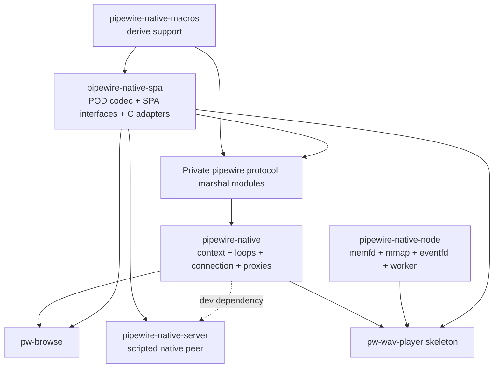
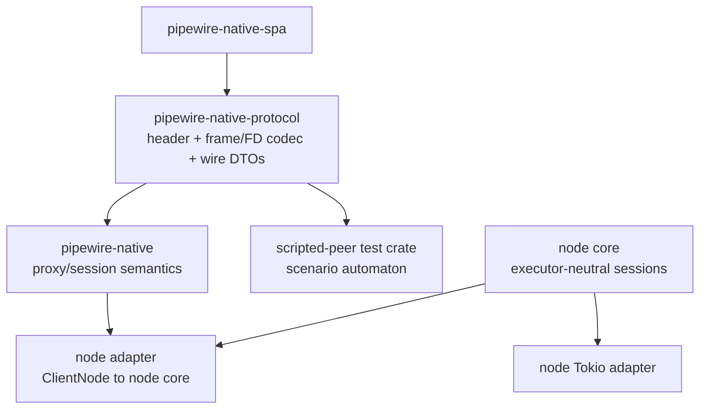
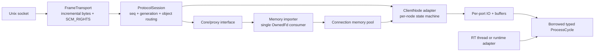
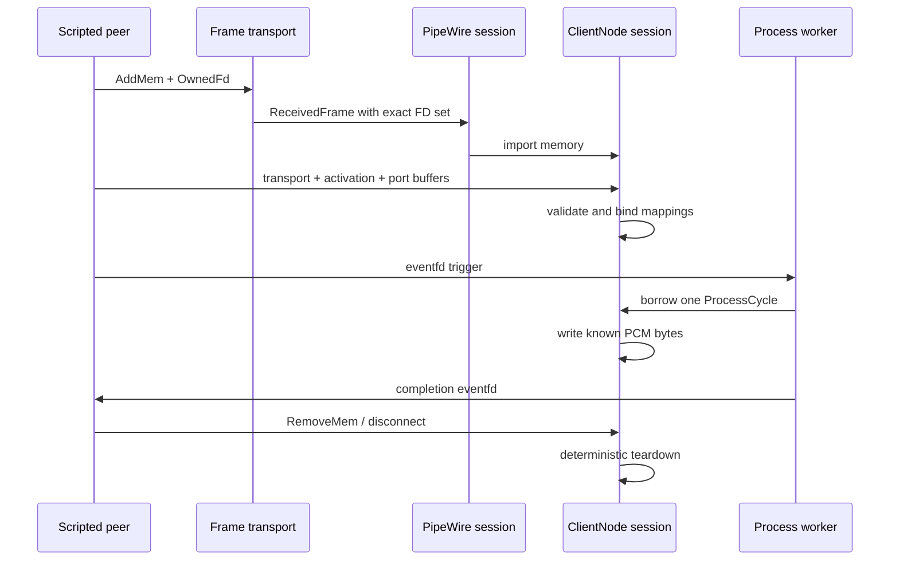
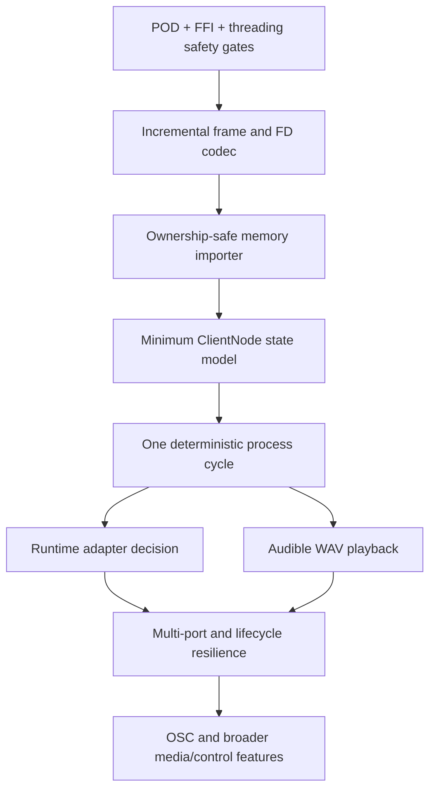

# PipeWire Native Rust Architecture Review

## Review scope

This review asks five questions:

1. What has actually been built?
2. Which modules are deep enough to justify their interfaces and seams?
3. Which risks are architectural rather than local implementation defects?
4. What other credible architectures could support the same goals?
5. What sequence of work best tests the architecture instead of merely extending it?

The review covers the full workspace, with special attention to [`/spa`](/spa),
[`/pipewire`](/pipewire), [`/server`](/server), [`/node`](/node), the test suites,
the WAV-player example, discovery documents, recent history, and the current beads
roadmap.

## Executive assessment

This repository contains three substantial but differently mature systems:

1. A credible native Rust PipeWire control-plane client.
2. A useful deterministic native-protocol scripted peer for integration tests.
3. An early data-plane substrate for memfd mapping, eventfd signaling, and activation-memory callbacks.

The first is a real library. The second is a valuable test adapter. The third is
not yet a PipeWire node implementation: it is the operating-system and runtime
substrate on which a node implementation could be built.

That distinction matters. The missing work is not just connective glue between
otherwise complete crates. The repository still lacks the domain model and wire
coverage for a hosted `ClientNode`: transport and activation structures, port IO,
buffer descriptors, media memory, negotiated format, process-cycle validity,
reconfiguration, and teardown.

The strongest architecture already present is the separation between SPA POD and
support primitives in `spa` and PipeWire object/proxy semantics in `pipewire`.
The strongest new idea is deterministic testing over a real Unix stream with
SCM_RIGHTS. The largest weakness is that the wire framing and descriptor ownership
model is not itself a deep module. Client and test peer each implement part of it,
received descriptors are not bound to frames, and the public event model cannot
safely transfer unique descriptor ownership.

The next milestone should therefore not be described as “finish wiring the node
crate.” It should be:

> Prove one ownership-safe, bounded, typed ClientNode cycle from a scripted native
> peer through frame and FD receipt, memory import, activation and buffer binding,
> callback execution, completion signaling, and teardown.

That tracer bullet will validate the major seams. Audible WAV playback should
follow immediately, but it is not a substitute for the deterministic cycle test.

## What was built

### Workspace map



The manifests make three architectural facts explicit:

- `pipewire-native` depends on SPA and macros, and owns the private native marshal stack ([`/pipewire/Cargo.toml`](/pipewire/Cargo.toml), [`/pipewire/src/protocol`](/pipewire/src/protocol)).
- `pipewire-native-server` depends only on SPA, so it independently reimplements native frame and protocol types ([`/server/Cargo.toml`](/server/Cargo.toml), [`/server/src/protocol/frame.rs`](/server/src/protocol/frame.rs)).
- `pipewire-native-node` depends only on libc and Tokio; no production dependency connects it to the PipeWire client ([`/node/Cargo.toml`](/node/Cargo.toml)).

### The control-plane client is substantial

The main crate is not a toy binding layer. It provides:

- PipeWire initialization, contexts, configuration, main loops, and thread loops.
- Native Unix-socket framing, buffering, generation footers, and receive-side SCM_RIGHTS.
- Core, registry, client, node, port, device, factory, module, link, metadata, and profiler proxies.
- Typed method encoding and event decoding for those interfaces.
- Proxy identity, object registration, listener dispatch, binding, creation, and destruction.
- A TUI browser exercising object enumeration and parameter inspection.

The closed dispatch table in [`/pipewire/src/protocol/client.rs#L218-L308`](/pipewire/src/protocol/client.rs#L218-L308)
and object factory in [`/pipewire/src/core.rs#L206-L225`](/pipewire/src/core.rs#L206-L225)
show both the breadth of implemented interfaces and the cost of adding another
one. This is a credible control-plane implementation with an extensibility problem,
not an incomplete proof of concept.

### The scripted peer is a real testing capability

The `server` crate adds a testing level that the repository previously lacked:

- deterministic ordered expectations and actions;
- real Unix stream framing rather than mock calls;
- server-to-client descriptor transfer;
- startup, rejection, and AddMem scenarios;
- focused failure locations rather than host-daemon dependence.

Its narrow scope is appropriate. It should remain a scripted peer, not evolve into
a general PipeWire daemon. Its value comes from controlled protocol adversity and
repeatability, not server feature count.

### The node crate is a substrate, not yet a node

The node crate currently owns:

- an `OwnedFd` memory registry ([`/node/src/shm/registry.rs`](/node/src/shm/registry.rs));
- mmap ownership and byte-slice access ([`/node/src/shm/memfd.rs`](/node/src/shm/memfd.rs));
- Tokio `AsyncFd` eventfd signaling ([`/node/src/signal/eventfd.rs`](/node/src/signal/eventfd.rs));
- binding two eventfds and one activation-memory region ([`/node/src/transport/mod.rs#L33-L76`](/node/src/transport/mod.rs#L33-L76));
- a worker that waits, passes raw activation bytes to a callback, and signals completion ([`/node/src/runtime/mod.rs#L13-L59`](/node/src/runtime/mod.rs#L13-L59));
- a small accumulator for AddMem, RemoveMem, and one pending transport ([`/node/src/control/mod.rs#L15-L60`](/node/src/control/mod.rs#L15-L60)).

It does not yet model a PipeWire media cycle. `ProcessCycle` has only a trigger
counter and raw activation bytes. It cannot locate, validate, dequeue, write, or
recycle an audio buffer. It has no per-port or per-node identity. The comments in
[`/examples/wav-player/src/main.rs#L100-L135`](/examples/wav-player/src/main.rs#L100-L135)
correctly expose this gap.

### Test inventory and current signal

The workspace has meaningful tests in four bands:

| Band | Existing evidence | Main limitation |
|---|---|---|
| SPA unit/integration | POD, hooks, FFI, thread behavior | Almost entirely valid-input examples; hostile parser inputs are missing |
| Client integration | loop and real-daemon object lifecycle | Host-dependent and insufficiently bounded |
| Scripted peer | frame roundtrip, bootstrap, rejection, AddMem | Happy-path packetization; limited asynchronous and adversarial behavior |
| Node primitives | mmap, eventfd, transport bind | One valid case per primitive; no lifecycle or failure matrix |

Verification during this review:

```text
cargo test -p pipewire-native-node -p pipewire-native-server
10 passed, 0 failed

cargo test -p pipewire-native --test scripted_server_add_mem -- --nocapture
1 passed, 0 failed
```

An independent review run observed the AddMem test miss its final `Done` after a
socket HUP, while this review's rerun passed. The implementation handles `ERR | HUP`
before `IN` in [`/pipewire/src/protocol/client.rs#L154-L177`](/pipewire/src/protocol/client.rs#L154-L177),
so final readable data can be discarded when readiness reports `IN | HUP`. Treat
this as a race to make deterministic with an adversarial test, not as an
always-failing test.

The full workspace suite was reported by multiple independent review runs to
remain in the real-daemon test for over 60 seconds. That test spawns `pipewire`,
sleeps a fixed 500 ms, and has no outer watchdog
([`/pipewire/tests/lib.rs#L40-L53`](/pipewire/tests/lib.rs#L40-L53)). CI runs plain
`cargo test`, not an explicit workspace/test-class matrix
([`/.gitlab-ci.yml#L86-L106`](/.gitlab-ci.yml#L86-L106)).

## Architecture findings

Findings are ordered by the potential to invalidate the architecture or safety
story, not by ease of repair.

### Critical: hostile POD input can panic or hang the process

The SPA POD codec is a deep and central module, but its decoder currently assumes
too much about peer-provided sizes.

Examples:

- Primitive decode validates the header and declared primitive size but not that the fixed body is present before `decode_body` ([`/spa/src/pod/mod.rs#L225-L250`](/spa/src/pod/mod.rs#L225-L250)).
- String and bytes decoders read `[0..4]` before checking that eight header bytes exist ([`/spa/src/pod/mod.rs#L487-L508`](/spa/src/pod/mod.rs#L487-L508), [`/spa/src/pod/mod.rs#L545-L560`](/spa/src/pod/mod.rs#L545-L560)).
- A zero-length string underflows `len - 1` ([`/spa/src/pod/mod.rs#L502-L504`](/spa/src/pod/mod.rs#L502-L504)).
- Array decode permits `size < 8` and `child_size == 0`, leading to subtraction underflow or division by zero ([`/spa/src/pod/mod.rs#L694-L726`](/spa/src/pod/mod.rs#L694-L726)).
- Raw-array parsing never advances when `child_size == 0` ([`/spa/src/pod/parser.rs#L94-L134`](/spa/src/pod/parser.rs#L94-L134)).
- Choice parsing computes child ranges before fully validating each shape and divides by `child_size` for enum choices ([`/spa/src/pod/parser.rs#L144-L238`](/spa/src/pod/parser.rs#L144-L238)).
- Object parsing subtracts eight from an insufficient declared object size ([`/spa/src/pod/parser.rs#L275-L332`](/spa/src/pod/parser.rs#L275-L332), [`/spa/src/pod/parser.rs#L335-L385`](/spa/src/pod/parser.rs#L335-L385)).

These are protocol-facing parser defects. A malformed or merely unsupported peer
message can crash or wedge the client. Before extending protocol coverage, the
project needs a parser invariant audit and no-panic/no-hang fuzz target.

### Critical: AddMem ownership is incompatible with multicast listeners

Receive code correctly creates an `OwnedFd`, but core demarshal converts it to one
owning `RawFd` ([`/pipewire/src/protocol/marshal/core.rs#L292-L308`](/pipewire/src/protocol/marshal/core.rs#L292-L308)).
The event system broadcasts callback arguments to every listener. The built-in
listener closes the descriptor immediately
([`/pipewire/src/core.rs#L158-L164`](/pipewire/src/core.rs#L158-L164)).

Today external listeners cannot observe AddMem because those fields are private
([`/pipewire/src/core.rs#L361-L378`](/pipewire/src/core.rs#L361-L378)). Simply making
them public would be unsafe: the first listener can close the descriptor and every
later listener receives a stale integer. Descriptor-number reuse could turn that
into access to an unrelated resource.

Unique resources should not cross the ordinary multicast event interface. The
correct seam is a single-owner memory-import adapter installed on a connection or
core. It receives `OwnedFd` exactly once, records it in a connection-wide memory
pool, and may emit a non-owning notification afterward. Explicit `try_clone()` is
appropriate only when duplication is intentional.

### Critical: frames and descriptors are not one ownership unit

The native header declares `n_fds`, but the client stores every received descriptor
in one connection-global queue
([`/pipewire/src/protocol/connection.rs#L33-L48`](/pipewire/src/protocol/connection.rs#L33-L48),
[`/pipewire/src/protocol/connection.rs#L418-L440`](/pipewire/src/protocol/connection.rs#L418-L440)).
Demarshal code then pops the next descriptor without validating the current
header's count ([`/pipewire/src/protocol/connection.rs#L323-L325`](/pipewire/src/protocol/connection.rs#L323-L325)).

Unknown objects, unknown events, decode errors, coalesced receives, missing FDs, or
extra FDs can therefore shift association and hand a later message the wrong
resource. Outbound FD support is also unfinished: headers hard-code `n_fds = 0`
while an unused raw-FD queue exists
([`/pipewire/src/protocol/connection.rs#L125-L135`](/pipewire/src/protocol/connection.rs#L125-L135)).

The missing deep module is a frame codec with this conceptual result:

```rust
pub struct ReceivedFrame {
    pub header: Header,
    pub payload: Bytes,
    pub fds: Vec<OwnedFd>,
}
```

Frame completion must include exact descriptor-count validation. Typed dispatch
must consume or reject an already-owned frame; it must never control stream-buffer
advancement.

### Critical: blanket `Send` and `Sync` assertions erase the actual threading model

The `refcounted!` macro unconditionally marks every generated strong and weak type
as `Send + Sync`, regardless of inner fields
([`/pipewire/src/refcounted.rs#L81-L100`](/pipewire/src/refcounted.rs#L81-L100)).
Affected internals include callback tables that do not themselves require
`Send + Sync` and state that appears event-loop-affine.

This has two architectural effects:

1. Rust cannot expose where PipeWire objects are thread-affine.
2. The repository accumulates locks as a substitute for a stated concurrency model.

The macro should not assert concurrency traits. Inner types should derive them
automatically where valid. Loop-affine objects should remain non-`Send`, with a
separate command or wake handle for cross-thread interaction. If a type truly
requires a manual unsafe implementation, that implementation belongs beside the
specific type with a documented safety argument.

### Critical: SPA plugin lifetimes and C ABIs are not represented safely

The FFI plugin module exposes C vtable entries as Rust-ABI `fn` pointers rather
than `unsafe extern "C" fn`
([`/spa/src/support/ffi/plugin.rs#L69-L88`](/spa/src/support/ffi/plugin.rs#L69-L88),
[`/spa/src/support/ffi/plugin.rs#L164-L170`](/spa/src/support/ffi/plugin.rs#L164-L170)).
That is not a sound cross-language contract.

There are also two unrepresented lifetime chains:

- A factory stores a pointer into a dynamic library but does not retain the `Plugin`/`Library` ([`/spa/src/support/ffi/plugin.rs#L23-L45`](/spa/src/support/ffi/plugin.rs#L23-L45)).
- An interface stores a pointer into a handle but does not retain the handle, which is cleared and freed on drop ([`/spa/src/support/ffi/plugin.rs#L172-L217`](/spa/src/support/ffi/plugin.rs#L172-L217)).

The source acknowledges the second issue
([`/spa/src/interface/plugin.rs#L99-L108`](/spa/src/interface/plugin.rs#L99-L108)).
These ownership chains should be modeled with shared owners or borrowing rather
than documented as caller discipline.

### High: unknown object IDs can wedge client dispatch

`next_message()` identifies a complete frame without consuming it. If object lookup
fails, `process_messages()` returns success without calling `decode_message()`, the
only operation that advances the input offset
([`/pipewire/src/protocol/client.rs#L218-L230`](/pipewire/src/protocol/client.rs#L218-L230),
[`/pipewire/src/protocol/connection.rs#L260-L278`](/pipewire/src/protocol/connection.rs#L260-L278)).

The event loop then repeatedly sees the same header. This is another consequence
of coupling frame consumption to typed dispatch. An owned `ReceivedFrame` fixes
both this defect and descriptor association.

### High: the scripted peer is not a correct stream codec

The server requires one `recvmsg` call to return the complete 16-byte header
([`/server/src/protocol/frame.rs#L100-L154`](/server/src/protocol/frame.rs#L100-L154)).
Unix stream sockets preserve byte order, not write boundaries; fragmented headers
are valid.

Its FD-bearing sender reports every partial `sendmsg` as terminal failure instead
of sending ancillary data once and continuing the remaining bytes
([`/server/src/protocol/frame.rs#L280-L296`](/server/src/protocol/frame.rs#L280-L296)).
It also adopts received descriptors only after payload `read_exact`, so descriptors
can leak on early frame errors
([`/server/src/protocol/frame.rs#L139-L169`](/server/src/protocol/frame.rs#L139-L169)).

These limitations do not erase the value of the test peer, but they mean current
tests prove only friendly local packetization. The shared codec should be tested at
every byte split, not just with one socketpair roundtrip.

### High: memory type constants have already drifted

The node crate maps `0` to memfd and `1` to DMA-BUF
([`/node/src/control/events.rs#L19-L26`](/node/src/control/events.rs#L19-L26)).
The server uses SPA's `MEM_FD = 2` and `DMA_BUF = 3`
([`/server/src/protocol/messages.rs#L37-L50`](/server/src/protocol/messages.rs#L37-L50)).
The AddMem integration scenario sends `2`.

Real memfd events therefore become `MemoryType::Unknown(2)`. This remains hidden
because `ControlPlaneState::on_add_mem` ignores both type and flags
([`/node/src/control/mod.rs#L28-L34`](/node/src/control/mod.rs#L28-L34)).

This is direct evidence that protocol-domain values need one canonical home. SPA
data kinds belong in `pipewire-native-spa`, not independently in node and server.

### High: mmap's safe interface does not uphold its implied safety contract

`MappedRegion::map_shared` validates nonzero length and conversion of offset to
`off_t`, but does not:

- check `offset + len` overflow;
- inspect backing-object size with `fstat`;
- reject or compensate for non-page-aligned offsets;
- enforce a compatible memory kind;
- consider truncation or sealing after mapping.

See [`/node/src/shm/memfd.rs#L50-L94`](/node/src/shm/memfd.rs#L50-L94). An mmap can
succeed beyond EOF and later SIGBUS when the safe-looking slice is accessed.
The document promised bounds checking before exposing slices
([`/doc/discovery/node.md#L96-L101`](/doc/discovery/node.md#L96-L101)); the
implementation does not yet satisfy that guardrail.

The wrapper also manually implements `Sync` while permitting mutable access through
`&mut self`. That may be defensible under Rust's borrowing rules, but shared memory
has external concurrent writers, so the interface must state whether bytes are
volatile, atomic, synchronized by cycle protocol, or merely raw storage.

### High: the event interface invokes user code while holding its own mutex

`emit_hook!` locks the hook list and calls every `FnMut` while retaining that lock
([`/spa/src/hook.rs#L92-L119`](/spa/src/hook.rs#L92-L119)). A callback that adds or
removes a listener on the same object deadlocks. Arbitrary callback latency also
blocks listener management and event dispatch.

The listener mechanism is broad and shallow: each proxy repeats add/remove methods,
callers retain numeric IDs manually, and lifecycle policy leaks into application
code. A deeper event-source module should provide an RAII subscription token,
reentrancy-safe dispatch, and a defined mutation policy during emission.

### High: `ControlPlaneState` is not a node state machine

`ControlPlaneState` has one connection-wide memory registry and one
`pending_transport`. A later transport silently replaces the first. Binding removes
the pending transport before mapping succeeds, so a failed bind destroys retry
state and closes its eventfds
([`/node/src/control/mod.rs#L41-L60`](/node/src/control/mod.rs#L41-L60)).

It has no object identity, transport generation, duplicate policy, bound state,
reconfiguration state, or invalidation behavior when RemoveMem revokes an active
mapping. The interface appears simple because the implementation omits required
domain behavior, not because it hides that behavior deeply.

The next design should distinguish:

- connection-wide exported memory;
- per-ClientNode session state;
- per-port configuration and buffers;
- transport generations and replacement;
- cycle-time borrows;
- teardown and reconnect.

### High: Tokio currently defines the process path

The design says Tokio is for orchestration, but `NodeRuntime::run` waits and executes
the synchronous user callback directly inside a Tokio task
([`/node/src/runtime/mod.rs#L36-L55`](/node/src/runtime/mod.rs#L36-L55)).

There is no real-time scheduling contract, overrun policy, callback isolation,
latency metric, or dropped-handle shutdown behavior. A blocking callback blocks a
runtime worker. Signaling always writes `1`, regardless of the drained trigger
count.

Keep Tokio as one adapter, not the definition of node processing. The domain model
should support a dedicated processing thread and, potentially, SPA loop integration.
Benchmarking both adapters under load is a design task, not a late optimization.

### Medium: protocol and proxy extension is closed and repetitive

Adding a protocol interface currently touches:

- a proxy wrapper;
- a methods closure table;
- an events callback struct;
- a marshal enum and structs;
- object construction by interface string;
- incoming dispatch by interface string;
- often repeated listener plumbing.

The pattern is visible in node proxy and marshal modules
([`/pipewire/src/proxy/node.rs`](/pipewire/src/proxy/node.rs),
[`/pipewire/src/protocol/marshal/node.rs`](/pipewire/src/protocol/marshal/node.rs)).
The macros reduce encoding boilerplate but do not remove the closed registration
steps.

ClientNode will make this cost acute because it has a large method/event surface.
Protocol schemas or generated declarations should become the source for opcodes,
wire DTOs, and dispatch registration. Handwritten code should concentrate on
semantic adaptation and public interfaces.

### Medium: nominal message decode has an inverted success condition

`Message::decode` returns success when calculated sizes differ and returns “Data
left over” when they match
([`/pipewire/src/protocol/marshal/message.rs#L52-L87`](/pipewire/src/protocol/marshal/message.rs#L52-L87)).
This appears not to be the main receive path, which is probably why existing tests
do not expose it. It is nevertheless a warning against reusing nominally generic
protocol code during consolidation without direct tests.

### Medium: the scripted scenario model is too linear for the next milestone

The current scenario is an ordered list where each step consumes one inbound packet
and then emits actions. That is excellent for bootstrap. It is insufficient for:

- startup events before an inbound method;
- optional/interleaved messages;
- barriers and deadlines;
- asynchronous server events;
- explicit “must not occur” windows;
- multiple object identities sharing opcode values;
- transport replacement or teardown during a cycle.

Do not turn it into a daemon. Evolve it into a small typed event automaton with an
object table and bounded expectations.

## Deep-module review

### `spa::pod`: high leverage, safety debt at the interface

The POD module has strong depth. Callers get builders, parsers, typed PODs, raw PODs,
objects, arrays, choices, and derived structures through a relatively small set of
concepts. Deleting it would spread wire-format complexity throughout every marshal
module.

Its problem is not shallowness. Its problem is that the interface promises safe
decode results while the implementation does not yet defend all declared lengths.
This deserves concentrated hardening rather than replacement.

### `pipewire` proxies: useful domain interface, expensive extension surface

Users can work with `Core`, `Registry`, `Node`, and other domain objects without
manually handling headers and PODs. That is real leverage. The public object model
is earning its keep.

Internally, however, closure tables, proxy wrappers, event structs, and marshal
enums repeat the same mechanics. The deletion test says the public proxy module is
deep, while several internal seams are shallow. Code generation or one internal
`ProtocolObject` dispatch interface could improve locality without changing the
public model.

### Native connection: currently too many responsibilities behind the wrong interface

`Connection` owns buffering, framing, sequence allocation, generation tracking,
SCM_RIGHTS parsing, descriptor queues, encoding, flushing, footer parsing, and
listener signaling. That could be deep, but its interface leaks ordering assumptions
(`next_message`, then type lookup, then typed decode, then `pop_fd`) that callers
must obey precisely.

Splitting an internal `FrameTransport` from protocol-session concerns would make
both modules deeper:

- `FrameTransport`: bytes, partial IO, frames, descriptors, limits.
- `ProtocolSession`: generation, sequence, typed method/event adaptation.

### Scripted peer: a good adapter around a duplicated implementation

The scenario vocabulary is a useful interface. The peer should keep that interface
and replace its private framing/message implementation with shared wire modules.
Its seam is justified because it is a second real adapter with different orchestration
and dependencies.

### Node primitives: good internal modules, premature external composition

`EventFd`, `MemoryRegistry`, and `MappedRegion` are directionally good focused
modules. They can become deep after safety contracts and negative tests are added.

`ControlPlaneState`, `BoundTransport`, and `ProcessCycle` do not yet hide a complete
domain behavior. They expose OS primitives because the PipeWire node session has
not been modeled. Keep them internal or explicitly experimental until the typed
session interface emerges from the vertical slice.

## Credible target architectures

### Option A: shared native-wire crate, separate client and scripted peer



This is the preferred long-term architecture.

Why it is justified:

- There are already two concrete adapters at the seam: client and scripted peer.
- Frame/FD correctness is independently complex and security-sensitive.
- Test-only dependencies remain out of the product client.
- Server and client can share exact wire declarations without sharing proxy/session behavior.
- A future protocol analyzer or alternate transport can reuse the same module.

The crate should be narrow. It should not become a miscellaneous “common” crate.
Its interface should center on complete frames, exact descriptor ownership, limits,
and symmetric wire DTOs.

### Option B: merge scripted peer into `pipewire` test support

This is the accepted direction in the newest discovery docs
([`/doc/discovery/merge.md#L224-L246`](/doc/discovery/merge.md#L224-L246)). It is
credible and minimizes workspace crates.

Advantages:

- private marshal types can be reused immediately;
- no public protocol crate must be designed yet;
- migration can be incremental.

Costs:

- integration tests cannot naturally consume private library internals without
  feature or module-placement complexity;
- test dependencies and product internals become more entangled;
- the wire seam remains implicit inside the larger client module;
- it encourages sharing client dispatch concepts that a peer should not share.

This is a reasonable intermediate refactor, but it should not be treated as an
architectural truth. If used, still create a sharply bounded internal `protocol::io`
module that could later move unchanged.

### Option C: one feature-gated product crate

One `pipewire-native` crate could expose optional `node`, `node-tokio`, and `testkit`
features. This reduces publishing and dependency-management overhead while the API
is pre-1.0.

The risk is a wide, shallow interface and complex feature combinations. This is
credible only if modules remain domain-grouped and the default control-plane client
does not acquire Tokio or test dependencies.

### Option D: actor-owned data-plane integration

Regardless of crate placement, an actor-like ownership adapter is compelling. One
owner receives commands such as:

```rust
enum DataPlaneCommand {
    AddMemory { id: u32, kind: MemoryType, fd: OwnedFd, flags: u32 },
    RemoveMemory { id: u32 },
    InstallTransport { node_id: u32, transport: TransportDescriptor },
    ConfigurePort { node_id: u32, port_id: u32, buffers: Vec<BufferDescriptor> },
    Disconnect,
}
```

The PipeWire loop transfers unique resources into this owner over a bounded channel.
The data-plane side owns mappings and teardown. Ordinary listeners receive copyable
state notifications, not owning descriptors. This cleanly separates callback locks,
thread affinity, and resource lifetime.

## Recommended architecture

Adopt Option A as the target and use a product-first tracer bullet to discover the
minimum interface.



Key interface rules:

1. A frame owns its descriptors.
2. Typed dispatch receives an already-consumed frame.
3. AddMem has exactly one owning consumer.
4. Exported memory is connection-wide; transport, ports, and cycle state are per node.
5. Mappings cannot outlive registry entries or transport generations without an explicit retention rule.
6. Buffer access is borrowed for one cycle and cannot be retained by safe code.
7. Runtime choice is an adapter seam; Tokio is optional.
8. The scripted peer shares wire types and frame transport, not client proxy behavior.

## Prioritized next-work map

### Gate 1: secure the existing foundations

These tasks precede broad ClientNode implementation because new protocol coverage
would multiply current failure modes.

| Priority | Task | Acceptance signal |
|---|---|---|
| P0 | Harden all POD decoders | Every arbitrary byte slice returns or errors without panic, hang, overflow, or oversized allocation |
| P0 | Add POD fuzzing | Seed corpus covers zero child size, short bodies, invalid nesting, extreme lengths, and padding |
| P0 | Remove blanket `Send`/`Sync` | Compiler derives valid traits; loop-affine objects have explicit cross-thread handles |
| P0 | Correct plugin ABI/lifetimes | All C entries are `unsafe extern "C"`; library, factory, handle, and interface drop orders are safe |
| P0 | Bound integration tests | Every daemon/scripted test has startup and completion deadlines with useful diagnostics |

### Gate 2: make native transport one deep module

| Priority | Task | Acceptance signal |
|---|---|---|
| P0 | Introduce `ReceivedFrame`/`OutboundFrame` | Payload and exact `Vec<OwnedFd>` move together |
| P0 | Implement incremental read/write | Every header/payload byte split and partial write succeeds correctly |
| P0 | Validate ancillary data | `n_fds`, truncation, malformed cmsg, limits, and leak paths are tested |
| P1 | Decouple consume from dispatch | Unknown object/opcode is consumed once and cannot wedge the loop |
| P1 | Drain `IN` before terminal HUP | Final frames are handled deterministically |
| P1 | Share canonical SPA constants | Node, client, and peer use the same memory-kind definitions |

This is the point to decide whether the module is extracted immediately into a
protocol crate or first made internal to `pipewire`. Do not first make broad private
marshal internals public merely so `server` can compile.

### Gate 3: establish ownership-safe memory import

| Priority | Task | Acceptance signal |
|---|---|---|
| P0 | Add one-owner AddMem adapter | `OwnedFd` crosses exactly one seam; no raw owning FD is multicast |
| P0 | Harden mmap | Checked arithmetic, `fstat`, alignment, kind validation, and truncation/seal policy |
| P1 | Specify RemoveMem semantics | Active mappings, pending transports, and in-flight cycles have deterministic behavior |
| P1 | Add descriptor accounting | Adversarial failures leave `/proc/self/fd` count unchanged |

### Gate 4: model the minimum ClientNode session

Before implementing the full upstream interface, write the transition system for
one output node and one port. Include:

- proxy creation and identity;
- AddMem and RemoveMem;
- transport and activation setup;
- format negotiation;
- port IO and buffer descriptors;
- media-memory references and chunks;
- active/inactive state;
- process trigger and completion;
- buffer reuse;
- reconfiguration;
- disconnect during each state.

Then implement only the protocol methods/events required for that path. The public
cycle interface should expose typed port buffers, not activation bytes.

### Gate 5: prove one deterministic cycle

The scripted peer should drive this sequence:



Assertions should include bytes written, activation transition, completion count,
descriptor count, mapping invalidation, task/thread termination, and no leaked FDs.

### Gate 6: choose and validate runtime adapters

Implement or prototype both:

- a dedicated processing thread with explicit scheduling policy;
- the existing Tokio `AsyncFd` adapter.

Measure wake latency, jitter, callback overrun behavior, shutdown races, and behavior
under unrelated Tokio load. The result should determine defaults. Do not decide by
convenience alone.

### Gate 7: finish WAV playback

Once the deterministic cycle passes:

- create the correct ClientNode/adapter object;
- negotiate or reject format explicitly;
- expose a typed writable output buffer;
- copy PCM frames and update chunk metadata;
- handle end-of-stream and underrun;
- connect shutdown to both PipeWire loop and process worker;
- verify against a real daemon.

At that point the repository can truthfully claim an initial Rust PipeWire node
implementation.

### Gate 8: expand compatibility and resilience

After one-port playback:

- multiple buffers and buffer recycling;
- multiple ports;
- capture/input nodes;
- transport replacement and reconnect;
- DMA-BUF policy;
- commands and parameter changes;
- real-time allocation audit;
- differential wire tests against upstream C PipeWire;
- OSC/control streams.

OSC is a good downstream application of the data-plane model, but it should not
compete with completion of the generic node session
([`/doc/discovery/osc.md`](/doc/discovery/osc.md)).

## High-leverage challenge tasks

These are deliberately ambitious tasks that test architecture rather than add
surface area.

### 1. The hostile-byte challenge

Build fuzz targets for POD, header, footer, message, and ancillary-data decode.
Require no panic, infinite loop, unbounded allocation, stale descriptor queue, or FD
leak. Preserve every discovered input as a regression test.

### 2. The every-split transport challenge

For each valid multi-frame exchange, split the byte stream at every possible byte
position, coalesce neighboring frames, attach FDs at legal boundaries, force partial
writes, interrupt syscalls, and close after the final byte. The result must be
identical for every packetization.

### 3. The ownership proof challenge

Eliminate owning `RawFd` values from protocol event interfaces. Use compiler-enforced
`OwnedFd`/`BorrowedFd` lifetimes and descriptor accounting to show correct behavior
on success, decode failure, listener failure, replacement, disconnect, and panic.

### 4. The one-cycle ClientNode challenge

Run one complete output cycle against the scripted peer with a real memfd and real
eventfds. Write a known frame pattern into a negotiated buffer and verify it from
the peer side before teardown.

### 5. The lifecycle state-space challenge

Property-test permutations of AddMem, transport, buffers, RemoveMem, replacement,
activation, disconnect, and callback failure. Invalid orderings should produce typed
errors; valid orderings should converge to the same state.

### 6. The compiler-threading challenge

Remove all blanket concurrency assertions. Make invalid cross-thread use fail to
compile, then expose the smallest valid cross-thread command handles. Add Loom or
focused concurrency tests where shared state remains.

### 7. The plugin drop-order challenge

Build a tiny instrumented SPA shared library. Exercise every drop ordering among
plugin, factory, handle, and interface and prove that code is never unloaded while
pointers remain. Run under sanitizers.

### 8. The reentrant-listener challenge

Support self-removal, adding a listener during dispatch, nested emission,
disconnect-from-callback, and callback panic policy without deadlock or invalid
iteration. Replace numeric hook management with RAII subscriptions.

### 9. The upstream differential challenge

For every implemented method/event, compare encoded bytes and decoded semantic
values with upstream PipeWire. Include unknown opcodes, version differences,
footers, and FD counts.

### 10. The runtime bake-off challenge

Drive the same synthetic cycle load through a dedicated thread and Tokio adapter.
Report latency distributions, overruns, starvation under load, shutdown bounds,
and allocation behavior. Use evidence to choose the supported runtime contract.

## Documentation review

The discovery corpus contains valuable research and unusually concrete file-level
plans. Its main weakness is that it preserves successive conclusions without making
their status navigable.

### Contradictory current-state claims

[`/doc/discovery/node.md#L7-L13`](/doc/discovery/node.md#L7-L13) says AddMem and
SCM_RIGHTS are absent. Its progress section says they landed
([`/doc/discovery/node.md#L125-L129`](/doc/discovery/node.md#L125-L129)), then its
remaining-work section says they are still missing
([`/doc/discovery/node.md#L131-L136`](/doc/discovery/node.md#L131-L136)).

[`/doc/discovery/node-integration.md#L5-L8`](/doc/discovery/node-integration.md#L5-L8)
says all building blocks for hosting a node exist. That overstates the implementation:
activation signaling exists, but port buffers and the ClientNode lifecycle do not.

The same document says no node-crate changes are expected
([`/doc/discovery/node-integration.md#L157-L161`](/doc/discovery/node-integration.md#L157-L161)).
That is no longer credible once buffer access, state identity, mmap validation, and
runtime policy are considered.

### Architecture direction is unresolved, despite “final” language

[`/doc/discovery/server-unification.md#L287-L316`](/doc/discovery/server-unification.md#L287-L316)
recommends a shared protocol-types crate.

[`/doc/discovery/merge.md#L224-L246`](/doc/discovery/merge.md#L224-L246) and
[`/doc/discovery/merge-impl-plan.md`](/doc/discovery/merge-impl-plan.md) instead
recommend moving the peer into `pipewire` and deleting `server`.

The open `SU-epic` beads roadmap follows a third practical direction: keep `server`,
make it depend on `pipewire-native`, and widen private protocol visibility. Some
recorded dependency edges also run opposite to their descriptions.

This is not merely stale prose. Contributors can currently execute mutually
exclusive plans. Record the placement decision in an ADR, then supersede the
incompatible beads epic rather than leaving all plans “open.”

### README understates new work and contains stale claims

The root README accurately says audio/video is not yet supported, but does not map
the node, server, or WAV-player work. It should include a workspace table and a
status matrix distinguishing:

- stable-enough control-plane behavior;
- experimental receive-side FD support;
- scripted test-peer scope;
- node substrate versus usable node API;
- real-daemon versus deterministic tests.

Crate docs say server-side object creation is not implemented
([`/pipewire/src/lib.rs#L53-L57`](/pipewire/src/lib.rs#L53-L57)), while `Core::create_object`
and integration tests show that it is
([`/pipewire/src/core.rs#L279-L288`](/pipewire/src/core.rs#L279-L288)).

### Missing durable architecture documents

The repository needs these documents more than another broad implementation plan:

1. Workspace architecture and dependency policy.
2. Native frame/FD ownership contract.
3. Threading and callback-affinity contract.
4. Plugin/FFI ownership and safety contract.
5. ClientNode state machine and data-buffer model.
6. Shared-memory aliasing, bounds, and revocation model.
7. Testing levels, environment requirements, and timeout policy.
8. ADR for scripted-peer and wire-module placement.

Add [`/doc/discovery/index.md`](/doc/discovery/index.md) with date, status, successor,
and one-line purpose for every discovery document. Mark historical snapshots as
historical rather than rewriting their original conclusions invisibly.

## Documentation maintenance recommendations

1. Preserve `node.md` as the dated initial plan, but add a prominent status notice and successor links.
2. Replace “all building blocks” in `node-integration.md` with “activation signaling substrate.”
3. Convert the selected wire/server placement into an ADR with rejected alternatives.
4. Rewrite beads around the accepted ADR and actual ClientNode tracer bullet.
5. Add a root workspace/status table and test command matrix.
6. Document all unsafe module invariants near the unsafe code, not only in discovery prose.
7. Remove machine-specific file links such as the WAV archive reference from durable project docs.

## Suggested milestone map



This ordering deliberately puts parser, ownership, and transport invariants before
the large ClientNode protocol surface. It then uses one deterministic cycle to
prevent architecture work from becoming an open-ended foundation project.

## Final verdict

The project has crossed an important threshold. It is no longer “a Rust PipeWire
experiment”; its control-plane client and SPA codec contain enough real behavior
that safety and protocol architecture now matter more than feature count.

The milestone work was productive:

- it isolated data-plane OS primitives;
- exposed the AddMem/SCM_RIGHTS path;
- created deterministic real-socket testing;
- and produced an executable product target in the WAV player.

The blind spot was assuming those primitives were most of a node implementation.
They are not. The missing center is an ownership-safe native frame module and a
typed ClientNode session model.

Do not respond by adding glue to `ControlPlaneState` until playback happens. First
make bytes and FDs one owned frame, make AddMem single-owner, harden the parser and
mmap interfaces, and state the threading model. Then build exactly one complete
node cycle. That sequence will either validate the current crate seams or reveal
where they should move while the project is still pre-1.0.

## Cross-references

- [`/doc/discovery/node.md`](/doc/discovery/node.md): initial data-plane plan and the source of the intended control/data-plane separation; this review narrows its current maturity claims.
- [`/doc/discovery/node-integration.md`](/doc/discovery/node-integration.md): detailed bridge gap analysis; this review extends it with buffer, ownership, state-machine, and runtime gaps.
- [`/doc/discovery/server.md`](/doc/discovery/server.md): rationale for deterministic native-protocol testing; this review strongly supports the testing level while challenging its framing implementation.
- [`/doc/discovery/server-unification.md`](/doc/discovery/server-unification.md): prior shared-protocol analysis and protocol-crate option; this review recommends that option as the target architecture.
- [`/doc/discovery/merge.md`](/doc/discovery/merge.md): newest consolidation direction; this review treats in-crate test support as a credible intermediate design rather than a settled end state.
- [`/doc/discovery/merge-impl-plan.md`](/doc/discovery/merge-impl-plan.md): implementation plan for deleting `server`; it should be gated by an ADR on wire and test-peer placement.
- [`/doc/discovery/osc.md`](/doc/discovery/osc.md): downstream control-stream application; useful after the generic ClientNode session and buffer model are proven.
- [`/README.md`](/README.md): public project description; it needs a workspace map, status matrix, and test taxonomy grounded in the current implementation.
