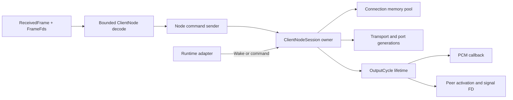
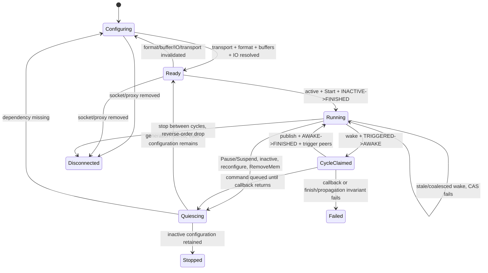

# One-Output ClientNode v6 Session State

## Decision

Implement one `ClientNodeSession` per ClientNode object. It owns one fixed output
port, receives owned commands from the loop-local protocol session, and is moved as
a single `Send` but not `Sync` owner into a process runtime adapter. The session,
not Tokio and not the protocol demarshaller, owns memory resolution, transport and
port generations, activation transitions, cycle borrows, and reverse-order
invalidation.

The connection's `AddMem` stream is represented inside that owner by a connection
memory pool. For the first one-node slice, the unique `OwnedFd` imported by the Core
event is transferred to this owner. Generalizing one connection pool to multiple
node owners will require an explicit coordinator or deliberate FD duplication; it
must not regress to broadcasting an owning raw descriptor.

The application receives only a cycle-scoped writable PCM plane and negotiated
format. It does not receive activation bytes, memory IDs, offsets, chunks, raw FDs,
or runtime-specific readiness objects.

## Required architecture correction

The current runtime's behavior is not ClientNode v6 completion:

```text
drain transport read eventfd -> call callback once -> always write transport write eventfd
```

[`/node/src/runtime/mod.rs#L45-L54`](/node/src/runtime/mod.rs#L45-L54) uses the
eventfd counter as callback authority and unconditionally calls
`signal_complete(1)`. [`/node/src/transport/mod.rs#L33-L66`](/node/src/transport/mod.rs#L33-L66)
therefore names the second transport FD `complete` and makes it the only completion
mechanism. That is the pre-v5 mental model, not the normal v6 non-driving output
path.

For a ClientNode interface version 6, non-driving synchronous output node:

1. The transport read eventfd is only a wake hint. One drained count, including a
   count greater than one, authorizes at most one attempt to claim activation.
2. Processing starts only when the own activation status CAS succeeds from
   `TRIGGERED` to `AWAKE`.
3. Media, chunk, port IO, process result, and timestamps are published before a CAS
   from `AWAKE` to `FINISHED`.
4. Only a successful finish CAS permits downstream propagation.
5. Each configured downstream peer's `state[0].pending` is atomically decremented.
   A peer is signaled only when the decrement returns zero and its activation CAS
   succeeds from `NOT_TRIGGERED` to `TRIGGERED`.
6. The peer's `signal_time` is written before its `SetActivation` signal eventfd is
   incremented.
7. The transport write FD is retained and closed with its transport generation, but
   it is not written for this mode. It is used only by an explicitly implemented
   legacy `< 5` or driving/client-scheduled completion policy.

This is the behavior in upstream
[`process_node`](https://gitlab.freedesktop.org/pipewire/pipewire/-/blob/69c1b4c8b6a1cfa95982e5ed740a3995d94c1308/src/pipewire/impl-node.c#L1490-1554)
and
[`trigger_target_v1`](https://gitlab.freedesktop.org/pipewire/pipewire/-/blob/69c1b4c8b6a1cfa95982e5ed740a3995d94c1308/src/pipewire/private.h#L646-674).
The server-side read of the transport write FD reports legacy readiness or graph
completion depending on interface version; it is not a substitute for v6 target
activation
([`client-node.c#L1180-1207`](https://gitlab.freedesktop.org/pipewire/pipewire/-/blob/69c1b4c8b6a1cfa95982e5ed740a3995d94c1308/src/modules/module-client-node/client-node.c#L1180-1207)).

## Module boundary

```text
pipewire-native-protocol
  native::frame                  complete frames and frame-owned FDs

pipewire
  protocol::wire::core           AddMem/RemoveMem DTO conversion
  protocol::wire::client_node    exact v6 methods/events and bounded descriptors
  protocol::session              object routing and generation footers

node
  session::command               owned event-to-command seam
  session::memory                connection memory pool and region plans
  session::activation            ABI view and SeqCst atomic operations
  session::transport             own transport generation and completion policy
  session::port                  format, IO, buffer, chunk generations
  session::cycle                 callback-scoped output cycle and publication
  session::owner                 state machine and command serialization
  runtime                        Tokio/dedicated-thread waiting adapters only
```

The wire layer takes FD-table indices from `FrameFds` and creates semantic owned
descriptors. The node layer never sees an FD index. Conversely, wire code never maps
memory or interprets scheduling state. The runtime waits for either commands or
transport readability and calls the same synchronous owner methods; it does not
decide whether a wake means a cycle.



## Domain identifiers and descriptors

Do not use bare `u32` at ownership boundaries:

```rust
#[derive(Clone, Copy, Debug, Eq, Hash, PartialEq)]
pub struct MemoryId(pub u32);

#[derive(Clone, Copy, Debug, Eq, Hash, PartialEq)]
pub struct NodeId(pub u32);

#[derive(Clone, Copy, Debug, Eq, Hash, PartialEq)]
pub struct PortId(pub u32);

#[derive(Clone, Copy, Debug, Eq, Hash, PartialEq)]
pub struct MixId(pub u32); // SPA_ID_INVALID is represented explicitly on decode

#[derive(Clone, Copy, Debug, Eq, PartialEq)]
pub struct RegionRef {
    pub memory: MemoryId,
    pub offset: usize,
    pub len: usize,
}

pub struct TransportDescriptor {
    pub trigger_fd: OwnedFd,
    pub completion_fd: OwnedFd,
    pub activation: RegionRef,
}

pub struct PeerActivationDescriptor {
    pub node: NodeId,
    pub signal_fd: OwnedFd,
    pub activation: RegionRef,
}
```

Conversion from protocol integers checks signed-to-unsigned conversion and all
`offset + len` arithmetic before constructing these types. The removable
`SetActivation(node, Fd(-1), SPA_ID_INVALID, 0, 0)` becomes a distinct
`RemovePeerActivation { node }`, never a descriptor with sentinel values.

## Connection memory pool

```rust
pub struct ImportedMemory {
    pub id: MemoryId,
    pub kind: MemoryKind,
    pub flags: u32,
    pub fd: OwnedFd,
    pub file_len: usize,
    pub shrink_safe: bool,
}

pub enum MemoryKind {
    MemFd,
    DmaBuf,
    Other(u32),
}

pub struct ConnectionMemoryPool {
    next_epoch: u64,
    live: HashMap<MemoryId, MemoryEntry>,
}

struct MemoryEntry {
    epoch: u64,
    memory: ImportedMemory,
}

#[derive(Clone, Copy, Debug, Eq, PartialEq)]
pub struct MemoryKey {
    pub id: MemoryId,
    pub epoch: u64,
}
```

`AddMemory` validates the memory kind, `fstat` size, supported seals/policy, and
duplicate ID before insertion. The first slice accepts only mappable `MemFd`.
Duplicate live IDs are a protocol/session error; replacement is not silently
allowed because descriptors containing only the numeric ID could otherwise bind to
the wrong file. Reuse after `RemoveMemory` gets a new epoch.

`RemoveMemory` immediately removes the ID from `live`, so no new descriptor can
resolve it. Existing mapped generations own their `mmap`, not a borrow of the pool
entry. They remain mapped until the current cycle guard ends and the owning
generation is retired. The pool can therefore close the imported FD immediately
after removal if no pending unresolved descriptor needs it; existing mappings remain
valid as mappings. A shrinkable foreign memfd remains a documented SIGBUS risk and
must be rejected from the safe first slice unless an accepted revocation strategy is
implemented.

Pending descriptors may refer to memory announced by an earlier frame but not yet
applied to the process owner. Keep them in a bounded `PendingConfiguration` keyed by
`MemoryId`. Every `AddMemory` retries resolution. A synchronization barrier or
configuration deadline turns unresolved IDs into `UnknownMemory`; they do not wait
forever.

## Mapping ownership and region plan

Each installed generation owns all its `MappedRegion` values. No mapping is shared
between the control loop and process owner, and `MappedRegion` is `Send` but not
`Sync`. Replacement is transactional:

1. Resolve all `MemoryKey` values.
2. Validate ABI size, alignment, range, access mode, and region relationships.
3. Build all new mappings and typed views off to the side.
4. Swap the complete generation between callbacks.
5. Retire the old generation; drop it only after its cycle guard is gone.

Different `mmap` calls can alias the same file bytes even when Rust values differ.
The safe first slice rejects overlapping writable intervals identified by
`(MemoryKey, start..end)` across own activation, peer activations, port IO,
metadata/chunks, and media planes. A `MemPtr` plane must also be disjoint from the
metadata payload and chunk prefix in its metadata mapping. This conservative rule
prevents creating two safe mutable slices to aliased shared bytes. A later aliasing
model requires one mapping arena and a proof of non-overlapping cycle borrows.

Mappings do not expose `as_mut_slice()` publicly from session internals. Typed views
retain raw `NonNull<u8>` plus a checked length and create a slice only for the exact
callback lifetime.

## Activation ABI and atomics

The activation record is a target-native shared-memory ABI. Build-time C probes
against the pinned headers must assert `sizeof`, `_Alignof`, and every field offset
used by Rust. On x86_64 LP64 for the pinned commit, the expected size is 2312 bytes,
with status at 0, `state[0]` at 8, signal/awake/finish timestamps at 32/40/48, but
these values are test expectations rather than portable constants.

```rust
#[repr(u32)]
#[derive(Clone, Copy, Debug, Eq, PartialEq)]
pub enum ActivationStatus {
    NotTriggered = 0,
    Triggered = 1,
    Awake = 2,
    Finished = 3,
    Inactive = 4,
}

pub struct ActivationView {
    base: NonNull<u8>,
    len: usize,
    abi: &'static ActivationAbi,
}

impl ActivationView {
    pub fn initialize_client_v1(&mut self) -> Result<(), ActivationError>;
    pub fn status(&self) -> Result<ActivationStatus, ActivationError>;
    pub fn mark_ready(&self) -> Result<(), ActivationError>; // INACTIVE -> FINISHED
    pub fn claim_cycle(&self, now_ns: u64) -> Result<CycleClaim, ClaimError>;
    pub fn deactivate(&self); // atomic exchange/store to INACTIVE between cycles
}

pub struct CycleClaim<'a> {
    activation: &'a ActivationView,
    _exclusive_cycle: PhantomData<&'a mut ()>,
}

impl CycleClaim<'_> {
    pub fn publish_result_and_finish(
        self,
        process_status: i32,
        now_ns: u64,
    ) -> Result<FinishedClaim, FinishError>;
}
```

All activation `status`, `state[n].required`, and `state[n].pending` operations use
`AtomicU32`/`AtomicI32` at ABI-checked aligned addresses with
`Ordering::SeqCst`, matching upstream `SPA_ATOMIC_*` macros. `fetch_sub(1)` must
detect zero-before-decrement and negative-after-decrement as protocol-state errors;
wrapping underflow must not trigger a peer.

The bitfield word and non-atomic payload fields are never represented by a Rust
`&PwNodeActivation` or `&mut PwNodeActivation`. Access uses field-specific raw
pointer helpers after bounds/alignment checks. The activation CAS establishes the
protocol's ownership window: own `awake_time`, `state[0].status`, and `finish_time`
are written only while this owner holds `AWAKE`; peer `signal_time` is written only
after this owner wins the peer `NOT_TRIGGERED -> TRIGGERED` CAS and before eventfd
signal. No ordinary field may be read while the peer is allowed to mutate it unless
the upstream ABI specifies synchronization.

`initialize_client_v1` writes `client_version = 1` only after the transport mapping
is complete. It preserves server-owned fields and padding. The implementation must
not initialize the whole record with zeroes.

## Transport generation

```rust
pub struct TransportGeneration {
    pub id: u64,
    trigger: EventFd,
    completion: EventFd,
    own_activation_mapping: MappedRegion,
    own_activation: ActivationView,
    policy: CompletionPolicy,
}

pub enum CompletionPolicy {
    ClientNodeV6NonDriving,
    LegacyReadyFd,       // deferred; interface < 5 only
    DrivingCompleteFd,   // deferred; explicitly configured only
}
```

The first implementation constructs only `ClientNodeV6NonDriving`. It still owns
the completion FD because `Transport` transferred it, but no cycle code can call it.
There is intentionally no generic `signal_complete()` method on
`TransportGeneration`; any later completion policy gets a private policy-specific
method and differential tests.

A replacement transport is validated and initialized before swap. Once installed,
the adapter deregisters the old trigger FD, registers the new one, and drops the old
generation between callbacks. A wake tagged with an old generation is stale and
ignored. Failure to bind the replacement leaves the old generation active and
returns an error; it never half-replaces FDs or activation.

## Negotiated format

```rust
#[derive(Clone, Debug, Eq, PartialEq)]
pub struct NegotiatedAudioFormat {
    pub sample_format: AudioSampleFormat,
    pub rate: NonZeroU32,
    pub channels: Box<[AudioChannel]>,
    pub bytes_per_sample: NonZeroUsize,
    pub frame_stride: NonZeroUsize,
}

impl NegotiatedAudioFormat {
    pub fn validate_chunk(&self, size: usize, stride: i32) -> Result<usize, PortError>;
}
```

`PortSetParam(Format, Some)` decodes to this semantic value and increments the port
configuration epoch. It must match one advertised capability. Unknown media type,
unsupported sample encoding, zero rate/channels, channel-count mismatch, and stride
overflow are rejected. One exact interleaved PCM format is the recommended first
fixture.

`Format(None)` clears format, IO, and buffers in that dependency order after any
live cycle. A changed format invalidates old buffers even if their memory IDs remain
live. The callback receives the negotiated value by shared borrow for the cycle; it
cannot infer it from buffer length.

## Port IO, buffers, memory, and chunks

The first port key is `(Output, PortId(0), MixId(SPA_ID_INVALID))`. Decode all wire
counts with limits before allocation. The semantic descriptors are:

```rust
pub struct PortIoDescriptor {
    pub port: PortId,
    pub mix: Option<MixId>,
    pub kind: PortIoKind,
    pub region: RegionRef,
}

pub enum PortIoKind {
    Buffers,
    AsyncBuffers, // decoded but rejected in first slice
}

pub struct BufferSetDescriptor {
    pub port: PortId,
    pub mix: Option<MixId>,
    pub flags: BufferFlags,
    pub buffers: Vec<BufferDescriptor>,
}

pub struct BufferDescriptor {
    pub metadata: RegionRef,
    pub metas: Vec<MetaDescriptor>,
    pub datas: Vec<DataDescriptor>,
}

pub struct MetaDescriptor {
    pub type_id: u32,
    pub size: usize,
}

pub enum DataLocation {
    MemoryId(MemoryId),
    MetadataRelative(i32),
}

pub struct DataDescriptor {
    pub data_type: u32,
    pub location: DataLocation,
    pub flags: u32,
    pub map_offset: usize,
    pub max_size: usize,
}
```

`ALLOC` is rejected as `Unsupported::ClientAllocatedBuffers` in the first slice.
Only one data plane per buffer and mappable memfd data are accepted for processing;
additional metadata descriptors can be retained as checked opaque regions but are
not exposed to the callback.

For each buffer, metadata layout is reconstructed exactly:

```text
metadata region start
  meta[0] bytes
  round up to 8
  ...
  meta[n] bytes
  round up to 8
  spa_chunk[data 0] (16 bytes)
  ...
metadata region end
```

Every addition, rounding operation, and `count * size` is checked. `MemId` data is
the imported data memory at `map_offset .. map_offset + max_size`.
`MetadataRelative` is a signed offset from the metadata mapping; negative offsets
or ranges outside that mapping are rejected. `map_offset` is not added twice for a
relative pointer. The selected media address is the plane base plus
`chunk.offset % max_size`; the first slice rejects wrapped chunks whose `size`
crosses `max_size` rather than exposing two slices.

```rust
pub struct PortGeneration {
    pub id: u64,
    pub format: NegotiatedAudioFormat,
    io_mapping: MappedRegion,
    io: BuffersIoView,
    buffers: Box<[BoundOutputBuffer]>,
}

struct BoundOutputBuffer {
    metadata_mapping: MappedRegion,
    chunk: ChunkView,
    media_mapping: MappedRegion,
    media: MediaPlaneView,
}
```

`BuffersIoView` is exactly the ABI-checked 8-byte synchronous
`spa_io_buffers { i32 status, u32 buffer_id }`. `ChunkView` is exactly
`spa_chunk { u32 offset, u32 size, i32 stride, i32 flags }`. As with ordinary
activation fields, these are raw field views rather than long-lived Rust references.
Cycle synchronization guarantees that the client writes them only during its
claimed `AWAKE` interval. Field access is unaligned only if the ABI permits it; the
first slice instead requires natural alignment and rejects a misaligned region.

For output, process only when IO status is `NEED_DATA`. `buffer_id` must be less
than the configured count. On success, write PCM first, then chunk
`offset/size/stride/flags`, then `io.buffer_id`, then `io.status = HAVE_DATA`, all
before the own finish CAS. A non-`NEED_DATA` wake is still a claimed graph cycle:
publish an appropriate process status, finish, and propagate peers without exposing
a media slice.

## Peer activation set

```rust
pub struct PeerActivation {
    pub node: NodeId,
    pub generation: u64,
    signal: EventFd,
    mapping: MappedRegion,
    activation: ActivationView,
}

pub struct PeerSet {
    by_node: BTreeMap<NodeId, PeerActivation>,
}
```

`SetActivation` adds or transactionally replaces one peer by node ID. The first
slice requires activation ABI version 1 and rejects duplicate same-generation
installation. Removal is idempotent only for the exact wire removal form; removing
an unknown peer is recorded diagnostically but does not affect others.

After own completion, visit peers in `NodeId` order for deterministic tests. For
each peer:

```rust
let previous = peer.state0_pending().fetch_sub(1, SeqCst);
if previous <= 0 {
    return Err(TriggerError::InvalidPending(previous));
}
let pending = previous - 1;
if pending == 0 {
    peer.compare_exchange_status(NotTriggered, Triggered, SeqCst, SeqCst)?;
    peer.write_signal_time(now_ns);
    peer.signal.write(1)?;
}
```

`pending > 0` means another upstream dependency has not completed and no signal is
sent. `pending <= 0`, a failed status CAS, or eventfd failure is a cycle propagation
error with peer ID. Already-triggered peers are never signaled again. There is no
fallback write to the own transport completion FD.

## Owner and typestate

Use typestate for construction and cycle validity, and an explicit runtime state for
asynchronous protocol changes:

```rust
pub struct Configuring;
pub struct Ready;

pub struct ClientNodeSession<S> {
    object: NodeObjectKey,
    memory: ConnectionMemoryPool,
    pending: PendingConfiguration,
    transport: Option<TransportGeneration>,
    port: OutputPortState,
    peers: PeerSet,
    active_requested: bool,
    command: NodeCommandState,
    generation: u64,
    state: SessionState,
    _state: PhantomData<S>,
}

pub enum SessionState {
    Configuring,
    Ready,
    Running,
    CycleClaimed,
    Quiescing,
    Stopped,
    Failed,
    Disconnected,
}

impl ClientNodeSession<Configuring> {
    pub fn apply(&mut self, command: SessionCommand) -> Result<ApplyOutcome, SessionError>;
    pub fn try_into_ready(self) -> Result<ClientNodeSession<Ready>, NotReady>;
}

impl ClientNodeSession<Ready> {
    pub fn start(&mut self) -> Result<(), SessionError>;
    pub fn on_wake(
        &mut self,
        generation: u64,
        now_ns: u64,
        callback: &mut dyn OutputProcess,
    ) -> Result<WakeOutcome, SessionError>;
    pub fn apply_between_cycles(
        &mut self,
        command: SessionCommand,
    ) -> Result<ApplyOutcome, SessionError>;
}
```

`try_into_ready` succeeds only when transport, format, non-empty buffers,
synchronous IO, and all referenced memory are bound. Peer activation is required by
the truthful linked first-cycle test, although an unlinked ready node may exist as a
separate explicit topology state. `start` additionally requires both
`SetActive(true)` intent and `Command(Start)`, writes `client_version = 1`, and CASes
own status `INACTIVE -> FINISHED`. A wake before this is drained and reported as
`WakeOutcome::NotRunning`, never processed.



No command mutates generations while `CycleClaimed`. Runtime adapters queue commands
and apply them immediately after the callback/finish path. Because `on_wake` holds
`&mut self`, safe Rust prevents concurrent command application in the owner.

## Process-cycle lifetime

```rust
pub trait OutputProcess: Send + 'static {
    fn process(&mut self, cycle: OutputCycle<'_>) -> Result<ProcessResult, ProcessError>;
}

pub struct OutputCycle<'a> {
    pub format: &'a NegotiatedAudioFormat,
    pub frames_capacity: usize,
    media: &'a mut [u8],
    completion: CycleCompletion<'a>,
}

impl OutputCycle<'_> {
    pub fn interleaved_pcm(&mut self) -> &mut [u8];
    pub fn commit(self, frames: usize) -> Result<CommittedCycle, ProcessError>;
    pub fn silence(self, frames: usize) -> Result<CommittedCycle, ProcessError>;
}

pub enum ProcessResult {
    Produced(CommittedCycle),
    NoData,
    Drained,
}
```

The callback consumes `OutputCycle` to commit. `CommittedCycle` is an opaque proof
that frame count, byte count, stride, and chunk bounds were validated. It cannot be
constructed by applications. Compile-fail tests prove neither the media slice nor
the cycle can escape the callback.

The owner uses an internal completion guard. If application code returns an error or
panics after `TRIGGERED -> AWAKE`, the activation must not remain `AWAKE`. Initial
policy: catch panic at the runtime boundary, publish a deterministic negative
process status, CAS `AWAKE -> FINISHED`, do not publish `HAVE_DATA`, attempt peer
propagation so the graph does not deadlock, then transition the session to `Failed`
and stop accepting cycles. This policy requires an upstream differential fixture
before becoming a stable public guarantee.

## Event-to-command mapping

Protocol callbacks perform bounded decode, resolve frame FD indices, and enqueue
owned commands. They do not call session mapping code inline:

| Wire event or local action | `SessionCommand` | Session effect |
|---|---|---|
| Core `AddMem(id,type,Fd,flags)` | `AddMemory(ImportedMemory)` | Insert unique memory owner; retry pending bindings |
| Core `RemoveMem(id)` | `RemoveMemory(MemoryId)` | Forbid new resolution; quiesce and retire dependent generations |
| ClientNode `Transport` | `ReplaceTransport(TransportDescriptor)` | Transactionally bind per-node transport generation |
| `PortSetParam(Format, pod)` | `SetFormat(NegotiatedAudioFormat)` | Replace format epoch; invalidate buffers/IO |
| `PortSetParam(Format, None)` | `ClearFormat` | Clear IO, buffers, then format |
| `PortUseBuffers(n > 0)` | `UseBuffers(BufferSetDescriptor)` | Bind metadata/chunk/media generation |
| `PortUseBuffers(n == 0)` | `ClearBuffers` | Quiesce, clear IO dependency and buffers |
| `PortSetIo(..., mem_id,...)` | `SetPortIo(PortIoDescriptor)` | Bind synchronous buffer IO |
| `PortSetIo(..., INVALID,0,0)` | `ClearPortIo` | Quiesce and remove IO |
| `SetActivation(node,fd,mem,...)` | `SetPeerActivation(PeerActivationDescriptor)` | Add/replace downstream target generation |
| `SetActivation` sentinel form | `RemovePeerActivation(NodeId)` | Remove and close one peer generation |
| `Command(Start)` | `SetNodeCommand(Start)` | Start when active and ready |
| `Command(Pause/Suspend)` | `SetNodeCommand(Pause)` | Quiesce; own status becomes `INACTIVE` |
| local `SetActive(true/false)` completion | `SetActive(bool)` | Join/leave scheduling readiness |
| proxy removed/socket EOF | `Disconnect` | Stop, invalidate all, close exactly once |
| runtime FD readable | `RuntimeEvent::Wake { transport_generation }` | Drain counter, attempt exactly one activation claim |
| runtime shutdown | `RuntimeEvent::Shutdown` | Quiesce and stop without faking completion |

The command channel is bounded by command count and retained byte/FD cost. A full
queue is fatal for ownership-bearing protocol input unless backpressure can pause
frame dispatch; silently dropping `RemoveMem`, transport, or peer activation is not
allowed.

## Runtime adapter seam

```rust
pub trait RuntimeClock {
    fn monotonic_ns(&self) -> u64;
}

pub trait NodeRuntimeAdapter {
    type Handle;

    fn spawn(
        self,
        owner: ClientNodeSession<Ready>,
        commands: SessionCommandReceiver,
        process: Box<dyn OutputProcess>,
    ) -> Result<Self::Handle, RuntimeError>;
}
```

The concrete adapter waits on the current transport trigger FD plus command wake and
shutdown. On readability it records the transport generation, drains eventfd once,
records `missed_wakes = count.saturating_sub(1)` for diagnostics/xrun accounting,
and calls `on_wake` once. It then applies queued commands between callbacks. On
transport replacement it updates readiness registration before dropping the old FD.

Tokio may implement this with `AsyncFd`; a dedicated-thread adapter may use
`poll`/`epoll`. Both run the same synchronous session and scripted test. The owner is
`Send` because it moves as a unit, but not `Sync`; callback concurrency is exactly
one. The adapter cannot access mappings or call a transport completion method.

## Error model

```rust
pub enum SessionError {
    Protocol(ProtocolSemanticError),
    Unsupported(UnsupportedFeature),
    Memory(MemoryError),
    Mapping(MappingError),
    Activation(ActivationError),
    Port(PortError),
    InvalidTransition { state: SessionState, command: &'static str },
    StaleGeneration { expected: u64, received: u64 },
    Callback(ProcessError),
    PeerTrigger { peer: NodeId, source: TriggerError },
    Runtime(RuntimeError),
    Disconnected,
}
```

Errors have stable categories and contextual IDs/generations, never raw FD numbers.
Configuration errors reject the candidate generation and retain the old valid one
when possible. Activation corruption, impossible pending counts, finish CAS failure,
callback panic, and eventfd failure after peer CAS are fatal because retry could
double-process or double-signal. Unknown memory can remain pending only until the
defined barrier/deadline. Disconnect is terminal and idempotent.

Every failure report includes object key, session state, active/command state,
transport and port generations, unresolved memory IDs, own activation status, IO
status/buffer ID when safely readable, configured peer IDs and pending counts, last
wire object/opcode, drained wake count, and owned FD/mapping counts.

## Minimum first-cycle sequence

The session accepts legal interleavings but requires these dependency edges:

```mermaid
sequenceDiagram
    participant Core as Core protocol
    participant CN as ClientNode protocol
    participant Owner as Session owner
    participant Run as Runtime adapter
    participant App as Output callback
    participant Peer as Downstream peer

    Core-->>Owner: AddMemory(activation memfd)
    CN-->>Owner: ReplaceTransport(trigger, completion, activation region)
    Owner->>Owner: map, client_version=1
    CN-->>Owner: SetFormat(exact PCM)
    Core-->>Owner: AddMemory(metadata/IO/media memfds)
    CN-->>Owner: UseBuffers(descriptors)
    CN-->>Owner: SetPortIo(Buffers)
    Core-->>Owner: AddMemory(peer activation memfd)
    CN-->>Owner: SetPeerActivation(peer signal FD)
    CN-->>Owner: SetActive(true), Command(Start)
    Owner->>Owner: own INACTIVE->FINISHED
    Peer->>Owner: own NOT_TRIGGERED->TRIGGERED; trigger eventfd +1
    Run->>Owner: Wake(generation, now), drain count
    Owner->>Owner: own TRIGGERED->AWAKE
    Owner->>App: OutputCycle(format, selected writable plane)
    App-->>Owner: commit(frames)
    Owner->>Owner: PCM; chunk; IO HAVE_DATA; result; finish time
    Owner->>Owner: own AWAKE->FINISHED
    Owner->>Peer: pending--, NOT_TRIGGERED->TRIGGERED, signal_time, eventfd +1
    Note over Owner,Peer: own transport completion FD is not written
```

The callback sees only the server-selected `buffer_id` when IO says `NEED_DATA`.
For the fixture, write a fixed byte pattern representing an integral number of PCM
frames, set chunk offset zero, size to the committed bytes, stride to frame stride,
flags zero, preserve the selected buffer ID, and set IO status `HAVE_DATA`.

## Reconfiguration, RemoveMem, and disconnect

Reconfiguration is reverse dependency invalidation:

```text
peer activation -> runtime trigger registration -> port IO -> buffers -> format
                -> own activation/transport -> imported memory
```

The exact affected suffix is retired, not always the whole node. Removing media
memory clears dependent buffers and IO but may retain format and transport. Removing
own activation memory retires transport and stops scheduling. Removing peer memory
removes only those peer targets. A replacement format clears all buffer/IO state.

If a command arrives during a callback, it remains queued. The claimed cycle either
finishes against its original generation and then invalidation runs, or a fatal
callback path publishes terminal completion before teardown. No mapping is unmapped
behind an `OutputCycle<'_>`.

Pause, Suspend, `SetActive(false)`, and disconnect perform:

1. Stop accepting new cycle claims.
2. Wait for/finish the sole active callback within runtime shutdown policy.
3. Atomically set own activation to `INACTIVE`.
4. Deregister trigger readiness.
5. Remove peer targets and close their signal FDs/mappings.
6. Clear IO, buffers, and format as required.
7. Drop transport FDs and own activation mapping.
8. Remove/close all remaining imported memory.

Disconnect also rejects all queued ownership-bearing commands and drops their FDs.
Core `Destroy`/`RemoveId` remains control-plane object lifecycle; the node session
must already be safe if socket EOF happens without those messages.

## Deterministic scripted test

Create one real Unix-socket scenario with real sealed memfds and eventfds. Use fixed
object/memory IDs and a fake monotonic clock sequence. The script:

1. Receives and validates ClientNode v6 `CreateObject`, `Update`, `PortUpdate`, and
   later `SetActive(true)`.
2. Sends `AddMem` plus indexed FD for a 2312-byte own activation region initialized
   to `INACTIVE`, `server_version=1`.
3. Sends `Transport` with trigger and completion eventfds and that region.
4. Sends exact S16LE, 48 kHz, stereo format.
5. Sends memory and descriptors for two output buffers, one 8-byte Buffers IO, and
   one peer activation. All mutable regions are non-overlapping.
6. Sends peer `SetActivation`, `Command(Start)`, and waits until own status is
   `FINISHED` with `client_version=1`.
7. Sets IO to `{ NEED_DATA, buffer_id: 1 }`; sets own activation
   `NOT_TRIGGERED -> TRIGGERED`; writes one to transport trigger FD.
8. Callback commits four stereo S16LE frames containing a fixed 16-byte pattern.
9. Asserts buffer 1 bytes, chunk `{ offset:0, size:16, stride:4, flags:0 }`, IO
   `{ HAVE_DATA, buffer_id:1 }`, process status, fixed awake/finish timestamps, and
   own status `FINISHED`.
10. Initializes peer `required=1`, `pending=1`, status `NOT_TRIGGERED`; asserts peer
    pending becomes zero, status becomes `TRIGGERED`, signal time matches fake clock,
    and peer signal eventfd reads exactly one.
11. Asserts the own transport completion eventfd remains zero. This is the regression
    assertion that prevents restoration of unconditional completion signaling.
12. Sends a second/coalesced trigger eventfd count without changing activation;
    asserts no second callback and records a missed/stale wake.
13. Removes media memory, then disconnects; asserts no new cycle can borrow it and
    `/proc/self/fd` returns to baseline.

Run the same script through Tokio and dedicated-thread adapters. Bound every wait by
a deadline. Also permute each independent `AddMem` with its referring descriptor,
replace transport before one wake, and issue `RemoveMem` while the callback is held
at a barrier; all valid orders converge and teardown waits for the cycle guard.

Compile-fail tests attempt to retain `interleaved_pcm()`, retain `OutputCycle`, share
the session through `Arc`, and apply a command while a cycle borrow is live.

## Commit-sized migration plan

Each numbered item is one focused `jj` commit with its tests. Existing behavior may
remain behind private adapters only until the corresponding replacement lands.

1. **Introduce session command DTOs.** Add typed IDs, regions, format, buffer, IO,
   peer activation, and `SessionCommand`; adapt current control events without
   mapping or runtime changes.
2. **Correct Core memory import.** Decode AddMem's explicit frame-local FD index,
   transfer one `OwnedFd`, add RemoveMem, and route both into a bounded single-owner
   command sink. Delete raw/global FD-pop assumptions on this path.
3. **Replace `MemoryRegistry` with epoch memory pool.** Validate memory kind, file
   length, seals, duplicate IDs, removal, and unresolved references. Keep old
   `ControlPlaneState` as a temporary facade only.
4. **Add activation ABI probes and views.** Generate C size/alignment/offset checks;
   implement SeqCst status/pending operations and legal transition tests without
   exposing activation byte slices.
5. **Make transport per-node and generational.** Replace global
   `pending_transport`; bind transactionally, initialize client v1, tag wakes, and
   retain but hide the completion FD for v6 non-driving mode.
6. **Add ClientNode v6 event dispatch.** Decode Transport, Format, UseBuffers,
   PortSetIo, SetActivation, and Command into commands with frame-owned FD transfer,
   exact sentinel forms, limits, and fixtures.
7. **Add negotiated output-port generations.** Validate exact PCM format,
   synchronous IO, metadata/chunk layout, MemId/MemPtr planes, writable interval
   disjointness, and format-driven invalidation.
8. **Add peer activation generations.** Bind/remove targets by node ID; implement
   pending decrement, CAS, timestamp, and eventfd signaling with deterministic order.
9. **Add typed session readiness and cycle API.** Replace raw activation callback
   bytes with `OutputCycle<'_>`, commit proof, IO/chunk publication, own activation
   claim/finish, callback failure guard, and compile-fail lifetime tests.
10. **Refactor runtime into adapter.** Replace `NodeRuntime`'s owned
    `BoundTransport` loop with a session owner plus command/trigger multiplexer.
    Delete unconditional `signal_complete`; implement Tokio adapter first without
    putting Tokio types in session modules.
11. **Add the deterministic one-cycle script.** Assert exact PCM/shared-state bytes,
    downstream peer signal, zero own completion-FD count, stale/coalesced wake
    behavior, RemoveMem during a held callback, deadlines, and FD baseline.
12. **Add dedicated-thread parity.** Run the identical session scenario through a
    poll-based owner thread and retain runtime selection as an adapter decision.
13. **Delete legacy bridge types.** Remove `ControlPlaneState`, raw `Activation`,
    `TransportConfig`, `BoundTransport::activation_mut`, and runtime callback
    `trigger_count`; update crate docs to describe a ClientNode session rather than
    eventfd/mmap primitives.
14. **Integrate WAV player.** Construct one semantic output-node spec, feed committed
    negotiated PCM frames through `OutputCycle`, and remove the transport-only sketch.
15. **Add upstream differential gate.** Run the same v6 non-driving cycle against the
    pinned daemon and compare message semantics, activation transitions, downstream
    signaling, and absence of normal transport-completion writes.

Commits 4, 7, 9, and 10 are unsafe/lifetime review gates and should not be combined.
Commit 11 is the first acceptance proof; WAV integration must not invent a parallel
buffer or completion path.

## Explicit invariants

1. A frame owns every received FD until a decoder takes a specific indexed entry.
2. AddMem transfers one `OwnedFd` into one pool owner; no owning raw FD is broadcast.
3. Memory ID plus epoch identifies backing storage; a reused numeric ID cannot
   satisfy an old descriptor.
4. Every mapped interval is checked against file length and all arithmetic is
   overflow-safe before `mmap` or pointer construction.
5. The first safe slice uses only shrink-safe mappable memfds and rejects overlapping
   writable intervals.
6. The process owner and writable mappings are `Send`, not `Sync`, and have exactly
   one mutable Rust owner.
7. Activation atomic addresses are naturally aligned, ABI-probed, and accessed with
   SeqCst operations matching SPA.
8. Eventfd readability is not cycle authority; only `TRIGGERED -> AWAKE` is.
9. A callback runs at most once per successful activation claim, regardless of
   eventfd counter value.
10. PCM/chunk/IO/result writes happen before `AWAKE -> FINISHED`.
11. Peers are touched only after successful own finish; each is signaled only after
    pending reaches zero and `NOT_TRIGGERED -> TRIGGERED` succeeds.
12. A v6 non-driving cycle never writes the own transport completion FD.
13. No mapping replacement, RemoveMem, or disconnect unmaps memory during a cycle
    borrow.
14. Format replacement invalidates buffers and IO; buffer replacement invalidates
    IO if its selection contract no longer matches.
15. Safe application code cannot retain media, chunk, IO, or activation access after
    callback return.
16. Every accepted owned command is applied or explicitly failed and dropped; full
    queues cannot silently lose resource-lifecycle events.
17. Disconnect closes every FD and mapping exactly once and is terminal/idempotent.

## Open questions

1. Which negative `spa_node_process` status should callback failure publish before
   finishing and propagating peers? Capture upstream remote-node behavior before
   stabilizing the proposed fatal policy.
2. Must the first real-daemon topology support `SPA_IO_AsyncBuffers`, or can node
   properties reliably negotiate synchronous `SPA_IO_Buffers`? The implementation
   must explicitly reject async IO until its two-slot cycle indexing exists.
3. Are imported daemon memfds always sealed against shrinking on supported versions?
   If not, safe mapping needs an upstream lifetime guarantee, owned-copy strategy, or
   a documented unsafe opt-in rather than silently accepting SIGBUS exposure.
4. For future multiple ClientNodes, should one process-domain memory coordinator own
   all mappings, or should the loop-local importer explicitly duplicate AddMem FDs
   into node owners? The one-node design intentionally does not decide this by
   accidental `Arc<OwnedFd>` sharing.
5. Should unlinked nodes be representable as `ReadyWithoutPeers`, or should public
   readiness require at least one activation target? The scripted acceptance state
   requires a peer because it proves truthful graph propagation.
6. Which `PortSetMixInfo` fields are needed to distinguish multiple future peers from
   one output mix? This first model keys peer activation by node ID and keeps one
   fixed mix.
7. Can an eventfd write fail after peer status CAS without wedging the graph? The
   proposed policy is fatal with no retry because a retry could duplicate signaling;
   upstream behavior and fault injection should confirm operational handling.
8. Does teardown require completing a currently claimed cycle after `SetActive(false)`,
   or may it force `INACTIVE`? This design finishes a claimed cycle first because it
   preserves publication and borrow safety, pending differential confirmation.

## Acceptance criteria

- One object-local session reaches typed ready state from any legal ordering of its
  memory and configuration commands.
- No application or runtime-adapter API exposes activation bytes, chunks, memory IDs,
  owning raw FDs, or writable mappings.
- ABI differential tests match the pinned C activation, IO, and chunk layouts.
- The deterministic script completes exactly one output callback and verifies PCM,
  chunk, IO, own activation, peer pending/status/time, and peer eventfd state.
- The same test proves the own transport completion eventfd remains untouched for
  ClientNode v6 non-driving mode.
- Coalesced/stale wakes cannot execute extra callbacks.
- Transport, format, buffers, IO, peer activation, RemoveMem, and disconnect can be
  replaced/removed without stale borrows or descriptor leaks.
- Tokio and dedicated-thread adapters produce identical domain transitions.
- The WAV player uses the same cycle API and no example-only transport shortcut.

## Cross-references

- [`/.design/client-node-protocol/inventory0.gpt56.md`](/.design/client-node-protocol/inventory0.gpt56.md): canonical v6 opcodes, POD layouts, activation values, ordering edges, and upstream evidence. This design turns that inventory into one owner and explicitly implements its correction from completion eventfd to downstream peer activation.
- [`/.design/native-frame/frame0.gpt56.md`](/.design/native-frame/frame0.gpt56.md): defines complete frame ownership and indexed `FrameFds`; the event-to-command seam begins only after those FDs are safely resolved or transferred.
- [`/.design/threading-contract/threading0.gpt56.md`](/.design/threading-contract/threading0.gpt56.md): establishes loop-local control state, one movable process owner, bounded commands, `MappedRegion: Send + !Sync`, and callback-scoped cycle borrows used here.
- [`/.design/architecture-review/review-rekick0.oc.md`](/.design/architecture-review/review-rekick0.oc.md): defines the one-cycle tracer bullet and four-module architecture. This session is the missing center between typed wire events and runtime waiting.
- [`/node/src/control/mod.rs`](/node/src/control/mod.rs): current connection-global pending transport and immediate memory removal. It migrates to an object-local, generational session with deferred generation retirement.
- [`/node/src/control/events.rs`](/node/src/control/events.rs): useful ownership-shaped AddMem and Transport values, but missing format, buffers, IO, peers, commands, and removal sentinel semantics.
- [`/node/src/transport/mod.rs`](/node/src/transport/mod.rs): current raw activation mapping and always-present completion operation. It is replaced by ABI-typed activation and an explicit completion policy whose v6 non-driving variant cannot signal that FD.
- [`/node/src/runtime/mod.rs`](/node/src/runtime/mod.rs): current unconditional callback-plus-completion loop. It becomes a waiting adapter and delegates wake validation, cycle publication, and peer propagation to the session.
- [`/node/src/shm/memfd.rs`](/node/src/shm/memfd.rs): current checked mmap substrate and explicit shrink/SIGBUS caveat. Session mappings add memory-kind, seal, generation, overlap, and cycle-lifetime policy.
- [`/examples/wav-player/src/main.rs#L100-L135`](/examples/wav-player/src/main.rs#L100-L135): current transport-only integration sketch. It incorrectly expects activation parsing to locate media; the typed cycle API replaces that responsibility.
- [`pipewire/pipewire` activation ABI](https://gitlab.freedesktop.org/pipewire/pipewire/-/blob/69c1b4c8b6a1cfa95982e5ed740a3995d94c1308/src/pipewire/private.h#L508-694): canonical SeqCst state transitions, pending decrement, peer CAS, timestamp, and signal sequence.
- [`pipewire/pipewire` process implementation](https://gitlab.freedesktop.org/pipewire/pipewire/-/blob/69c1b4c8b6a1cfa95982e5ed740a3995d94c1308/src/pipewire/impl-node.c#L1485-1597): canonical wake-as-hint, own claim/finish, result publication, non-driving target trigger, and missed-wakeup behavior.
- [`pipewire/pipewire` remote buffer import](https://gitlab.freedesktop.org/pipewire/pipewire/-/blob/69c1b4c8b6a1cfa95982e5ed740a3995d94c1308/src/modules/module-client-node/remote-node.c#L586-737): canonical metadata alignment, per-data chunk placement, MemId resolution, MemPtr relative range checks, and ALLOC reversal.
- [`pipewire/pipewire` remote transport binding](https://gitlab.freedesktop.org/pipewire/pipewire/-/blob/69c1b4c8b6a1cfa95982e5ed740a3995d94c1308/src/modules/module-client-node/remote-node.c#L181-220): canonical mapping, read/write FD ownership, activation pointer installation, and client activation version initialization.
