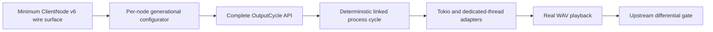

# Forward Roadmap

## Thesis

The best next move is to complete one truthful ClientNode v6 playback cycle.

The library has crossed the point where more disconnected foundation work is the
highest-leverage investment. It now has bounded native frames, frame-owned file
descriptors, canonical memory kinds, a single-owner Core memory importer,
generation-safe mappings, activation atomics, typed synchronous output-buffer views,
a deterministic scripted peer, fuzzing, and parameterized subsystem stress tooling.

The remaining uncertainty sits in the vertical connection between those pieces:

> Can a safe Rust application advertise one output node, accept real PipeWire
> configuration, claim one process cycle, publish PCM and shared state in the right
> order, signal the downstream peer, and tear everything down without leaks?

Answering that question unlocks the product. It also provides the forcing function
for the public API, threading model, compatibility fixtures, and future capture or
video work.

## North Star

A user should be able to describe an output node semantically and process audio
through a lifetime-safe callback without understanding native protocol opcodes,
SCM_RIGHTS indices, activation offsets, or mmap ownership.

An eventual application-facing shape should resemble:

```rust
let node = core.create_output_node(OutputNodeSpec {
    properties,
    port: OutputPortSpec::pcm_s16le(48_000, 2),
})?;

node.process(|mut cycle| {
    let output = cycle.interleaved_pcm()?;
    source.fill(output.samples_mut());
    output.commit()?;
    Ok(())
})?;
```

This is directional, not a stabilized API. Its important properties are:

- the application supplies semantic intent rather than wire DTOs;
- media, chunk, IO, and activation access cannot escape the cycle;
- one commit operation publishes all shared state in protocol order;
- runtime selection does not change session semantics;
- teardown and reconfiguration cannot invalidate a live cycle borrow.

## Current Leverage

| Foundation | Current capability | Why it matters next |
|---|---|---|
| Native transport | Incremental owned frames, partial sends, SCM_RIGHTS association, limits, cleanup | ClientNode events can consume exact frame-local FDs without global queues |
| Core memory import | Canonical AddMem/RemoveMem into one generational pool | Wire descriptors can resolve safely to checked mappings |
| Shared memory | Bounds/alignment checks, explicit shrink policy, unsafe raw-byte boundary | Typed activation and buffer views no longer hide foreign-memory unsafety |
| Activation v1 | ABI-checked status, pending, result, and timing operations | A process wake can be authorized and completed truthfully |
| Output buffers | Typed synchronous IO, chunk publication, selected one-plane media | A callback can publish real PCM without parsing raw activation bytes |
| Scripted peer | Real Unix sockets, memfds, eventfds, deadlines, diagnostics | One complete cycle can be proven without a host daemon |
| Robustness | POD regressions/fuzzing, malformed ancillary cleanup, FD lifecycle tests | Expanding protocol surface does not reopen basic parser/ownership hazards |
| Stress harness | Parameterized frame, POD, and memory workloads under Hyperfine | Scale and regressions can be measured with verified production-API workloads |

The foundation is not finished in every dimension. Deterministic EINTR injection,
broader threading enforcement, and some ABI/platform coverage remain. None should
delay the minimum ClientNode protocol and deterministic cycle unless they expose a
concrete correctness blocker.

## Critical Path



### 1. Minimum ClientNode v6 Wire Surface

This is the immediate ready work: `SU-client-node-cycle-min-protocol`.

Implement only the methods and events required for one linked output cycle:

- Core `CreateObject` for `client-node`, interface version 6;
- ClientNode `Update` and `PortUpdate` advertisement;
- `Transport` with two indexed eventfds and one activation region;
- `PortSetParam(Format)` for one exact PCM format;
- `PortUseBuffers` for a small bounded buffer set;
- `PortSetIo(Buffers)` for synchronous IO;
- `SetActivation` for one downstream peer;
- `SetActive(true/false)` and `Command(Start/Pause)`;
- canonical clearing and teardown sentinels.

Wire modules should remain domain-grouped under a canonical ClientNode namespace.
They own bounded POD conversion, versions, opcodes, and FD indices. They do not own
session order, mmap, activation transitions, or application callbacks.

Exit conditions:

- client and scripted peer share one definition for each selected message;
- valid fixtures round-trip or match pinned upstream bytes;
- malformed payloads fail without shifting frame or FD ownership;
- unknown compatible traffic is consumed frame-locally;
- object routing constructs a typed ClientNode proxy.

### 2. Per-Node Generational Configurator

Translate wire events into owned session commands and dependency-driven state.

The configurator should assemble, replace, and retire:

- one transport generation;
- one negotiated output-format generation;
- one output buffer-set generation;
- one synchronous port-IO generation;
- one or more downstream peer-activation generations;
- connection-memory references resolved through `MemoryPoolHandle`.

Events may interleave where dependencies permit. Do not implement one brittle
transcript. Hold bounded unresolved descriptors when upstream ordering permits it,
or fail explicitly at a defined barrier.

Format replacement invalidates buffers and IO. Buffer replacement invalidates IO if
its selection contract changes. RemoveMem retires new bindings immediately while
existing cycle guards pin their exact generation until drop.

### 3. Complete `OutputCycle<'_>`

Join the existing activation and output-buffer foundations into one authority and
publication transaction:

1. Drain the wake hint.
2. Claim authority with `TRIGGERED -> AWAKE`.
3. Select the requested output buffer.
4. Expose cycle-scoped interleaved PCM.
5. Publish media, chunk, IO, process result, and timestamps.
6. Complete with `AWAKE -> FINISHED`.
7. Decrement and trigger downstream peer activation.

Eventfd readability is not cycle authority. A coalesced counter cannot authorize
multiple callbacks. In v6 non-driving mode, normal completion must not write the
node's own transport completion FD.

Add compile-fail tests proving that media, chunk, IO, activation, and the cycle itself
cannot escape callback scope. Define callback failure publication before stabilizing
the API.

### 4. Deterministic Linked Cycle

This is the first product acceptance proof: `SU-client-node-cycle-integration`.

The scripted peer should:

- validate node creation and advertisement;
- send sealed activation, IO, media, and peer memfds;
- send real trigger, retained completion, and peer eventfds;
- negotiate exact S16LE, 48 kHz, stereo output;
- select one of two buffers and trigger one cycle;
- verify exact PCM bytes and chunk/IO state;
- verify own activation reaches `FINISHED`;
- verify the downstream peer is triggered and signaled exactly once;
- verify the own completion FD remains untouched;
- exercise stale/coalesced wake behavior;
- race RemoveMem against a held callback barrier;
- return process FDs to baseline after teardown.

Run the same scenario through every runtime adapter. Every wait must have a deadline
and report the last protocol/session step on failure.

### 5. Runtime Adapters

Session semantics must be runtime-independent.

Implement:

- a Tokio waiting/command adapter;
- a dedicated poll-thread adapter;
- one shared process owner and session transition implementation beneath both.

Delete unconditional completion-eventfd writes and legacy raw activation callbacks.
Tokio types should not enter the core session domain.

### 6. Real WAV Playback

Replace the stale transport-only sketch in
[`examples/wav-player/src/main.rs`](/examples/wav-player/src/main.rs).

The example must use the exact API proven by the scripted cycle:

- create the semantic output-node specification;
- negotiate or clearly reject the WAV format;
- fill committed output cycles;
- define looping, underrun, and end-of-stream behavior;
- coordinate control-loop and process-runtime shutdown;
- use no example-only ownership, mmap, or signaling shortcuts.

Audible playback against a real daemon is the first compelling external capability
and the strongest test of API depth.

### 7. Upstream Differential Gate

Run the same non-driving v6 scenario against a pinned PipeWire daemon and compare:

- selected wire message semantics;
- activation transitions and timestamps;
- output IO/chunk publication;
- downstream peer pending/CAS/signal behavior;
- absence of normal transport-completion writes;
- teardown ordering and FD/mapping closure.

The existing bounded real-daemon test currently reaches link setup and stalls in its
helper callback. Diagnose that path as part of the differential fixture rather than
relaxing its deadline.

## Parallel Forward Bets

The critical path should retain priority, but several streams can proceed without
inventing a competing architecture.

### Threading And Public Handles

The control-plane graph should become loop-local. Replace blanket proxy `Send + Sync`
assertions with bounded, generation-aware command handles and owned event snapshots.

Use `pw-browse` as the executable migration proof: the UI thread should hold handles
and snapshots, not raw proxies or loop-affine SPA interfaces.

Do not make the ClientNode process session depend on broad cross-thread proxy
sharing. The process domain should own its mappings and receive bounded owned
commands.

### Protocol Definition Generation

Centralize interface versions, opcodes, POD layouts, and sentinel forms so product
client and scripted peer cannot drift.

Generation should preserve domain grouping:

```text
protocol/wire/
  core/
  registry/
  client_node/
```

Avoid publishing the entire internal marshal implementation merely to share a few
wire facts.

### Compatibility Laboratory

Build a version matrix around pinned PipeWire releases and current upstream:

- known wire fixtures and differential decoding;
- ClientNode version/feature negotiation;
- daemon memfd seal behavior;
- synchronous versus asynchronous buffer IO negotiation;
- teardown and replacement ordering;
- supported Linux architecture ABI tables.

Compatibility evidence should drive feature support and safety contracts rather
than undocumented assumptions.

### Performance Regression Practice

Use the [`stress harness`](/stress/README.md) to establish reproducible medium-sized
commands for frame, POD, and memory subsystems.

Initially report trends rather than imposing brittle timing thresholds. Record CPU,
kernel, compiler, commit, governor, affinity, workload parameters, operation count,
verified byte count, and Hyperfine JSON. Add hard budgets only after variance is
understood on controlled runners.

Performance work must not weaken mandatory verification, ownership checks, or
resource limits.

## Capability Horizon

After one output cycle and WAV playback work reliably, expand along proven seams.

### Near Horizon

- input/capture nodes using the same session and cycle vocabulary;
- duplex streams and multiple ports;
- richer PCM format negotiation and conversion boundaries;
- multiple data planes and metadata descriptors;
- explicit underrun, drain, and end-of-stream semantics;
- ergonomic builders around semantic node/port specifications.

### Later Horizon

- `SPA_IO_AsyncBuffers` two-slot cycle semantics;
- DMA-BUF and SyncObj ownership/access APIs;
- video and zero-copy media paths;
- client-scheduled driver mode;
- dynamic ports, mixes, and richer graph topology;
- OSC and SPA control-stream integration;
- stable public API and published compatibility guarantees.

Each expansion should reuse frame ownership, generation retirement, typed cycles,
and runtime adapters. A feature that needs an example-only or protocol-bypassing path
is evidence that the core module seam is incomplete.

## Sequencing Rules

1. Prefer one truthful vertical cycle over broad shallow protocol coverage.
2. Keep wire conversion, session semantics, and runtime waiting as separate layers.
3. Do not stabilize the callback API before scripted cycle and WAV playback use it.
4. Do not add capture, async IO, DMA-BUF, or multiple planes by weakening the first
   cycle's invariants.
5. Keep hostile-input and FD-lifecycle tests beside every protocol expansion.
6. Treat reconfiguration and teardown as first-class state transitions, not cleanup
   afterthoughts.
7. Preserve one implementation path across scripted tests, real daemon use, and
   examples.
8. Let compatibility fixtures decide uncertain upstream behavior.
9. Measure release binaries with verified workloads; never optimize away correctness
   checks to improve benchmark numbers.
10. Delete legacy bridges as soon as the typed replacement proves parity.

## What Not To Prioritize Yet

- broad opcode coverage without a product path;
- polishing legacy `ControlPlaneState` or `BoundTransport` APIs;
- stabilizing public semver before one real processing API exists;
- example-only playback shortcuts;
- generalized async runtime abstraction before two concrete adapters share a session;
- DMA-BUF or video before memfd PCM teardown is proven;
- micro-optimizing startup-dominated smoke benchmarks;
- expanding unsafe platform support without target-specific ABI evidence.

## Active Tracking

The active architectural parent is `SU-client-node-cycle`.

| Ticket | Role |
|---|---|
| `SU-client-node-cycle-min-protocol` | Immediate ready work: minimum ClientNode v6 wire surface |
| `SU-client-node-cycle-session-state` | Per-node generations, readiness, peer activation, and complete cycle API |
| `SU-client-node-cycle-integration` | Deterministic linked process-cycle acceptance proof |
| `SU-client-node-cycle-wav-playback` | First user-visible playback capability |
| `SU-client-node-cycle-frame-transport` | Residual deterministic EINTR injection and transport test closure |
| `SU-client-node-cycle-threading` | Loop-local control graph and bounded cross-thread handles |

The minimum protocol ticket is intentionally unblocked by residual EINTR test work.
The frame implementation and all consumers are already in place.

## Definition Of Forward Progress

A change moves the library forward when it does at least one of the following:

- completes another edge of the one-cycle vertical path;
- replaces a raw or duplicated ownership mechanism with a typed single-owner seam;
- proves behavior against the scripted peer or upstream daemon;
- makes invalid lifetime, ordering, or thread usage unrepresentable;
- expands a proven session/cycle abstraction to another media capability;
- improves measured scale without weakening verification or safety.

Work that adds surface area without strengthening one of those properties should be
treated skeptically.

## Cross-References

- [`Architecture re-kickoff`](/.design/architecture-review/review-rekick0.oc.md): invariants and tracer-bullet rationale that established the current direction.
- [`Advancement wave`](/.design/architecture-review/advance0.oc.md): implemented foundations, verification, independent review, and remaining frontier.
- [`Native frame design`](/.design/native-frame/frame0.gpt56.md): complete-frame and descriptor ownership contract beneath all protocol work.
- [`ClientNode protocol inventory`](/.design/client-node-protocol/inventory0.gpt56.md): exact minimum v6 messages, shared-memory layouts, ordering, and upstream evidence.
- [`Typed ClientNode session design`](/.design/client-node-session/session0.gpt56s.md): generations, activation, cycle lifetime, peer signaling, teardown, and commit-sized migration.
- [`Threading contract`](/.design/threading-contract/threading0.gpt56.md): loop affinity and typed cross-thread handle direction.
- [`Stress harness`](/stress/README.md): correctness-first parameterized subsystem load and Hyperfine matrices.
- [`WAV player target`](/examples/wav-player/src/main.rs): current incomplete product example to replace through the proven cycle path.
