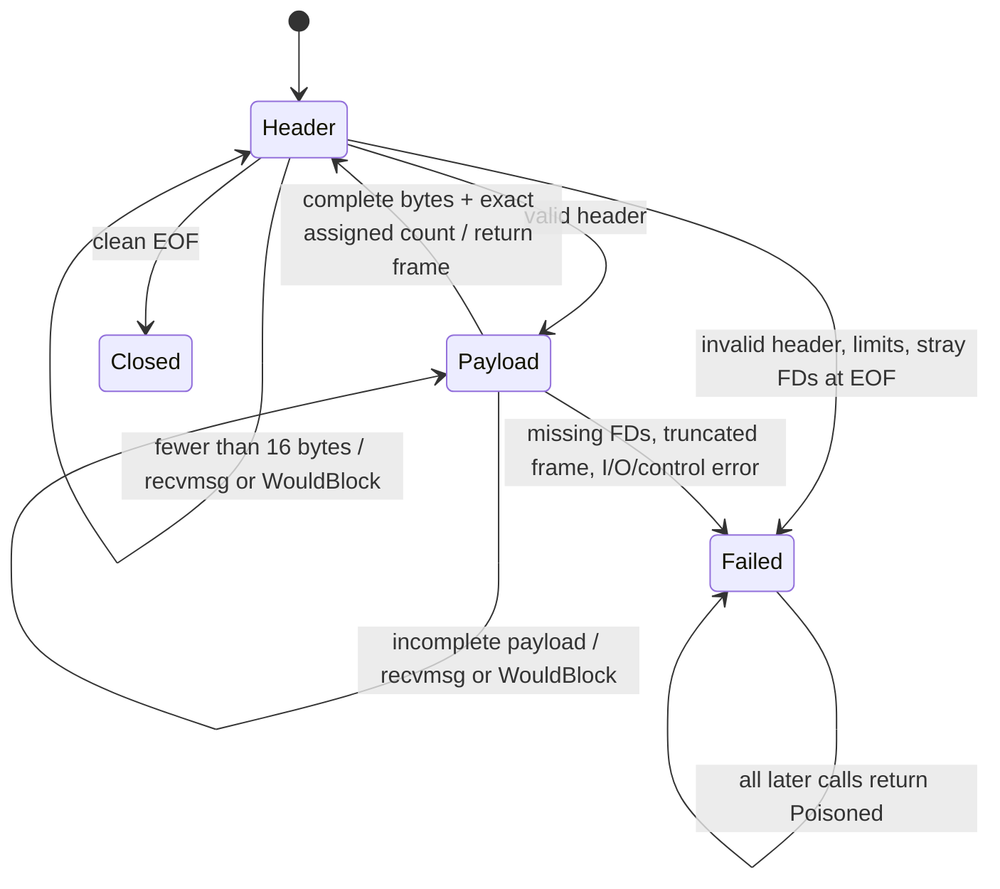
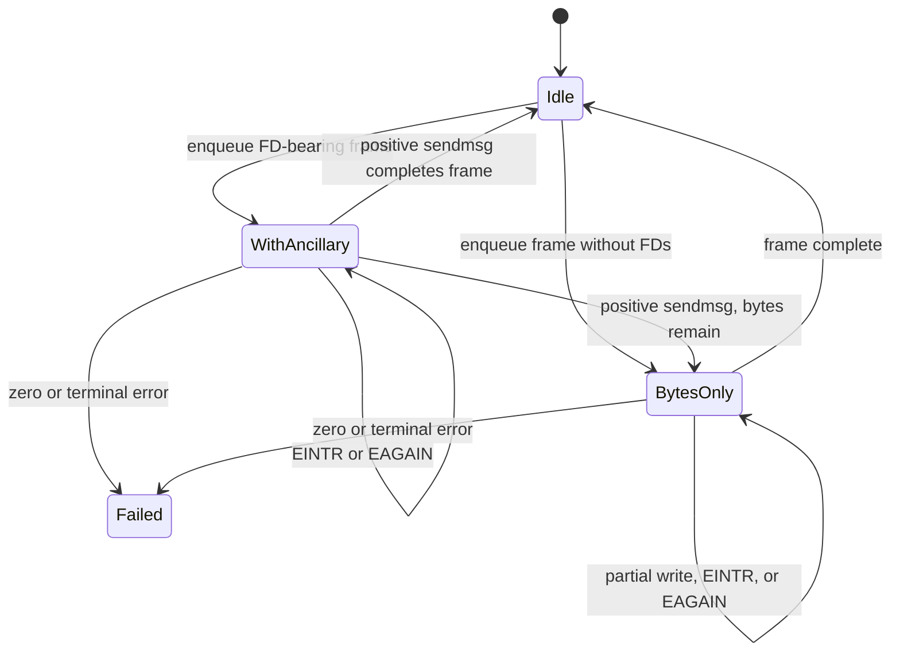

# Native Frame and File-Descriptor Transport Architecture

## Purpose

This design specifies the missing transport boundary identified by the architecture
review and re-kickoff: one bounded, incremental native-frame implementation shared
by the product client and scripted peer. It is intentionally narrower than a
generic protocol or session crate.

The transport owns:

- the 16-byte PipeWire native v3 header;
- incremental Unix stream reads and writes;
- SCM_RIGHTS parsing, sending, and cleanup;
- association of ordered descriptors with complete frames;
- payload and descriptor limits;
- terminal transport error state.

The transport does not own:

- SPA POD encoding or decoding;
- core/client generation footers;
- sequence allocation policy;
- object identity, interface lookup, or opcode routing;
- AddMem or ClientNode semantics;
- event listeners or process scheduling.

Those exclusions are essential. A frame must be consumed independently of whether
the protocol session recognizes its object or opcode, while protocol semantics must
not reach back into stream-buffer advancement.

## Current problem

The client and scripted peer each implement an incomplete half of the required
transport.

The client stores bytes and descriptors in separate connection-global structures
([`/pipewire/src/protocol/connection.rs#L33-L48`](/pipewire/src/protocol/connection.rs#L33-L48)).
`next_message()` only observes a header, typed decoding advances the byte offset,
and demarshal code obtains descriptors later through `pop_fd()`
([`/pipewire/src/protocol/connection.rs#L211-L325`](/pipewire/src/protocol/connection.rs#L211-L325)).
Consequences include:

- unknown object IDs do not consume the frame and can wedge dispatch;
- `header.n_fds` does not delimit the descriptors visible to that frame;
- decode failures can leave descriptor ordering semantically poisoned;
- outbound headers always declare zero FDs;
- the raw outbound FD queue is unused;
- EOF is reported as `EAGAIN`, obscuring clean close versus incomplete frame;
- `IN | HUP` handling can discard final readable bytes before transport sees them.

The scripted peer does validate `n_fds`, but assumes a single `recvmsg` returns the
whole header, adopts received descriptors only after a fallible payload read, and
treats a partial FD-bearing `sendmsg` as terminal failure
([`/server/src/protocol/frame.rs#L100-L184`](/server/src/protocol/frame.rs#L100-L184),
[`/server/src/protocol/frame.rs#L191-L296`](/server/src/protocol/frame.rs#L191-L296)).
It therefore proves friendly packetization rather than Unix stream correctness.

Upstream defines a 16-byte, native-endian header containing object ID, packed
opcode/24-bit payload size, sequence, and FD count. A receiver must collect the
complete message before processing it
([`pipewire/pipewire` native protocol header](https://gitlab.freedesktop.org/pipewire/pipewire/-/blob/69c1b4c8b6a1cfa95982e5ed740a3995d94c1308/doc/dox/internals/protocol.dox#L12-57)).
Upstream also demonstrates two compatibility constraints:

1. Several frames and all their descriptors may be queued before one flush.
2. A send with descriptors may write only part of the queued byte stream; the
   descriptors are then considered sent while remaining bytes are retried without
   them.

The Rust design must preserve those wire behaviors while improving ownership and
failure locality.

## Architectural placement

Create a narrow workspace crate named `pipewire-native-protocol` with a
domain-grouped module rooted at `native::frame`:

```text
protocol/
  Cargo.toml
  src/
    lib.rs
    native/
      mod.rs
      frame/
        mod.rs
        header.rs
        recv.rs
        send.rs
```

The package depends only on `libc` and the Rust standard library. Both
`pipewire-native` and `pipewire-native-server` depend on it. It must not depend on
SPA, proxy types, either consumer, Tokio, or scenario code.

This chooses the preferred target from the architecture review rather than first
making the client marshal tree public. There are already two real consumers, and
the transport's unsafe ancillary-data code deserves one audit surface. The crate
may later host other strictly native-wire types, but it must not become a
miscellaneous common crate.

## Wire and ownership invariants

1. `HEADER_LEN` is 16. Header words use native endianness, matching upstream.
2. The wire payload length is a 24-bit value. A configured limit may be lower but
   never higher than `0x00ff_ffff`.
3. Header parsing uses checked arithmetic before allocation or slicing.
4. A delivered `ReceivedFrame` owns exactly `header.n_fds` `OwnedFd` values.
5. Descriptors never live in an untyped queue visible to protocol dispatch.
6. Every raw descriptor returned by `recvmsg` is adopted into RAII ownership before
   any later fallible operation, or is explicitly closed on that operation's error
   path.
7. `MSG_CTRUNC`, malformed SCM_RIGHTS metadata, limit overflow, an impossible FD
   count, EOF mid-frame, or EOF with unassigned descriptors is a terminal transport
   error. The socket must not be reused after it.
8. Unknown objects, opcodes, and semantic decode errors are not frame errors. The
   complete frame has already left the receiver and is dropped exactly once.
9. Outbound queued descriptors are owned duplicates. Borrowed descriptors cannot
   outlive the call which duplicates them into an `OutboundFrame`.
10. SCM_RIGHTS is emitted at most once for an outbound frame. Any positive
    `sendmsg` result commits ancillary transfer even when the byte write is partial.
11. `EINTR` retries without changing state. `EAGAIN`/`EWOULDBLOCK` preserves all
    unsent state and is not a transport failure.
12. A zero-byte successful send while bytes remain is `WriteZero`, not progress.
13. Clean EOF is reported only when there is no partial header, partial payload, or
    unassigned descriptor.
14. Disconnect, clear, or drop closes every queued inbound and outbound descriptor.
15. Limits cover payload bytes, descriptors per frame, pending descriptors, and
    buffered bytes. A peer cannot force unbounded allocation by header declaration
    or descriptor flood.

## Concrete Rust interface

The following is the intended crate interface. Names may change mechanically during
implementation, but ownership, outcomes, and separation should not.

```rust
use std::collections::VecDeque;
use std::io;
use std::os::fd::{BorrowedFd, OwnedFd};

pub const HEADER_LEN: usize = 16;
pub const WIRE_MAX_PAYLOAD: usize = 0x00ff_ffff;

#[derive(Clone, Copy, Debug, Eq, PartialEq)]
pub struct Header {
    pub object_id: u32,
    pub opcode: u8,
    pub payload_len: u32,
    pub seq: u32,
    pub n_fds: u32,
}

impl Header {
    pub fn decode(bytes: [u8; HEADER_LEN]) -> Self;
    pub fn encode(self) -> Result<[u8; HEADER_LEN], FrameError>;
}

#[derive(Clone, Copy, Debug)]
pub struct FrameLimits {
    pub max_payload: usize,
    pub max_frame_fds: usize,
    pub max_pending_fds: usize,
    pub recv_chunk_bytes: usize,
    pub recv_control_fds: usize,
    pub max_queued_bytes: usize,
    pub max_queued_fds: usize,
}

impl Default for FrameLimits {
    fn default() -> Self {
        Self {
            max_payload: WIRE_MAX_PAYLOAD,
            max_frame_fds: 1024,
            max_pending_fds: 1024,
            recv_chunk_bytes: 32 * 1024,
            recv_control_fds: 64,
            max_queued_bytes: WIRE_MAX_PAYLOAD * 4,
            max_queued_fds: 1024,
        }
    }
}

#[derive(Debug)]
pub struct ReceivedFrame {
    header: Header,
    payload: Vec<u8>,
    fds: FrameFds,
}

impl ReceivedFrame {
    pub fn header(&self) -> Header;
    pub fn payload(&self) -> &[u8];
    pub fn fds(&self) -> &FrameFds;
    pub fn fds_mut(&mut self) -> &mut FrameFds;
    pub fn into_parts(self) -> (Header, Vec<u8>, FrameFds);
}

#[derive(Debug)]
pub struct FrameFds(Vec<Option<OwnedFd>>);

impl FrameFds {
    pub fn len(&self) -> usize;
    pub fn is_empty(&self) -> bool;
    pub fn get(&self, index: u32) -> Result<BorrowedFd<'_>, FrameError>;
    pub fn take(&mut self, index: u32) -> Result<OwnedFd, FrameError>;
}

#[derive(Debug)]
pub struct OutboundFrame {
    header: Header,
    bytes: Vec<u8>,
    fds: Vec<OwnedFd>,
}

impl OutboundFrame {
    pub fn new(
        object_id: u32,
        opcode: u8,
        seq: u32,
        payload: Vec<u8>,
        fds: Vec<OwnedFd>,
        limits: FrameLimits,
    ) -> Result<Self, FrameError>;

    pub fn duplicate_fds(
        object_id: u32,
        opcode: u8,
        seq: u32,
        payload: Vec<u8>,
        fds: &[BorrowedFd<'_>],
        limits: FrameLimits,
    ) -> Result<Self, FrameError>;
}

#[derive(Debug)]
pub enum ReceiveOutcome {
    Frame(ReceivedFrame),
    WouldBlock,
    Closed,
}

#[derive(Debug, Eq, PartialEq)]
pub enum FlushOutcome {
    Drained,
    WouldBlock,
}

pub struct FrameReceiver { /* private incremental state */ }

impl FrameReceiver {
    pub fn new(limits: FrameLimits) -> Self;
    pub fn receive(
        &mut self,
        socket: BorrowedFd<'_>,
    ) -> Result<ReceiveOutcome, FrameError>;
    pub fn buffered_bytes(&self) -> usize;
    pub fn pending_fds(&self) -> usize;
    pub fn clear(&mut self);
}

pub struct FrameSender { /* VecDeque<SendFrame> */ }

impl FrameSender {
    pub fn new(limits: FrameLimits) -> Self;
    pub fn enqueue(&mut self, frame: OutboundFrame) -> Result<(), FrameError>;
    pub fn flush(
        &mut self,
        socket: BorrowedFd<'_>,
    ) -> Result<FlushOutcome, FrameError>;
    pub fn is_empty(&self) -> bool;
    pub fn queued_bytes(&self) -> usize;
    pub fn clear(&mut self);
}

pub struct FrameTransport {
    pub receiver: FrameReceiver,
    pub sender: FrameSender,
}
```

`OutboundFrame::new` derives `payload_len` and `n_fds`; callers cannot provide
inconsistent values. `duplicate_fds` uses `F_DUPFD_CLOEXEC` (or `OwnedFd::try_clone`
where it gives equivalent close-on-exec behavior) before enqueueing. The sender
owns those duplicates until a successful ancillary send or cleanup.

`FrameFds` is indexed because SPA `Fd` values are indices into the frame's FD table,
not instructions to pop a connection-global queue. `get` supports repeated
non-owning references while the frame lives. `take` transfers unique ownership to
an importer such as AddMem and fails on a second take. Unused entries close when the
frame is dropped.

`FrameError` should retain a stable category plus source `io::Error` where relevant:

```rust
#[derive(Debug)]
pub enum FrameError {
    Io(io::Error),
    PayloadTooLarge { declared: usize, limit: usize },
    TooManyFrameFds { declared: usize, limit: usize },
    TooManyPendingFds { received: usize, limit: usize },
    SendQueueFull { queued: usize, additional: usize, limit: usize },
    SendFdQueueFull { queued: usize, additional: usize, limit: usize },
    TruncatedControl,
    MalformedControl,
    MissingFds { declared: usize, available: usize },
    UnexpectedFdsAtEof { count: usize },
    TruncatedFrame { buffered: usize, needed: usize },
    InvalidFdIndex { index: u32, count: usize },
    FdAlreadyTaken { index: u32 },
    WriteZero,
    Poisoned,
}
```

All errors except an invalid/taken index used after frame delivery poison the
corresponding receiver or sender. Subsequent transport operations return
`FrameError::Poisoned`; the session disconnects and drops the transport.
`SendQueueFull` and `SendFdQueueFull` are pre-enqueue backpressure results and do
not poison the sender.

## Receive state

The receiver tracks absolute stream positions so buffer compaction cannot erase
where ancillary data entered the byte stream:

```rust
struct FrameReceiver {
    limits: FrameLimits,
    state: RecvState,
    bytes: VecDeque<u8>,
    byte_base: u64,
    stream_end: u64,
    fd_batches: VecDeque<FdBatch>,
}

struct FdBatch {
    at: u64,
    fds: VecDeque<OwnedFd>,
}

enum RecvState {
    Header,
    Payload { header: Header, frame_start: u64, frame_end: u64 },
    Eof,
    Failed,
}
```

For every `recvmsg`, `chunk_start` is the pre-read `stream_end`. All SCM_RIGHTS FDs
returned with that call are recorded in an `FdBatch { at: chunk_start, ... }`.
`stream_end` advances only by the positive byte count. A stream SCM_RIGHTS send must
carry data; a zero-byte receive is EOF and cannot introduce a valid new batch.

### SCM_RIGHTS association rule

PipeWire's header supplies an ordered FD count, while SCM_RIGHTS supplies ordered
descriptor batches associated with byte progress. The receiver combines both:

1. Frame byte span is `[frame_start, frame_end)`.
2. Only descriptors from batches with `batch.at < frame_end` may satisfy this frame.
   A descriptor observed with later bytes can never be pulled backward.
3. Eligible descriptors remain in receive order across cmsgs and recvmsg calls.
4. The next `header.n_fds` eligible descriptors become this frame's `FrameFds`.
5. Any unconsumed descriptors remain position-tagged for later frames.
6. If the complete frame bytes have been received but fewer than `n_fds` eligible
   descriptors exist, receipt fails with `MissingFds`.
7. EOF with any unassigned descriptors fails with `UnexpectedFdsAtEof`.

The byte position is a causality bound, not a claim that one cmsg equals one frame.
Upstream queues descriptors for multiple frames and may attach up to 28 at a time to
the earliest bytes of a flush
([`connection.c#L755-L843`](https://gitlab.freedesktop.org/pipewire/pipewire/-/blob/69c1b4c8b6a1cfa95982e5ed740a3995d94c1308/src/modules/module-protocol-native/connection.c#L755-843)).
Its own receiver consequently partitions a connection FD array by each header's
`n_fds`
([`connection.c#L495-L563`](https://gitlab.freedesktop.org/pipewire/pipewire/-/blob/69c1b4c8b6a1cfa95982e5ed740a3995d94c1308/src/modules/module-protocol-native/connection.c#L495-563)).

This has a fundamental limit: with the upstream wire behavior, an extra descriptor
prefetched in a batch is indistinguishable from a legitimate descriptor for a later
queued frame until more headers or EOF arrive. No compatible receiver can prove
one-cmsg-per-frame provenance that the sender did not encode. This design still
improves on a raw global queue by preserving byte causality, exact delivered frame
counts, RAII cleanup, and terminal detection at the earliest deterministic point.
Stronger provenance would require a protocol revision or a negotiated sender rule
that emits each frame's FDs in a separate send operation.

### Receive transition table

| State | Input | Action | Next/result |
|---|---|---|---|
| Header | At least 16 buffered bytes | Decode header; validate payload and FD limits; compute `frame_end` with checked arithmetic | Payload |
| Header | Fewer than 16 bytes | `recvmsg` into bounded chunk | Header, EOF/error, or retry |
| Payload | Complete byte span and enough eligible FDs | Remove header/payload bytes; move exactly `n_fds`; compact; construct owned frame | Header + `Frame` |
| Payload | Complete byte span but too few eligible FDs | Drop all pending resources and poison | `MissingFds` |
| Payload | Incomplete bytes | `recvmsg` and atomically adopt ancillary data | Payload, EOF/error, or retry |
| Any live | `EINTR` | Retry same syscall without state mutation | Same |
| Any live | `EAGAIN`/`EWOULDBLOCK` | Preserve buffers and FD batches | `WouldBlock` |
| Header, empty | EOF, no pending FDs | Mark EOF | `Closed` |
| Header/Payload | EOF with partial bytes | Drop pending FDs and poison | `TruncatedFrame` |
| Header, empty | EOF with pending FDs | Drop FDs and poison | `UnexpectedFdsAtEof` |
| Any live | malformed/truncated control | Adopt/close every parseable received FD, clear state, poison | control error |



`receive()` first attempts to assemble from existing state, then performs `recvmsg`
only when more bytes or descriptor evidence is required. It may loop over `EINTR`,
but it returns after one frame, `WouldBlock`, clean close, or error. The event loop
calls it repeatedly to drain readable data before reacting to HUP.

## Ancillary receive safety

The unsafe `recvmsg` helper is private and small. Its postcondition is either an
owned `(bytes_read, Vec<OwnedFd>)` result or no leaked descriptor.

Required order:

1. Allocate an aligned control buffer sized with `CMSG_SPACE` for
   `recv_control_fds` and a bounded byte chunk.
2. Call `recvmsg` with `MSG_CMSG_CLOEXEC | MSG_DONTWAIT`.
3. On a positive result, walk every cmsg using checked addresses and lengths.
4. Reject SCM_RIGHTS records whose `cmsg_len` is below `CMSG_LEN(0)`, exceeds the
   visible control range, or has a data length not divisible by `size_of::<RawFd>()`.
5. Convert each nonnegative raw FD to `OwnedFd` immediately. Keep adopted values in
   a local vector so any later error drops them.
6. Ignore well-formed ancillary records of unrelated level/type. They are not part
   of native framing.
7. If `MSG_CTRUNC` is set, parse and adopt every safely visible SCM_RIGHTS FD, then
   return `TruncatedControl`; local ownership closes all visible descriptors.
8. Enforce pending limits before moving the local vector into receiver state.

The implementation must not subtract `CMSG_LEN(0)` before validating `cmsg_len`, as
both current Rust implementations do. It must not defer adoption until payload
completion. Upstream explicitly closes visible SCM_RIGHTS descriptors on truncation
and overflow
([`connection.c#L172-L274`](https://gitlab.freedesktop.org/pipewire/pipewire/-/blob/69c1b4c8b6a1cfa95982e5ed740a3995d94c1308/src/modules/module-protocol-native/connection.c#L172-274)); Rust RAII should encode the same cleanup rather than reproduce manual ownership globally.

## Send state

The sender queues complete frames but writes only the front frame. This is simpler
than upstream's global byte/FD queues and remains wire-compatible.

```rust
struct SendFrame {
    bytes: Vec<u8>,       // encoded header followed by payload
    offset: usize,
    fds: Vec<OwnedFd>,
    ancillary_sent: bool,
}

struct FrameSender {
    limits: FrameLimits,
    queue: VecDeque<SendFrame>,
    queued_bytes: usize,
    queued_fds: usize,
    failed: bool,
}
```

The first send attempt for a frame with FDs uses `sendmsg` with one iovec for the
unsent bytes and one SCM_RIGHTS record. A positive byte count means all attached FDs
were transferred; set `ancillary_sent = true` and clear the local FD vector before
any further fallible operation. Advance `offset` by the returned byte count. If
bytes remain, subsequent attempts contain no ancillary data.

Frames without FDs may use `send` or the same `sendmsg` helper with an empty control
buffer. Use `MSG_NOSIGNAL | MSG_DONTWAIT` in either case.

### Send transition table

| State | Syscall result | Action | Next/result |
|---|---|---|---|
| Empty queue | none | No syscall | `Drained` |
| Frame, ancillary not sent | positive `sendmsg` | Mark ancillary sent, drop owned duplicates, advance bytes | Continue or pop frame |
| Frame, ancillary not sent | `EAGAIN` | Retain bytes and all FDs | `WouldBlock` |
| Frame, ancillary sent | positive send | Advance bytes only | Continue or pop frame |
| Any frame | `EINTR` | Retry unchanged | Same |
| Any frame | zero | Poison and drop queue | `WriteZero` |
| Any frame | terminal error | Poison and drop queue/Fds | `Io` |
| Complete frame | offset equals length | Pop; begin next frame in same flush call | Next frame or `Drained` |



The current scripted peer's expectation that FD-bearing `sendmsg` must write the
entire frame is removed. Upstream likewise decrements its FD queue immediately after
a positive `sendmsg`, then retains only remaining bytes
([`connection.c#L779-L843`](https://gitlab.freedesktop.org/pipewire/pipewire/-/blob/69c1b4c8b6a1cfa95982e5ed740a3995d94c1308/src/modules/module-protocol-native/connection.c#L779-843)).

## Session integration contract

The client protocol session changes from:

```text
next_message -> object lookup -> typed decode from connection -> pop_fd
```

to:

```text
FrameReceiver::receive -> owned ReceivedFrame -> object lookup -> typed decode
```

Typed decoders accept `&mut ReceivedFrame` or its split payload and `FrameFds`.
They may resolve SPA FD indices through `FrameFds::get` or transfer an FD through
`take`. They never advance transport buffers.

Footer handling remains in the session. It decodes the first payload POD and an
optional trailing footer POD from `frame.payload()`, updates generation state, and
requires their consumed lengths to equal `header.payload_len`. The transport does
not need to know that a footer exists.

Policy after frame delivery:

- Unknown object: log route fields and drop the frame.
- Unknown opcode: apply interface compatibility policy and drop the frame.
- POD decode error: report semantic protocol error and drop the frame.
- AddMem: decoder validates the SPA FD index and transfers exactly one `OwnedFd` to
  the single-owner memory importer.
- Any unclaimed FD: closes with the frame; no descriptor can shift into a later
  frame.

The event loop must process `IN` before terminal `HUP`/`ERR`. It repeatedly calls
`receive()` until `WouldBlock` or `Closed`, dispatching every returned frame, then
handles the terminal readiness bit. This fixes the final-frame race documented in
the architecture review.

## Error cleanup matrix

| Failure point | Bytes | FDs | Connection policy |
|---|---|---|---|
| Header length/limit invalid | Clear receiver | Drop all pending batches | Fatal |
| `MSG_CTRUNC` | Clear receiver | Adopt and drop all safely visible plus prior pending FDs | Fatal |
| Malformed cmsg | Clear receiver | Drop all already adopted and all prior pending FDs; explicitly close any safely discoverable raw rights | Fatal |
| Pending FD limit exceeded | Clear receiver | Drop new and pending owned FDs | Fatal |
| Complete frame lacks eligible FDs | Clear receiver | Drop all pending FDs | Fatal |
| EOF mid-frame | Clear receiver | Drop all pending FDs | Fatal |
| EOF with leftover FDs | Empty bytes | Drop leftover FDs | Fatal |
| Unknown object/opcode | Already consumed | Drop only that frame's FDs | Session policy; transport remains usable |
| POD/footer decode error | Already consumed | Drop/take only that frame's FDs | Session policy; transport remains synchronized |
| Outbound FD duplication fails | No frame enqueued | Drop duplicates already made | Caller error; sender remains usable |
| Outbound queue byte/FD limit exceeded | No frame enqueued | Drop the rejected frame and its owned FDs | Backpressure; sender remains usable |
| `sendmsg` `EAGAIN` before progress | Preserve bytes | Preserve unsent FDs | Retry on writable |
| Partial positive FD send | Preserve byte suffix | Drop sent local duplicates | Retry bytes without cmsg |
| Terminal send error | Drop queue | Drop every not-yet-sent FD | Fatal |
| Explicit clear/disconnect/drop | Clear both directions | RAII drop all queues and delivered-frame temporaries | Closed |

Descriptor accounting tests should compare `/proc/self/fd` before and after every
failure case on Linux. Unit tests must also use close-observable pipe or eventfd
fixtures so correctness does not depend solely on process-wide counts.

## Migration sequence

Each step is independently testable and keeps the existing product and peer paths
until its replacement has parity.

### 1. Introduce the shared frame crate

- Add `pipewire-native-protocol` with `native::frame::{header, recv, send}`.
- Implement header, limits, owned frame types, ancillary helpers, and state machines.
- Add pure state tests plus real `UnixStream::pair` tests.
- Do not alter `Connection` or `server` yet.

Exit condition: every-split, partial-send, ancillary-error, and cleanup tests pass in
the new crate.

### 2. Migrate scripted-peer sending

- Adapt each scripted action to build an `OutboundFrame`.
- Replace `write_packet_with_fds` with `FrameSender::enqueue/flush`.
- Keep scenario DTO encoders unchanged; they still produce payload bytes.
- Make the runtime wait for writable readiness on `WouldBlock` with a bounded test
  deadline.
- Preserve existing bootstrap, rejection, and AddMem behavior.

Exit condition: existing peer tests pass, including forced partial send where the
SCM_RIGHTS cmsg is observed once.

### 3. Migrate scripted-peer receiving

- Replace `read_packet` and the one-shot header recvmsg with `FrameReceiver`.
- Decode the returned payload through the current `InboundMessage` adapter.
- Explicitly reject or consume inbound frame FDs according to scripted expectation;
  never silently retain them globally.
- Add diagnostics for receiver state, buffered bytes, pending FDs, last frame route,
  and script step on timeout.

Exit condition: all current server tests pass under every header and payload split;
the old `server/src/protocol/frame.rs` implementation is deleted or reduced to a
temporary type adapter with no I/O.

### 4. Migrate client outbound framing

- Keep `Connection::push<T>` as a session adapter initially.
- Encode object POD plus optional generation footer into payload bytes.
- Construct `OutboundFrame`; derive header size and FD count rather than hard-coding
  zero.
- Replace `out_buf`, `out_size`, and `out_fds` with `FrameSender`.
- Add an internal push variant accepting owned or intentionally duplicated FDs for
  future ClientNode methods.
- Preserve sequence allocation and `need_flush` signaling in `Connection`/session.

Exit condition: byte-for-byte no-FD messages match existing output, partial writes
work, and outbound FD roundtrips pass against both the shared receiver and upstream.

### 5. Migrate client inbound framing

- Replace `in_buf`, `in_size`, `in_offset`, and `in_fds` with `FrameReceiver`.
- Change `process_messages` to obtain a complete owned frame before proxy lookup.
- Change every event demarshaller to accept frame payload/FD table rather than
  `Connection` plus header.
- Convert AddMem first as the ownership proof: resolve its POD FD index with
  `FrameFds::take` and transfer the `OwnedFd` once.
- Remove `next_message`, `decode_message` buffer advancement, and `pop_fd` after all
  demarshallers migrate.
- Drain readable frames before honoring HUP.

Exit condition: unknown object, unknown opcode, malformed payload, AddMem, coalesced
frames, and final-frame-plus-HUP tests all consume exactly one frame and leak no FD.

### 6. Remove duplicate transport code

- Delete the direct libc recvmsg/sendmsg code from both existing modules.
- Keep session-specific generation/footer handling in `pipewire`.
- Keep scripted scenarios and object expectations in `server` until the separate
  placement ADR decides whether the peer moves in-crate.
- Do not make the full marshal tree public as part of this cleanup.

Exit condition: repository search finds one SCM_RIGHTS implementation, both
consumers use complete frames, and no owning `RawFd` crosses protocol APIs.

### 7. Differential and compatibility gate

- Exchange queued multi-frame, multi-FD traffic in both directions with an upstream
  PipeWire connection harness.
- Include more than upstream's `MAX_FDS_MSG` (28) in a queued exchange so multiple
  ancillary batches are exercised.
- Confirm native v3 header bytes, FD indices, frame ordering, partial flush, and
  cleanup match upstream commit `69c1b4c8b6a1cfa95982e5ed740a3995d94c1308`.

Exit condition: the same semantic frames result from shared Rust sender/receiver,
Rust/upstream, and upstream/Rust combinations.

## Test matrix

### Header and limits

| Case | Expected result |
|---|---|
| Minimum empty payload | One frame, no allocation beyond header |
| Maximum configured payload | Accepted |
| Configured limit + 1 | `PayloadTooLarge`, fatal |
| Wire maximum `0x00ff_ffff` | Correct encode/decode |
| `n_fds == max_frame_fds` | Accepted when supplied |
| `n_fds > max_frame_fds` | `TooManyFrameFds`, fatal |
| Native-endian known vector | Matches upstream header bytes |
| Checked absolute-position overflow | Rejected before state mutation |

### Segmentation and coalescing

| Case | Expected result |
|---|---|
| Split at every byte of one frame | Identical `ReceivedFrame` for all splits |
| Split every header byte | No short-header error before EOF |
| Split every payload byte | No premature decode |
| Two or more frames in one recv | Returned in order, one per call |
| Header of next frame coalesced with prior payload | Prior frame exact; suffix retained |
| Final full frame followed by EOF | Frame first, then `Closed` |
| EOF at every incomplete byte position | `TruncatedFrame`, no leak |
| `IN | HUP` readiness | All final frames dispatched before close |

### Descriptor association

| Case | Expected result |
|---|---|
| One FD at first header byte | Frame owns one FD |
| FD batch arrives in later header fragment | Eligible for that frame when before `frame_end` |
| FD observed at/after next frame start | Cannot satisfy preceding frame |
| One batch contains FDs for several queued frames | Ordered partition by each `n_fds` |
| Several cmsgs in one recvmsg | Stable cmsg and FD order |
| More than 28 FDs split across ancillary sends | One frame/table in correct order |
| Header claims more than eligible rights | `MissingFds`, fatal |
| Extra rights with no later claiming frame, then EOF | `UnexpectedFdsAtEof`, fatal |
| FD POD index out of range | Semantic `InvalidFdIndex`; later frame unaffected |
| Same index borrowed twice | Both borrows valid while frame lives |
| Same index taken twice | Second take fails; no double close |
| Unknown frame with FDs | All its assigned FDs close on drop |

### Ancillary robustness

| Case | Expected result |
|---|---|
| `MSG_CTRUNC` | Fatal; every visible and pending FD closes |
| `cmsg_len < CMSG_LEN(0)` | `MalformedControl`, no arithmetic underflow |
| `cmsg_len` beyond control buffer | `MalformedControl`, no out-of-bounds read |
| SCM_RIGHTS byte length not divisible by FD size | `MalformedControl` |
| Negative FD value in synthetic parser test | Rejected without adoption |
| Unknown well-formed ancillary type | Ignored |
| Descriptor flood beyond pending limit | Fatal; all received FDs close |
| `recvmsg` interrupted repeatedly | Eventual result, no duplicate adoption |

### Partial sending

| Case | Expected result |
|---|---|
| No-FD frame partial at every byte | Exact wire bytes, no duplication |
| FD frame first send writes 1 byte | FDs observed once; remainder has no cmsg |
| FD frame first send writes full header only | Payload resumes without cmsg |
| `EAGAIN` before first progress | FDs retained and sent on retry |
| `EINTR` before first progress | Same send state retried |
| `EAGAIN` after ancillary progress | FDs already dropped locally; bytes retained |
| Multiple queued FD frames | Each frame's cmsg emitted once, in frame order |
| Terminal error before ancillary progress | Queued duplicates close |
| Terminal error after ancillary progress | Remaining queue closes; sent duplicates are not resent |
| Zero successful write | `WriteZero`, fatal |

### Consumer integration

| Case | Client assertion | Scripted-peer assertion |
|---|---|---|
| Bootstrap | Existing proxy/session behavior unchanged | Existing ordered scenario unchanged |
| Unknown object | Frame consumed once; loop continues | Can script and observe policy |
| Malformed POD | Frame FDs close; next frame remains aligned | Reports exact failed step |
| AddMem | One `OwnedFd` reaches importer | Sent memfd remains valid until RemoveMem |
| Coalesced AddMem + Done | Correct FD only on AddMem | Both actions complete |
| Final Done + close | Done dispatched before disconnect | Deterministic report |
| Deadline | State/byte/FD diagnostics emitted | Last script step emitted |

Property tests should generate frame sequences, byte splits, cmsg batch boundaries,
FD-count distributions, `EINTR`/`EAGAIN` schedules, and close positions. The oracle
is the original sequence of `(Header, payload, descriptor identity)` values, not the
syscall packetization.

## Explicit decisions

| Topic | Decision | Reason |
|---|---|---|
| Placement | New narrow `pipewire-native-protocol::native::frame` crate | Two real consumers need the same unsafe transport without sharing proxy/session behavior |
| Protocol version | Implement native v3 16-byte framing only in the first slice | Both current Rust paths use v3; upstream v0 negotiation would complicate a safety-critical migration without a demonstrated consumer |
| Frame payload storage | Owned `Vec<u8>` initially | Decouples dispatch and reentrancy from receiver buffer lifetime; optimize only with evidence |
| Received descriptors | `FrameFds` of `OwnedFd`, indexed by POD FD index | Encodes per-frame ownership and supports unique transfer without raw owning integers |
| Outbound descriptors | Sender-owned `OwnedFd` duplicates | Queue lifetime is independent of caller; cleanup is deterministic |
| Receive mismatch | Fatal transport error | Stream and descriptor synchronization cannot be safely recovered |
| Semantic decode failure | Drop one owned frame; session chooses continue/disconnect | Framing remains synchronized and cannot wedge |
| Ancillary association | Absolute receive byte position plus ordered `n_fds` partition | Strongest rule compatible with upstream batched sends |
| Send batching | One front frame at a time | Simpler ownership and partial-write state; wire-compatible despite differing syscall batching |
| Send backpressure | Bound total queued encoded bytes and descriptors in `FrameLimits` | Prevents an unwritable peer or producer burst from growing memory or FD ownership without limit |
| Footer/generation | Remain in protocol session | They are payload semantics, not native stream framing |
| HUP handling | Drain `IN` to `WouldBlock`/EOF before terminal HUP | Prevents loss of final readable frames |
| Recovery after malformed control/frame | Poison and disconnect | Continuing risks descriptor substitution and byte desynchronization |
| Scripted peer lifecycle | Preserve separate peer during transport migration | Sharing frame code does not require prematurely deciding or executing peer relocation |

## Open questions

1. Should the default payload limit preserve the client's intended 16 MiB policy as
   `0x00ff_ffff`, or use a lower operational bound? The current `16_777_216` constant
   is one byte above the wire's 24-bit maximum and must not be copied unchanged.
2. Is native protocol v0 interoperability required by any supported daemon? If yes,
   add a separate negotiated header codec after v3 migration rather than making the
   v3 state machine branch implicitly.
3. Should a semantic POD decode error allow subsequent frames or terminate the
   session? The transport can safely continue, but compatibility and security policy
   belong to the session and need a documented answer.
4. Does any implemented outbound method require preserving upstream's within-frame
   duplicate-FD deduplication by raw descriptor identity? Prefer explicit reuse of
   one FD-table index during payload construction rather than deduplicating inside
   the transport.
5. Should `FrameFds::take` be the only owning operation, or should an explicit
   `try_clone(index)` helper exist for intentional multicast? Do not add it until a
   concrete protocol consumer needs duplicated ownership.
6. Can Linux-specific tests reliably force `MSG_CTRUNC`, multiple ancillary batches,
   and one-byte positive FD sends in CI, or is a syscall-injection state harness
   needed alongside socketpair tests? The design expects both pure state tests and
   real kernel tests.
7. Is the upstream prefetch ambiguity acceptable in the documented trust model?
   Eliminating it requires an incompatible/negotiated framing rule or upstream
   per-frame ancillary discipline; a receiver-only change cannot create provenance
   absent from the stream.

## Acceptance criteria

The architecture is implemented when:

- client and scripted peer use the same header and ancillary transport;
- every returned frame owns exactly its declared FD table;
- no protocol demarshaller calls `pop_fd` or owns a `RawFd`;
- every header/payload split and frame coalescing produces identical frames;
- partial positive FD sends never resend ancillary data;
- malformed, truncated, missing, extra-at-EOF, and overflow cases close every FD;
- unknown objects/opcodes and POD failures cannot stall stream advancement;
- readable data is drained before HUP teardown;
- upstream/Rust differential exchanges pass for queued frames and more than 28 FDs;
- diagnostics expose current receive/send state, buffered bytes, pending/queued FDs,
  and the last complete frame route without exposing raw descriptor ownership.

## Cross-references

- [`/.design/architecture-review/review0.oc.md`](/.design/architecture-review/review0.oc.md): identifies frame/FD separation, dispatch-controlled consumption, partial-I/O defects, and the shared narrow wire module as the highest-leverage transport work. This design turns those findings into concrete state and ownership interfaces.
- [`/.design/architecture-review/review-rekick0.oc.md`](/.design/architecture-review/review-rekick0.oc.md): defines the frame-owned descriptor proof and migration direction. This document resolves its frame-interface ticket into implementable receive/send transitions and tests.
- [`/pipewire/src/protocol/connection.rs`](/pipewire/src/protocol/connection.rs): current client implementation to replace incrementally; generation and sequence policy remain here while byte/FD queues move to the shared transport.
- [`/pipewire/src/protocol/client.rs#L154-L230`](/pipewire/src/protocol/client.rs#L154-L230): current HUP-first and lookup-before-consume behavior; the session integration contract specifically reverses both orderings.
- [`/pipewire/src/protocol/marshal/message.rs`](/pipewire/src/protocol/marshal/message.rs): current duplicate header and footer-aware message wrapper; header moves to the shared crate while footer parsing remains session-owned.
- [`/server/src/protocol/frame.rs`](/server/src/protocol/frame.rs): current scripted-peer one-shot codec; its public packet adapters migrate onto `FrameReceiver`/`FrameSender` before its direct libc code is removed.
- [`/doc/discovery/server.md`](/doc/discovery/server.md): establishes the deterministic real-socket peer as a testing level. The shared transport preserves that peer rather than replacing it with mocks.
- [`/doc/discovery/server-unification.md`](/doc/discovery/server-unification.md): inventories duplicated headers and SCM_RIGHTS helpers. This design narrows the shared boundary and avoids sharing client-side marshal/session behavior prematurely.
- [`/doc/discovery/merge.md`](/doc/discovery/merge.md): argues for one protocol path across client and test peer. This design provides that path while leaving the separate peer-placement decision reversible.
- [`/doc/discovery/merge-impl-plan.md`](/doc/discovery/merge-impl-plan.md): earlier in-crate migration plan. This design differs by extracting the already-proven two-consumer frame seam first, but its parity-before-deletion sequencing remains applicable.
- [`pipewire/pipewire` native protocol documentation](https://gitlab.freedesktop.org/pipewire/pipewire/-/blob/69c1b4c8b6a1cfa95982e5ed740a3995d94c1308/doc/dox/internals/protocol.dox#L12-57): canonical header, native endianness, payload/footer extent, and per-message FD-count definition.
- [`pipewire/pipewire` `connection.c`](https://gitlab.freedesktop.org/pipewire/pipewire/-/blob/69c1b4c8b6a1cfa95982e5ed740a3995d94c1308/src/modules/module-protocol-native/connection.c#L30-68): canonical upstream limits and input/output buffer state used as the compatibility baseline.
- [`pipewire/pipewire` receive implementation](https://gitlab.freedesktop.org/pipewire/pipewire/-/blob/69c1b4c8b6a1cfa95982e5ed740a3995d94c1308/src/modules/module-protocol-native/connection.c#L200-295): primary reference for nonblocking recvmsg, control truncation cleanup, FD limits, and buffer compaction.
- [`pipewire/pipewire` frame preparation](https://gitlab.freedesktop.org/pipewire/pipewire/-/blob/69c1b4c8b6a1cfa95982e5ed740a3995d94c1308/src/modules/module-protocol-native/connection.c#L495-610): primary reference for complete-frame collection and ordered `n_fds` partitioning.
- [`pipewire/pipewire` send implementation](https://gitlab.freedesktop.org/pipewire/pipewire/-/blob/69c1b4c8b6a1cfa95982e5ed740a3995d94c1308/src/modules/module-protocol-native/connection.c#L674-843): primary reference for frame header construction, duplicated outbound descriptors, batching, and partial ancillary send behavior.
- [`pipewire/pipewire` connection tests](https://gitlab.freedesktop.org/pipewire/pipewire/-/blob/69c1b4c8b6a1cfa95982e5ed740a3995d94c1308/src/modules/module-protocol-native/test-connection.c#L38-248): upstream evidence for queued multi-frame FD exchanges and rejection of a header claiming unavailable descriptors.
- [`pipewire/pipewire` native extension API](https://gitlab.freedesktop.org/pipewire/pipewire/-/blob/69c1b4c8b6a1cfa95982e5ed740a3995d94c1308/src/pipewire/extensions/protocol-native.h#L27-64): canonical message shape and indexed add/get FD interface informing `FrameFds`.
