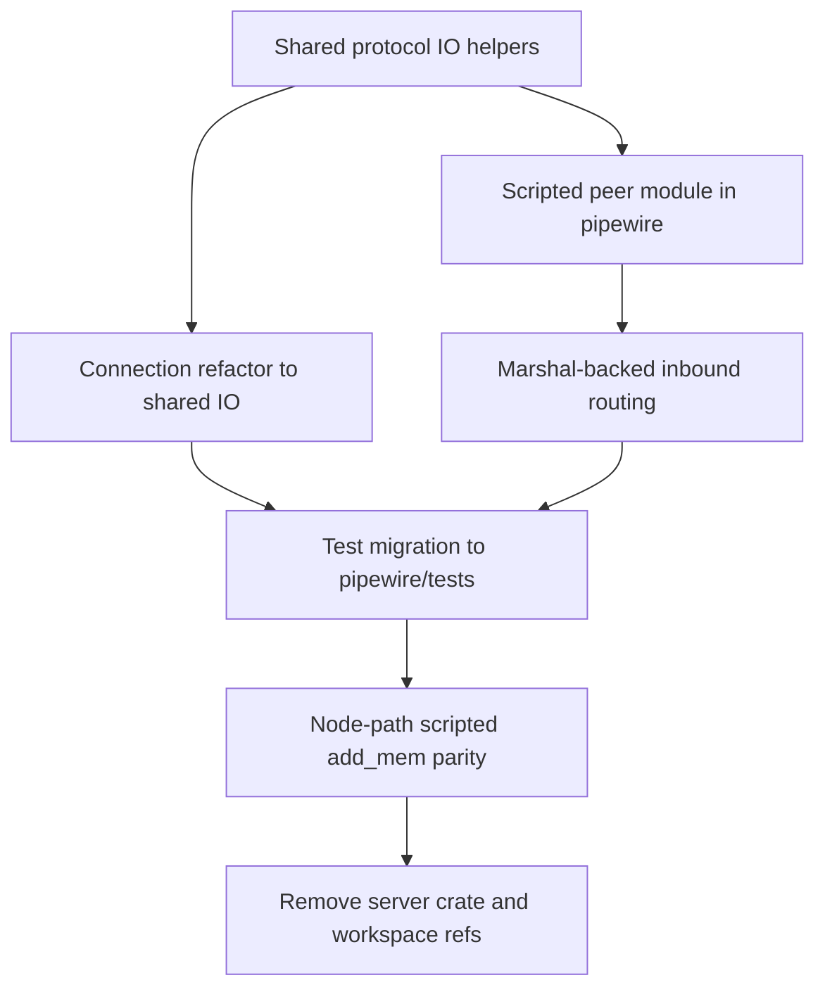

# Implementation Plan: Merge `server/` into `pipewire/`

## Goal

Execute the merge strategy from [`/doc/discovery/merge.md`](/doc/discovery/merge.md) so deterministic scripted-peer testing and node/data-plane validation live inside [`/pipewire`](/pipewire), with one shared protocol implementation.

## Scope

In scope:

- unify native frame + SCM_RIGHTS I/O primitives in `pipewire`
- migrate scripted peer runtime/model from [`/server/src`](/server/src) to `pipewire` test support
- migrate relevant integration tests to use in-crate scripted peer
- remove standalone `server/` crate from workspace after parity

Out of scope for this pass:

- full production server implementation
- broad public API redesign for scripted testing
- unrelated node runtime behavior changes

## Constraints

- Reuse existing marshal types under [`/pipewire/src/protocol/marshal`](/pipewire/src/protocol/marshal) instead of introducing parallel protocol structs.
- Keep module layout domain-grouped; no flat dumping.
- Keep scripted peer test-focused and internal.
- Preserve current deterministic behavior from [`/server/tests/scripted_server.rs`](/server/tests/scripted_server.rs).

## Work graph

## Task breakdown

### 1) Shared protocol I/O helpers

Target files:

- add `pipewire/src/protocol/io/mod.rs`
- update [`/pipewire/src/protocol/mod.rs`](/pipewire/src/protocol/mod.rs)

Actions:

- extract reusable primitives for native header read/write and SCM_RIGHTS send/recv
- centralize constants (`HEADER_LEN`, `MAX_CONTROL_FDS`, max payload)
- expose internal APIs for both `connection` and scripted-peer runtime

Validation:

- new unit tests for fd send/recv and truncation/error handling

### 2) Refactor connection to shared I/O

Target files:

- [`/pipewire/src/protocol/connection.rs`](/pipewire/src/protocol/connection.rs)

Actions:

- replace direct `recvmsg` handling with shared `io` helper usage
- preserve current generation/footer behavior
- prepare outbound fd send path for non-zero `n_fds` support

Validation:

- existing `pipewire` test suite remains green

### 3) Introduce in-crate scripted peer runtime

Target files (new):

- `pipewire/src/testing/mod.rs`
- `pipewire/src/testing/scripted_peer/{runtime.rs,script.rs,state.rs,testkit.rs,mod.rs}`

Actions:

- port runtime/script/state/testkit model from [`/server/src`](/server/src)
- keep builder ergonomics and deterministic step execution
- switch frame/fd operations to shared `protocol::io` helpers

Validation:

- parity unit tests for expectation matching and run-state updates

### 4) Replace custom inbound decode with marshal-backed routing

Target areas:

- scripted-peer inbound dispatch in `pipewire/src/testing/scripted_peer/`
- marshal usage from [`/pipewire/src/protocol/marshal/core.rs`](/pipewire/src/protocol/marshal/core.rs), [`/pipewire/src/protocol/marshal/client.rs`](/pipewire/src/protocol/marshal/client.rs), and [`/pipewire/src/protocol/marshal/registry.rs`](/pipewire/src/protocol/marshal/registry.rs)

Actions:

- remove custom message-shape parser logic from migrated server code
- decode inbound payloads using marshal structs/opcodes where available
- keep explicit fallback path for unknown opcodes

Validation:

- scripted bootstrap and bind scenarios produce identical behavior to pre-merge tests

### 5) Migrate tests to in-crate scripted peer

Target files:

- migrate logic from [`/server/tests/scripted_server.rs`](/server/tests/scripted_server.rs)
- update [`/pipewire/tests/scripted_server_add_mem.rs`](/pipewire/tests/scripted_server_add_mem.rs)
- add `pipewire/tests/support/scripted_peer.rs`

Actions:

- move deterministic bootstrap, single-client rejection, and `Core::AddMem` fd tests into `pipewire/tests`
- remove dependency on `pipewire-native-server` in [`/pipewire/Cargo.toml`](/pipewire/Cargo.toml)

Validation:

- `cargo test -p pipewire-native`
- verify scripted tests pass without external `pipewire` daemon for migrated scenarios

### 6) Remove standalone `server/` crate

Target files:

- [`/Cargo.toml`](/Cargo.toml)
- remove `server/` crate directory after migration

Actions:

- drop `server` from workspace members/default-members and workspace deps
- remove any remaining references/imports

Validation:

- `cargo check --workspace`
- `cargo test --workspace`

## Completion criteria

- One protocol I/O implementation is shared by connection and scripted peer.
- Scripted deterministic tests run from `pipewire` without `pipewire-native-server`.
- `Core::AddMem` scripted fd path remains validated end-to-end.
- Workspace no longer contains `server/` as a standalone crate.
- No duplicate native header/SCM_RIGHTS implementations remain.

## Follow-up after merge

- complete client-node marshal coverage in `pipewire` for deeper node-path scenarios
- add explicit owned-fd/memory registry handling for default `add_mem` callback in [`/pipewire/src/core.rs`](/pipewire/src/core.rs)
