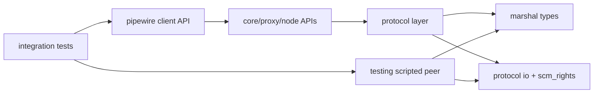

# Merge `server/` Into `pipewire/`

## Intent

This note proposes replacing the standalone [`/server`](/server) crate with an in-crate implementation under [`/pipewire`](/pipewire), so node/data-plane behavior is a normal client capability instead of a special sidecar workflow.

The priority is to reuse existing protocol and marshal material, reduce duplicate code, and keep eventual upstream-facing changes focused on broadly useful primitives.

## Why change direction

Current `server/` work proved the deterministic test-server concept, but it also re-implements protocol pieces that already exist in `pipewire`:

- Header framing is duplicated in [`/server/src/protocol/frame.rs`](/server/src/protocol/frame.rs) and [`/pipewire/src/protocol/marshal/message.rs`](/pipewire/src/protocol/marshal/message.rs).
- SCM_RIGHTS receive/send logic exists in both [`/server/src/protocol/frame.rs`](/server/src/protocol/frame.rs) and [`/pipewire/src/protocol/connection.rs`](/pipewire/src/protocol/connection.rs).
- A subset of core/registry message parsing is redefined in [`/server/src/protocol/messages.rs`](/server/src/protocol/messages.rs) while canonical marshaling already lives in [`/pipewire/src/protocol/marshal/core.rs`](/pipewire/src/protocol/marshal/core.rs) and [`/pipewire/src/protocol/marshal/registry.rs`](/pipewire/src/protocol/marshal/registry.rs).

Also, parts of [`/doc/discovery/node.md`](/doc/discovery/node.md) are stale relative to current code:

- `Core::AddMem` and `Core::RemoveMem` decode is now present in [`/pipewire/src/protocol/marshal/core.rs`](/pipewire/src/protocol/marshal/core.rs).
- SCM_RIGHTS receive support is now present in [`/pipewire/src/protocol/connection.rs`](/pipewire/src/protocol/connection.rs).

So the best next step is consolidation, not more parallel crate growth.

## Design goals

- Make node/data-plane setup feel like regular client behavior, not a separate subsystem.
- Reuse `pipewire` protocol internals first; only add new code where gaps are real.
- Keep test determinism, but avoid creating a second protocol stack.
- Minimize long-term upstream delta by aligning with existing types and known upstream protocol shapes.

## Target shape

Move scripted server/test harness capabilities inside `pipewire` with domain-grouped modules:

- `pipewire/src/protocol/io/`
  - shared native frame + SCM_RIGHTS helpers used by both client connection and test peer runtime
- `pipewire/src/protocol/marshal/`
  - single canonical source for core/registry/client-node wire structs/opcodes
- `pipewire/src/testing/scripted_peer/`
  - deterministic scenario runtime, expectations, actions, and state for integration tests
- `pipewire/tests/support/`
  - lightweight fixtures that call into `testing/scripted_peer`

## Reuse-first mapping

| Current `server/` area | Reuse in `pipewire/` | Merge action |
|---|---|---|
| `protocol/frame.rs` | `protocol/marshal/message::Header` + shared I/O helpers | Delete duplicate header type; keep one encoder/decoder path |
| `protocol/messages.rs` constants/parsers | `protocol/marshal/{core,registry,client}` | Replace custom decode with marshal-backed decode dispatch |
| `runtime/mod.rs` | `testing/scripted_peer/runtime` | Move runtime logic, swap to shared protocol I/O |
| `script/mod.rs` + `state/mod.rs` | `testing/scripted_peer/{script,state}` | Keep model, trim protocol duplication |
| `testkit/mod.rs` | `tests/support/scripted_peer` | Keep helper utilities as test-only support |

## Concrete migration sequence

1. Add shared protocol I/O helpers under [`/pipewire/src/protocol`](/pipewire/src/protocol) and switch [`/pipewire/src/protocol/connection.rs`](/pipewire/src/protocol/connection.rs) to use them.
2. Implement the same shared helpers for scripted peer runtime (inside `pipewire`, not `server`).
3. Move scripted scenario/runtime/state modules from [`/server/src`](/server/src) into `pipewire/src/testing/scripted_peer/`.
4. Replace custom inbound parsing in `server` logic with marshal-based decode routing using existing marshal enums.
5. Move integration helpers/tests from [`/server/tests/scripted_server.rs`](/server/tests/scripted_server.rs) patterns into [`/pipewire/tests`](/pipewire/tests).
6. Remove `pipewire-native-server` workspace dependency and crate membership from [`/Cargo.toml`](/Cargo.toml) once parity is reached.
7. Keep `node`-path tests running against the in-crate scripted peer to confirm no behavior regression.

## Node-specific impact

This merge supports the broader goal: being a node should not be a special-case client mode.

- `Core::AddMem`/`RemoveMem` handling remains part of normal core event flow in [`/pipewire/src/core.rs`](/pipewire/src/core.rs) and [`/pipewire/src/protocol/marshal/core.rs`](/pipewire/src/protocol/marshal/core.rs).
- Deterministic peer scripting becomes a test harness for all clients, including node-oriented ones, instead of a separate crate API.
- Client-node protocol additions should land as marshal modules in `pipewire` first, then be consumed by both runtime client code and scripted test peer behavior.

## Upstream-scope reduction

Consolidation narrows what we would eventually want upstream:

- Upstream-worthy: shared protocol I/O helpers, marshal completeness, and decode/encode correctness.
- Probably not upstream-worthy: local scripted test harness runtime and scenario DSL.
- Result: fewer exported crates, fewer duplicate abstractions, clearer boundary between product code and test scaffolding.

## Known gaps to resolve during merge

- Outbound FD send path from `Connection::push()` still has `n_fds` TODO in [`/pipewire/src/protocol/connection.rs`](/pipewire/src/protocol/connection.rs); shared I/O work should close this.
- Current default `add_mem` callback in [`/pipewire/src/core.rs`](/pipewire/src/core.rs) closes fd immediately; node/data-plane integration needs an owned-fd registry path.
- Marshal coverage for client-node protocol is still incomplete and should be added in `pipewire` before adding more scripted scenarios.

## Guardrails

- No second protocol type system: reuse existing marshal types unless impossible.
- Keep domain-grouped layout; avoid flat dumping grounds.
- Keep scripted peer test-focused; do not accidentally turn it into a production daemon.
- Validate behavior via existing deterministic scripted tests and add parity tests before removing `server/`.

## Definition of done

All of these are true:

- `pipewire` contains the scripted peer harness used by integration tests.
- No duplicated native header or SCM_RIGHTS logic remains in a separate crate.
- `pipewire/tests` cover core bootstrap and `Core::AddMem` scripted flows without `pipewire-native-server` dependency.
- Workspace no longer builds `server/` as a separate crate.
- Node/data-plane tests consume the same in-crate protocol/marshal material as all other clients.

## References

- Existing standalone harness and protocol duplication analysis: [`/doc/discovery/server-unification.md`](/doc/discovery/server-unification.md)
- Original node/data-plane discovery (partially stale): [`/doc/discovery/node.md`](/doc/discovery/node.md)
- Current standalone server implementation: [`/server/src`](/server/src)
- Current client protocol implementation: [`/pipewire/src/protocol`](/pipewire/src/protocol)
- Upstream protocol internals: [`pipewire/pipewire` `doc/dox/internals/protocol.dox`](https://gitlab.com/pipewire/pipewire/-/blob/master/doc/dox/internals/protocol.dox)
- Upstream native protocol implementation: [`pipewire/pipewire` `src/modules/module-protocol-native/protocol-native.c`](https://gitlab.com/pipewire/pipewire/-/blob/master/src/modules/module-protocol-native/protocol-native.c)
- Upstream client-node protocol implementation: [`pipewire/pipewire` `src/modules/module-client-node/protocol-native.c`](https://gitlab.com/pipewire/pipewire/-/blob/master/src/modules/module-client-node/protocol-native.c)
