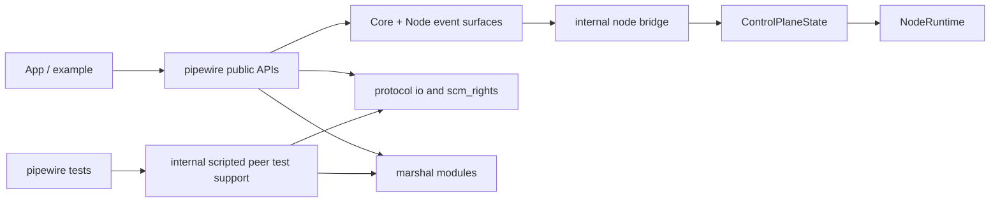

# Final Merge Picture: Unify `server/`, `pipewire/`, and Node Integration

## Executive view

We are not doing two separate efforts.

- Effort A: merge the standalone [`/server`](/server) crate into [`/pipewire`](/pipewire).
- Effort B: make node/data-plane support actually usable from `pipewire` clients (as shown by [`/examples/wav-player/src/main.rs`](/examples/wav-player/src/main.rs)).

These are one effort because both require a single, correct, shared protocol path for:

- header framing
- SCM_RIGHTS fd transport
- event decode/dispatch
- memory/transport lifecycle ordering

If we keep `server/` separate, we keep duplicating exactly the code that must be trustworthy for node bring-up.

## Why this rewrite

Previous merge docs described crate consolidation well, but underplayed the strongest evidence: the integration TODOs in [`/examples/wav-player/src/main.rs`](/examples/wav-player/src/main.rs) and the detailed gap analysis in [`/doc/discovery/node-integration.md`](/doc/discovery/node-integration.md).

This version uses those as primary requirements.

## Current reality

### What is already true

- `pipewire` decodes `Core::AddMem` / `Core::RemoveMem` and receives fd payloads in [`/pipewire/src/protocol/marshal/core.rs`](/pipewire/src/protocol/marshal/core.rs).
- `pipewire` receives SCM_RIGHTS fds in [`/pipewire/src/protocol/connection.rs`](/pipewire/src/protocol/connection.rs).
- `node` crate has working data-plane primitives:
  - control bridge state in [`/node/src/control/mod.rs`](/node/src/control/mod.rs)
  - memory registry in [`/node/src/shm/registry.rs`](/node/src/shm/registry.rs)
  - transport binding in [`/node/src/transport/mod.rs`](/node/src/transport/mod.rs)
  - runtime loop in [`/node/src/runtime/mod.rs`](/node/src/runtime/mod.rs)
- `server` provides deterministic scripted scenarios in [`/server/src`](/server/src).

### What is still broken for real node usage

- Default `Core::add_mem` handling closes the fd instead of forwarding it in [`/pipewire/src/core.rs`](/pipewire/src/core.rs).
- `Core::remove_mem` default path is effectively a no-op for data-plane state in [`/pipewire/src/core.rs`](/pipewire/src/core.rs).
- `pipewire` lacks full client-node transport/setup event coverage, so there is no path to build `TransportEvent` from protocol events.
- There is no integrated bridge from protocol events to `ControlPlaneState`.
- The deterministic test harness lives in a separate crate that duplicates protocol framing/parsing concerns.

## The key product requirement

The wav player should be able to do this with first-class APIs:

1. Create adapter node.
2. Receive AddMem/transport setup through normal listeners.
3. Bind transport.
4. Spawn runtime.
5. Fill buffers in process callback.

Today the primitives exist, but the connective tissue is missing.

## High-level architecture target

Principle: **one protocol implementation, many consumers** (runtime client path and test peer path).

## Why merging `server/` is required for node correctness

Node bring-up is sensitive to protocol ordering and fd ownership. The exact parts `server/` duplicates are the parts where tiny differences can break node startup:

- header fields (`id`, `opcode`, `size`, `seq`, `n_fds`)
- fd receive/send semantics and truncation behavior
- message decode paths and opcode routing

So the merge is not housekeeping; it reduces semantic split-brain in the node-critical path.

## Integration gap map (from node-integration + wav-player)

### Gap 1: AddMem ownership boundary

Current behavior:

- protocol decode receives fd
- core callback closes fd

Needed behavior:

- convert `RawFd` to `OwnedFd`
- forward to `ControlPlaneState::on_add_mem()`
- retain until `RemoveMem` or teardown

### Gap 2: RemoveMem lifecycle

Current behavior:

- logs id, no registry update

Needed behavior:

- forward `RemoveMemEvent { id }`
- drop/unmap memory deterministically

### Gap 3: Missing transport setup event surface

Current behavior:

- node transport descriptors are not fully decoded/surfaced in `pipewire`

Needed behavior:

- complete marshal coverage for client-node setup events
- map fd-bearing transport events to `TransportEvent`
- feed `ControlPlaneState::on_transport()`

### Gap 4: Runtime orchestration bridge

Current behavior:

- `node::runtime::NodeRuntime` exists but no managed integration path from `pipewire`

Needed behavior:

- when control state becomes bindable, create `BoundTransport`
- spawn and supervise `NodeRuntime`
- clean shutdown on disconnect/error

### Gap 5: Negotiation-to-buffer contract

Current behavior:

- app can receive some node events, but no complete integrated pathway from param negotiation to process callback expectations

Needed behavior:

- capture node format/buffer negotiation outputs
- provide callback with usable activation/buffer context
- ensure sample format assumptions are explicit and validated

## Detailed technical plan

### 1) Consolidate protocol I/O inside `pipewire`

Changes:

- add shared internal module under `pipewire/src/protocol` for header and SCM_RIGHTS helpers
- reuse from both `Connection` and scripted-peer runtime code

Expected result:

- one source of truth for frame/fd mechanics

### 2) Complete client-node marshal support

Changes:

- add `client_node` marshal module under [`/pipewire/src/protocol/marshal`](/pipewire/src/protocol/marshal)
- implement decode for transport/setup events needed by data-plane bootstrap
- ensure fd extraction and event payload assembly are exact

Expected result:

- protocol layer can represent all setup information needed by `node` control state

### 3) Add a node bridge in `pipewire`

Changes:

- internal state object that owns `ControlPlaneState`
- adapter methods:
  - `on_core_add_mem`
  - `on_core_remove_mem`
  - `on_node_transport`
- binding trigger path calling `try_bind_transport()` after each relevant update

Expected result:

- protocol events can drive node state machine directly

### 4) Fix fd lifecycle semantics

Changes:

- stop default immediate close for AddMem in integration path
- adopt `OwnedFd`-first handling through bridge boundaries
- make teardown idempotent and deterministic

Expected result:

- no premature closes, no leaks, no double-close hazards

### 5) Runtime lifecycle integration

Changes:

- introduce internal runtime supervisor for `NodeRuntimeHandle`
- define who owns Tokio runtime context for worker tasks
- connect shutdown to core disconnect and error events

Expected result:

- robust start/stop behavior around process cycle worker

### 6) Migrate scripted peer into `pipewire` test support

Changes:

- move scenario/runtime/state/testkit model from [`/server/src`](/server/src) to internal `pipewire` test support modules
- ensure it uses shared protocol I/O and marshal definitions
- migrate tests into `pipewire/tests`

Expected result:

- deterministic testing without protocol duplication

### 7) Remove standalone `server/` crate

Changes:

- remove workspace membership and dependencies from [`/Cargo.toml`](/Cargo.toml)
- remove `pipewire-native-server` dependency from [`/pipewire/Cargo.toml`](/pipewire/Cargo.toml)
- delete crate once parity tests pass

Expected result:

- single protocol stack in workspace

### 8) Close the loop with `wav-player`

Changes:

- replace integration TODO in [`/examples/wav-player/src/main.rs`](/examples/wav-player/src/main.rs) with real node bootstrap path
- wire callback to mapped buffer writes
- validate behavior under deterministic scripted tests and real daemon scenario

Expected result:

- example demonstrates end-to-end node data-plane operation

## Execution phases

### Phase A: Protocol unification

- shared protocol I/O helpers
- connection and scripted peer both consume shared helpers

### Phase B: Node control-plane completeness

- client-node marshal decode and event surfacing
- AddMem/RemoveMem ownership-correct forwarding

### Phase C: Runtime bridge

- transport binding + runtime spawn/supervision

### Phase D: Test harness consolidation

- scripted peer moved into `pipewire`
- parity tests migrated

### Phase E: Product validation + cleanup

- `wav-player` integration path implemented
- remove standalone `server/`

## Decision points and API shape concerns

### Data-plane events API placement

Options:

- extend `CoreEvents`
- add dedicated `CoreDataPlaneEvents`
- expose node-specific setup events via `NodeEvents`

Recommended direction:

- keep protocol-origin events near existing object model (`Core` and `Node` listeners), but avoid forcing all users to pay complexity for data-plane paths.

### Bridge ownership model

Options:

- user-managed bridge object
- `Core`-managed optional integration state
- per-node managed state attached to proxy

Recommended direction:

- explicit user-managed bridge integration first (predictable ownership), with optional higher-level helper API later.

### Tokio runtime relationship

Risk:

- `ThreadLoop` model and async worker model can deadlock or race if lifecycle is unclear.

Requirement:

- document and enforce runtime ownership contract at API boundaries.

## Risks

- protocol drift if scripted peer and connection paths diverge again
- fd lifecycle bugs under reconnect/error races
- incorrect event ordering assumptions around AddMem vs transport setup
- format-negotiation mismatch between app PCM and negotiated buffer format

## Guardrails

- no duplicate protocol framing/parsing implementations
- explicit `OwnedFd` semantics across boundaries
- deterministic scenario tests for every ordering-sensitive path
- integration validation with `wav-player` as acceptance reference

## Definition of done

All must be true:

- `pipewire` can run node data-plane cycles via integrated bridge/runtime path.
- AddMem/RemoveMem events are ownership-safe and feed node control state.
- client-node transport/setup events are decoded and surfaced where needed.
- deterministic scripted peer tests run from `pipewire/tests` with shared protocol internals.
- `wav-player` TODO block is replaced by real wiring.
- standalone `server/` crate is removed after parity.

## References

- Node integration gap baseline: [`/doc/discovery/node-integration.md`](/doc/discovery/node-integration.md)
- Application-level evidence: [`/examples/wav-player/src/main.rs`](/examples/wav-player/src/main.rs)
- Initial unification analysis: [`/doc/discovery/server-unification.md`](/doc/discovery/server-unification.md)
- Earlier node discovery: [`/doc/discovery/node.md`](/doc/discovery/node.md)
- Implementation phase draft: [`/doc/discovery/merge-impl-plan.md`](/doc/discovery/merge-impl-plan.md)
- Client protocol code: [`/pipewire/src/protocol`](/pipewire/src/protocol)
- Node primitives: [`/node/src`](/node/src)
- Standalone scripted server: [`/server/src`](/server/src)
- Upstream protocol internals: [`pipewire/pipewire` `doc/dox/internals/protocol.dox`](https://gitlab.com/pipewire/pipewire/-/blob/master/doc/dox/internals/protocol.dox)
- Upstream native protocol: [`pipewire/pipewire` `src/modules/module-protocol-native/protocol-native.c`](https://gitlab.com/pipewire/pipewire/-/blob/master/src/modules/module-protocol-native/protocol-native.c)
- Upstream client-node protocol: [`pipewire/pipewire` `src/modules/module-client-node/protocol-native.c`](https://gitlab.com/pipewire/pipewire/-/blob/master/src/modules/module-client-node/protocol-native.c)
