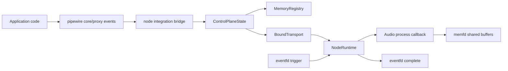

# Merge `server/` Into `pipewire/` and Complete Node Integration

## Why this document exists

The current [`/examples/wav-player/src/main.rs`](/examples/wav-player/src/main.rs) is the clearest statement of our real gap.

It already loads audio, connects to PipeWire, and sketches the intended data-path. The TODO block in that file is not just an example note; it is a concrete checklist of missing integration:

- receive and retain `Core::AddMem` fds instead of closing them
- capture transport signaling fds and activation region metadata
- bind those into `pipewire-native-node` control/runtime primitives
- run a process callback that writes PCM into shared buffers each cycle

That story was underrepresented in the earlier merge note. This version makes it explicit: **the `server/` merge and node-capable `pipewire/` are the same effort**, because both require a single canonical protocol/data-plane integration path.

## Big picture

Today we have three important pieces:

1. **`pipewire/` crate**: strong client/control-plane and marshal foundation.
2. **`node/` crate**: memfd/eventfd/runtime building blocks (`ControlPlaneState`, `BoundTransport`, `NodeRuntime`).
3. **`server/` crate**: deterministic scripted peer for testing, but with duplicated protocol framing and parsing.

The target state is:

- `pipewire/` remains the canonical protocol implementation.
- `node/` primitives are fed directly from `pipewire` events (not a parallel ad-hoc path).
- deterministic scripted-peer testing lives inside `pipewire` test support, not in a separate protocol crate.

In short: one protocol stack, one event decoding path, one node integration path.

## The core insight from `wav-player`

The TODO in [`/examples/wav-player/src/main.rs`](/examples/wav-player/src/main.rs) demonstrates that node playback is blocked by integration seams, not by missing low-level primitives:

- `ControlPlaneState::on_add_mem()` exists in [`/node/src/control/mod.rs`](/node/src/control/mod.rs).
- `ControlPlaneState::on_transport()` and `try_bind_transport()` exist in [`/node/src/control/mod.rs`](/node/src/control/mod.rs).
- `NodeRuntime` and `ProcessCallback` exist in [`/node/src/runtime/mod.rs`](/node/src/runtime/mod.rs).
- `BoundTransport` exists in [`/node/src/transport/mod.rs`](/node/src/transport/mod.rs).

What is missing is plumbing in `pipewire`:

- convert protocol events into those node control events
- hold fd ownership correctly
- expose client-node transport/setup events
- provide lifecycle-safe runtime orchestration

So the real work is integration and unification.

## How node actually works (conceptual model)

Node operation spans two planes:

- **Control plane** (protocol messages): object creation, format negotiation, transport descriptors, memory announcements.
- **Data plane** (shared memory + eventfds): server triggers process cycle, client writes/reads audio, client acknowledges completion.

`pipewire` already does most control-plane work for normal proxies. `node/` already does most data-plane mechanics. The missing bridge is where those meet.

## Why `server/` merge is directly related

If `server/` stays separate, we keep duplicating:

- native header encode/decode
- SCM_RIGHTS send/recv behavior
- opcode + message-shape parsing

Those are exactly the parts that must be correct for node/data-plane setup ordering (`AddMem`, transport fds, activation mapping). Duplicating them across crates increases drift risk and makes node debugging harder.

So we should:

- keep one canonical protocol implementation in `pipewire`
- move scripted peer support to `pipewire` test modules
- reuse marshal definitions and shared I/O helpers everywhere

## Current state snapshot

What is already in place:

- `Core::AddMem` / `Core::RemoveMem` decode in [`/pipewire/src/protocol/marshal/core.rs`](/pipewire/src/protocol/marshal/core.rs)
- SCM_RIGHTS receive in [`/pipewire/src/protocol/connection.rs`](/pipewire/src/protocol/connection.rs)
- node control/runtime primitives in [`/node/src/control/mod.rs`](/node/src/control/mod.rs), [`/node/src/transport/mod.rs`](/node/src/transport/mod.rs), and [`/node/src/runtime/mod.rs`](/node/src/runtime/mod.rs)
- scripted deterministic server behavior in [`/server/src`](/server/src)

What still blocks end-to-end node playback:

- default core `add_mem` path closes received fd in [`/pipewire/src/core.rs`](/pipewire/src/core.rs)
- missing client-node marshal/event coverage in `pipewire`
- no in-crate bridge that feeds protocol events into `ControlPlaneState`
- no integrated runtime lifecycle glue for spawning/stopping `NodeRuntime`
- scripted-peer harness still sits in separate `server/` crate with duplicated protocol internals

## Work required to add node to `pipewire/`

### A. Complete protocol surface for client-node setup

High concept:

- `pipewire` must decode all control-plane information needed to configure data-plane runtime.

Detailed work:

- add `client_node` marshal module under [`/pipewire/src/protocol/marshal`](/pipewire/src/protocol/marshal) for events/methods needed by node setup
- ensure fd-bearing events (transport-related) correctly receive and attach fds
- expose typed events through `proxy::node` listener surfaces
- keep opcode and pod layouts aligned with upstream protocol-native definitions

### B. Add a node integration bridge inside `pipewire`

High concept:

- convert protocol events into node control-state transitions.

Detailed work:

- introduce internal bridge state in `pipewire` that owns a `ControlPlaneState`
- on `Core::AddMem`, transform to `node::control::AddMemEvent` and call `on_add_mem`
- on `Core::RemoveMem`, call `on_remove_mem`
- on transport/setup events from node/client-node protocol, call `on_transport`
- call `try_bind_transport()` when state changes might satisfy binding

### C. Fix fd ownership and lifecycle semantics

High concept:

- received fds must be retained until explicitly released, not closed immediately.

Detailed work:

- remove close-on-receive default behavior for integration paths that need retained mem fds
- use `OwnedFd` boundaries end-to-end
- ensure remove/teardown paths drop fds deterministically
- verify no double-close and no leaked fds in success/error/shutdown paths

### D. Integrate runtime orchestration

High concept:

- once transport is bound, start cycle processing and keep shutdown safe.

Detailed work:

- create an internal runtime handle abstraction in `pipewire` that can spawn `node::runtime::NodeRuntime`
- define thread/runtime policy (Tokio executor ownership, shutdown signal wiring)
- provide deterministic stop semantics on core disconnect and errors
- ensure callback errors propagate clearly to caller and/or events

### E. Translate activation/buffer state into usable callback data

High concept:

- process callback needs enough structured context to fill audio buffers correctly.

Detailed work:

- parse or map activation/buffer metadata from shared memory regions
- expose stable process-cycle context API for app callbacks
- wire sample format/buffer negotiation outputs into callback expectations
- use the `wav-player` loop as first real consumer and remove its integration TODOs

### F. Merge scripted peer testing into `pipewire`

High concept:

- node integration must be tested against deterministic protocol sequences without duplicate protocol stacks.

Detailed work:

- move scripted runtime/model from [`/server/src`](/server/src) to `pipewire` internal testing modules
- centralize native frame + SCM_RIGHTS helpers in `pipewire` protocol I/O
- migrate server tests into `pipewire/tests` support
- remove `pipewire-native-server` dependency from [`/pipewire/Cargo.toml`](/pipewire/Cargo.toml)
- then remove `server` from workspace in [`/Cargo.toml`](/Cargo.toml)

### G. Validate with real app flow (`wav-player`)

High concept:

- success means we can actually drive audio callback cycles, not just parse packets.

Detailed work:

- update [`/examples/wav-player/src/main.rs`](/examples/wav-player/src/main.rs) to use the integrated bridge/runtime path
- replace TODO block with working node bootstrap path
- verify callback cadence and buffer writes are observable
- keep deterministic scripted tests as regression safety for protocol ordering and fd behavior

## Proposed execution phases (no timeline)

### Phase 1: Unify protocol mechanics

- shared protocol I/O helpers in `pipewire`
- connection + scripted peer both consume same I/O helpers

### Phase 2: Land node control-plane completeness

- client-node marshal coverage
- event surfacing and fd-safe handling

### Phase 3: Bridge to `node` runtime

- `ControlPlaneState` integration
- transport binding and runtime lifecycle

### Phase 4: App-level validation

- `wav-player` integration TODOs removed
- callback-based PCM writes functioning

### Phase 5: Remove standalone `server/`

- tests migrated
- workspace cleaned

## Risks and guardrails

Key risks:

- event ordering bugs between `AddMem`, transport, and runtime start
- fd ownership mistakes (leak/early close/double close)
- hidden drift between test harness protocol behavior and client protocol behavior
- runtime shutdown races between thread loop and Tokio tasks

Guardrails:

- one protocol stack in `pipewire`
- all fd-bearing paths use explicit `OwnedFd` lifetimes
- deterministic scripted tests for ordering-sensitive flows
- app-level validation via `wav-player`

## Definition of done

All of these are true:

- `pipewire` can configure and run node data-plane cycles through integrated control/runtime bridge.
- [`/examples/wav-player/src/main.rs`](/examples/wav-player/src/main.rs) no longer carries the node integration TODO block and can use the implemented path.
- deterministic scripted tests for bootstrap, `AddMem`, transport setup, and cycle signaling run from `pipewire/tests`.
- standalone `server/` crate is removed from workspace after parity.
- no duplicate native header or SCM_RIGHTS protocol logic remains in separate crates.

## References

- Node integration gap narrative: [`/examples/wav-player/src/main.rs`](/examples/wav-player/src/main.rs)
- Previous unification analysis: [`/doc/discovery/server-unification.md`](/doc/discovery/server-unification.md)
- Earlier node discovery context: [`/doc/discovery/node.md`](/doc/discovery/node.md)
- Initial implementation plan file: [`/doc/discovery/merge-impl-plan.md`](/doc/discovery/merge-impl-plan.md)
- Current client protocol implementation: [`/pipewire/src/protocol`](/pipewire/src/protocol)
- Current node primitives: [`/node/src`](/node/src)
- Current standalone scripted server: [`/server/src`](/server/src)
- Upstream protocol internals: [`pipewire/pipewire` `doc/dox/internals/protocol.dox`](https://gitlab.com/pipewire/pipewire/-/blob/master/doc/dox/internals/protocol.dox)
- Upstream native protocol implementation: [`pipewire/pipewire` `src/modules/module-protocol-native/protocol-native.c`](https://gitlab.com/pipewire/pipewire/-/blob/master/src/modules/module-protocol-native/protocol-native.c)
- Upstream client-node protocol implementation: [`pipewire/pipewire` `src/modules/module-client-node/protocol-native.c`](https://gitlab.com/pipewire/pipewire/-/blob/master/src/modules/module-client-node/protocol-native.c)
