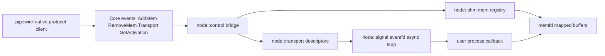

# Node Data Plane Plan for `pipewire-native-rs`

## Inputs and current state

This plan builds on [`/home/rektide/src/blue-ease/doc/discovery/uhid-transport-shared-memory-flow.md`](/home/rektide/src/blue-ease/doc/discovery/uhid-transport-shared-memory-flow.md), which traces PipeWire's shared-memory and eventfd transport model.

Today this repository is still control-plane only:

- `Core::AddMem` and `Core::RemoveMem` are not implemented in [`/pipewire/src/protocol/marshal/core.rs`](/pipewire/src/protocol/marshal/core.rs).
- Core callbacks for `add_mem` / `remove_mem` are `todo!()` in [`/pipewire/src/core.rs`](/pipewire/src/core.rs).
- Connection fd passing (SCM_RIGHTS send/recv) is still missing in [`/pipewire/src/protocol/connection.rs`](/pipewire/src/protocol/connection.rs).

So we can create/bind objects, but we cannot yet host media payloads on memfd-backed buffers and eventfd signaling.

## Goal

Add a data-plane stack that can host node transport in Rust:

- import memfd shared memory from `Core::AddMem`
- map activation and buffer memory regions
- drive process cycles from eventfd signals
- ack cycles with eventfd writes
- expose a Rust API that can be wired to new media/control payload types

## High-level architecture

Keep control-plane and data-plane responsibilities separate:

- `pipewire-native` stays focused on protocol object lifecycle and event decode.
- New `node/` crate owns memfd mapping, signaling, async runtime orchestration, and process callbacks.
- A thin bridge layer translates control-plane events (`AddMem`, transport setup, activation setup) into `node` crate descriptors.

## Proposed `node/` crate layout

Use domain-grouped modules (not a flat crate):

- `node/src/control/`
  - event descriptors from control-plane messages
  - adapter traits to wire `pipewire-native` into node runtime
- `node/src/shm/`
  - memfd registry keyed by mem id
  - mmap/unmap wrappers for shared slices
  - activation region mapping helpers
- `node/src/signal/`
  - eventfd wrappers
  - async wait + wake operations (tokio `AsyncFd`)
- `node/src/runtime/`
  - node worker lifecycle
  - process cycle loop (wait signal -> process callback -> acknowledge)
  - shutdown and error propagation
- `node/src/transport/`
  - transport descriptor structs (readfd/writefd, mem id, offset, size)
  - validation and binding logic against shm registry

## Async model

Use Tokio for orchestration and I/O readiness integration:

- `AsyncFd` for eventfd readiness.
- `tokio::select!` for shutdown/control-plane updates vs process triggers.
- Keep process callback API synchronous (`FnMut`) for deterministic cycle boundaries, while the outer worker lifecycle is async.

This gives us async composition without forcing user processing code to be async.

## Implementation sequence

1. Scaffold `node/` crate and workspace wiring.
2. Implement `shm` memfd registry and mmap wrappers.
3. Implement `signal` eventfd wrappers with async wait/write.
4. Implement transport descriptors and binding to mapped activation memory.
5. Implement runtime worker loop around signal + callback.
6. Add control bridge interfaces to accept decoded protocol transport events.
7. Backfill `pipewire-native` protocol gaps (`AddMem`, fd passing, activation/transport events) and wire to `node` crate.

## Risks and guardrails

- Real-time behavior: Tokio is for orchestration; avoid hidden blocking in process path.
- FD ownership: strict `OwnedFd` boundaries, no double-close.
- Shared memory safety: bounds-check offset/size against mapped memfd length before exposing slices.
- Event ordering: tolerate transport events arriving before full mem registry readiness by staging descriptors.

## Definition of done for first usable slice

First usable slice means:

- `Core::AddMem` is decoded and imported into mem registry.
- transport + activation descriptors can be bound into mapped regions.
- worker receives eventfd trigger and runs callback.
- callback can read/write mapped payload bytes and signal completion.

## Implementation log

- 2026-02-28: created initial architecture and implementation plan.
