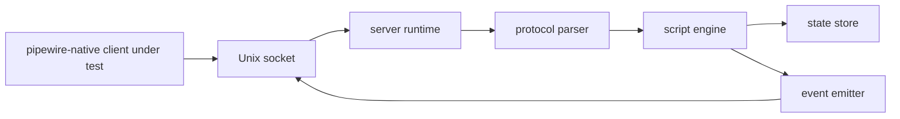

# Minimal PipeWire Test Server: Initial Response and Plan

## Executive summary

The repository needs deterministic integration tests that do not depend on a full external PipeWire deployment. Current integration tests shell out to `pipewire` and rely on host plugins/factories, which makes failures environment-dependent and hard to diagnose.

The recommended path is a new `server/` crate that implements a **scripted, deterministic, single-client** subset of the PipeWire native protocol specifically for integration testing of this workspace.

This is not a general-purpose server and should stay intentionally narrow.

## Why this is needed now

### Current test dependency is brittle

`pipewire/tests/lib.rs` currently starts an external daemon (`std::process::Command::new("pipewire")`) and sleeps before test operations ([`/pipewire/tests/lib.rs`](/pipewire/tests/lib.rs)). This creates at least three classes of instability:

- environment coupling (binary presence, modules, runtime dirs)
- non-deterministic startup timing
- indirect failures from unrelated host setup

### We now have a data-plane direction that needs controlled peer behavior

The `node/` crate is introducing memfd/eventfd transport behavior and needs targeted protocol scenarios to validate edge ordering and failure handling in a repeatable way ([`/doc/discovery/node.md`](/doc/discovery/node.md), [`/node/src`](/node/src)).

### Existing protocol code is client-first

- `Protocol` currently constructs clients only (`new_client`) ([`/pipewire/src/protocol/mod.rs`](/pipewire/src/protocol/mod.rs)).
- There is no server runtime entry point in `pipewire-native` today.
- Marshal modules are oriented toward client operations and event demarshal into proxies ([`/pipewire/src/protocol/marshal`](/pipewire/src/protocol/marshal)).

### Repo-specific gaps that affect server test design

- There is no local `ClientNode` marshal module in [`/pipewire/src/protocol/marshal`](/pipewire/src/protocol/marshal), so data-plane protocol scenarios will need new protocol definitions in `server/` or shared additions.
- The default core `add_mem` callback currently closes fds immediately in [`/pipewire/src/core.rs`](/pipewire/src/core.rs), so tests that assert retained mem registry behavior need explicit test-server flows.
- Outbound fd send path is still incomplete in [`/pipewire/src/protocol/connection.rs`](/pipewire/src/protocol/connection.rs) (`n_fds` TODO and no matching fd send marshaling path), which means the test server should focus first on inbound-fd validation and scripted server->client fd events.

## Protocol evidence that shapes scope

- Native startup sequence uses `Core::Hello`, `Client::UpdateProperties`, `Core::GetRegistry`, `Core::Sync`, `Registry::Global`, and `Core::Done` (see protocol internals in [`pipewire/pipewire` `doc/dox/internals/protocol.dox`](https://gitlab.com/pipewire/pipewire/-/blob/master/doc/dox/internals/protocol.dox)).
- Data-plane/client-node setup introduces `Core::AddMem`, `ClientNode::Transport`, `ClientNode::SetActivation`, `ClientNode::PortUseBuffers`, and related IO setup (same doc).
- Upstream `module-client-node` marshaling confirms fd-bearing transport and activation payload structure ([`pipewire/pipewire` `src/modules/module-client-node/protocol-native.c`](https://gitlab.com/pipewire/pipewire/-/blob/master/src/modules/module-client-node/protocol-native.c)).

Implication: a useful test server must at least script core/registry handshake, and should be designed so client-node/data-plane events can be added without redesign.

## MVP boundary

MVP of `server/` means:

- deterministic single client connection over Unix socket
- scripted protocol interaction with strict ordering
- enough protocol surface to drive stable integration tests for core/registry/object flows
- explicit rejection path for second client
- rich builder API (`bon`) for scenario definition
- traceable step execution with `tracing`

MVP non-goals:

- full PipeWire feature parity
- policy/session management
- dynamic scripting language runtime
- production daemon behavior

## Architecture options

### Option A: keep using real `pipewire` daemon plus wrappers

Pros:

- highest fidelity
- no protocol emulation effort

Cons:

- not deterministic enough for this repo's targeted protocol tests
- still tied to host modules and runtime environment
- hard to produce focused failure signals

### Option B (recommended): scripted native-protocol mini-server crate

Pros:

- deterministic by construction
- narrow protocol subset, easier to reason about
- gives direct hooks for asserting exact sequence expectations

Cons:

- requires implementing and maintaining a protocol subset
- fidelity lower than full daemon

### Option C: in-process fake transport (no real socket/protocol frames)

Pros:

- easiest to implement initially

Cons:

- misses wire framing, fd passing, and ordering behavior
- not sufficient for integration confidence on protocol/data-plane boundaries

## Recommendation

Choose **Option B**.

It balances determinism and protocol realism. It is also the only option that directly supports explicit scripted assertions over message-level behavior while remaining lightweight.

## Proposed `server/` crate design

Use domain-grouped modules (not flat):

- `server/src/protocol/`
  - wire frame header parsing/encoding
  - SCM_RIGHTS fd receive/send helpers
  - subset marshal types for scripted scenarios
- `server/src/runtime/`
  - Unix listener lifecycle
  - single-client connection guard
  - read loop + write queue
- `server/src/script/`
  - scenario model
  - expected inbound messages
  - outbound actions and assertions
- `server/src/state/`
  - connection/session state
  - proxy/global id bookkeeping
  - mem-id bookkeeping for future AddMem scenarios
- `server/src/builders/`
  - `bon` builders for server config, globals, and scripted steps
- `server/src/testkit/`
  - fixtures/helpers used by integration tests

## Script model requirements

Each scenario step should explicitly define:

- trigger (startup, inbound method match, timeout point)
- expected message shape (object id, opcode, key fields)
- action(s) (emit event, emit error, add global, done, disconnect)
- assertion outcome (must happen, may happen, must-not-happen)

Determinism rules:

- no unordered side effects
- explicit ordering for all emitted messages
- reproducible identifiers unless intentionally randomized and captured

## Single-client constraint behavior

Second client behavior must be explicit and testable. Recommended default:

- accept first connection only
- reject additional connections with immediate close
- emit tracing event with reason `single_client_limit`

Alternative (optional for later): send explicit protocol error before close.

## Minimum protocol subset for first implementation

### Inbound (client -> server)

- `Core::Hello`
- `Client::UpdateProperties`
- `Core::GetRegistry`
- `Core::Sync`
- `Registry::Bind`
- `Registry::Destroy` (optional in first slice, but useful)

### Outbound (server -> client)

- `Core::Info`
- `Registry::Global`
- `Registry::GlobalRemove` (optional initial)
- `Core::Done`
- `Core::Error` (for explicit failure scenarios)

### Next slice (data-plane oriented)

- `Core::AddMem` / `Core::RemoveMem`
- selected `ClientNode::*` events needed by `node/` integration paths

## API requirements (`bon` and typed builders)

Required builder surfaces:

- `ServerConfigBuilder`
  - socket path/runtime dir
  - single-client mode
  - tracing labels
- `ScenarioBuilder`
  - ordered script steps
  - initial globals
  - optional fail-fast mode
- `StepBuilder`
  - trigger + expectation + actions

Builder usage should be first-class, not cosmetic wrappers.

## Observability requirements

Use `tracing` spans/events for:

- listener start/stop
- client accepted/rejected
- each inbound message decoded (id/opcode)
- each scripted step entered/completed/failed
- each outbound message emitted

These traces should be sufficient to diagnose protocol-order failures without packet captures.

## Validation strategy

### Unit tests

- frame decode/encode correctness
- script engine ordering semantics
- single-client gate behavior
- builder validation errors

### Integration tests

- client bootstrap against scripted server (`Hello`, `GetRegistry`, `Sync`, `Done`)
- deterministic global advertisement and bind flow
- second-client rejection scenario
- negative scenario (`Core::Error` on forbidden operation)

### Future integration tests (node/data-plane)

- scripted `AddMem` + transport setup events
- verification that client-side memfd/eventfd bridge handles expected ordering

## Risks and unknowns

- **Protocol drift risk**: subset implementation can diverge from upstream details if not periodically checked.
- **Overreach risk**: adding too many daemon-like features defeats the deterministic-test objective.
- **ID lifecycle risk**: if id bookkeeping is implicit, tests become flaky; ids must be explicit in state.
- **FD lifecycle risk**: future AddMem/transport scenarios require strict fd ownership and cleanup rules.

## Stepwise implementation plan

1. Create `server/` crate scaffold and workspace wiring.
2. Implement protocol frame IO + single-client runtime loop.
3. Add core/registry subset marshal and script engine.
4. Add `bon` builders for config/scenario/steps.
5. Add trace instrumentation and deterministic assertion outputs.
6. Migrate one existing integration test to scripted server path.
7. Add rejection/error-path tests.
8. Extend with AddMem/client-node event slices for data-plane integration.

## Acceptance criteria

All must be true:

- same scenario runs produce same ordered outbound messages
- second client rejection is deterministic and covered by tests
- protocol subset supports bootstrap + registry flow used by integration tests
- builders are used by tests and enforce typed scenario construction
- traces clearly identify step ordering and failure location
- docs describe constraints and non-goals accurately

## References

- [`/README.md`](/README.md)
- [`/doc/discovery/node.md`](/doc/discovery/node.md)
- [`/doc/discovery/osc.md`](/doc/discovery/osc.md)
- [`/pipewire/tests/lib.rs`](/pipewire/tests/lib.rs)
- [`/pipewire/src/protocol/mod.rs`](/pipewire/src/protocol/mod.rs)
- [`/pipewire/src/protocol/client.rs`](/pipewire/src/protocol/client.rs)
- [`/pipewire/src/protocol/connection.rs`](/pipewire/src/protocol/connection.rs)
- [`/pipewire/src/protocol/marshal/core.rs`](/pipewire/src/protocol/marshal/core.rs)
- [`/pipewire/src/protocol/marshal/registry.rs`](/pipewire/src/protocol/marshal/registry.rs)
- [`pipewire/pipewire` `doc/dox/internals/protocol.dox`](https://gitlab.com/pipewire/pipewire/-/blob/master/doc/dox/internals/protocol.dox)
- [`pipewire/pipewire` `src/modules/module-client-node/protocol-native.c`](https://gitlab.com/pipewire/pipewire/-/blob/master/src/modules/module-client-node/protocol-native.c)
